[toc]

# Flume 概述

## Flume 定义

Flume 是 Cloudera 提供的一个**高可用的，高可靠的，分布式的**海量日志**采集、聚合和传输**的系统。Flume 基于流式架构，灵活简单。

<span style="text-align: center;display:block;">
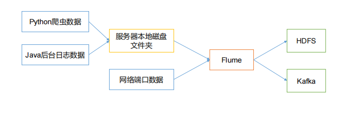
<span style="text-align: center;display:block;">Flume组件作用</span></span>

## Flume 基础架构

<span style="text-align: center;display:block;">

<span style="text-align: center;display:block;">Flume 基础架构</span></span>

1. Agent: Agent 是**一个 JVM 进程**，它以**事件的形式**将数据从源头送至目的。Agent 主要有 3 个部分组成，Source、Channel、Sink。
2. Source:Source 是**负责接收数据**到 Flume Agent 的组件。Source 组件可以**处理各种类型、各种格式的日志数据**，包括 avro、thrift、exec、jms、spooling directory、netcat、taildir、sequence generator、syslog、http、legacy。
3. Sink: Sink 不断地轮询 Channel 中的事件且批量地移除它们，并将**这些事件批量写入**到存储或索引系统、或者被发送到另一个 Flume Agent。Sink 组件目的地包括 hdfs、logger、avro、thrift、ipc、file、HBase、solr、自定义。
4. Channel: Channel 是位于 Source 和 Sink 之间的**缓冲区**。因此，Channel 允许 Source 和 Sink 运作在不同的速率上。Channel 是线程安全的，可以**同时处理几个 Source 的写入操作和几个Sink 的读取操作**。Flume 自带两种 Channel：Memory Channel 和 File Channel。
    * Memory Channel 是内存中的队列。Memory Channel 在不需要关心数据丢失的情景下适用。如果需要关心数据丢失，那么 Memory Channel 就不应该使用，因为程序死亡、机器宕机或者重启都会导致数据丢失。
    * File Channel 将所有事件写到磁盘。因此在程序关闭或机器宕机的情况下不会丢失数据。
5. Event: 传输单元，Flume **数据传输的基本单元**，以 Event 的形式将数据从源头送至目的地。Event 由 **Header 和 Body 两部分组成**，Header 用来存放该 event 的一些属性，为 K-V 结构，Body 用来存放该条数据，形式为字节数组。

# Flume 入门

## Flume 安装部署
> 见[Linux下Flume的安装](https://github.com/heibaiying/BigData-Notes/blob/master/notes/installation//Linux下Flume的安装.md)

## Flume 入门案例

### 监控端口数据官方案例

* 需求：使用Flume监听一个端口，收集该端口数据，并打印到控制台
* 分析
<span style="text-align: center;display:block;">
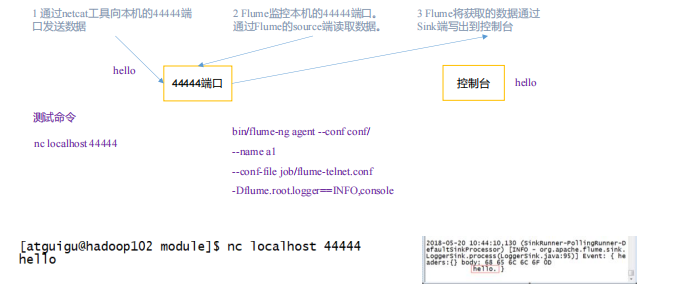
<span style="text-align: center;display:block;">监听数据端口案例分析</span></span>

* 实现步骤
    1. 安装netcat `yum -y install nc`
    2. 判断44444端口是否被占用 `netstat -nap | grep 44444`
    3. 创建配置文件 `flume-netcat-logger.conf`
    4. 配置文件
    ```
    # Name the components on this agent a1:表示agent名称
    a1.sources = r1 # 设置sources为r1
    a1.sinks = k1   # 设置sinks为k1
    a1.channels = c1    # 设置channels为c1
    # Describe/configure the source
    a1.sources.r1.type = netcat # 设置a1的sources中的r1输入类型类型为netcat
    a1.sources.r1.bind = localhost # 设置a1的sources中的r1输入监听的主机ip或名称
    a1.sources.r1.port = 44444 # 设置a1的sources中的r1输入监听的端口
    # Describe the sink
    a1.sinks.k1.type = logger   # 设置a1的sinks中的k1，也就是目的地类型为 logger
    # Use a channel which buffers events in memory
    a1.channels.c1.type = memory    # 设置a1的channels中的c1管道类型为memory
    a1.channels.c1.capacity = 1000  # 设置a1的channels中的c1管道总容量为1000个event
    a1.channels.c1.transactionCapacity = 100    # 设置a1的channels中的c1收集到100条event后再提交事务
    # Bind the source and sink to the channel # 连接sources 和 channels，sinks 和 channels
    a1.sources.r1.channels = c1 
    a1.sinks.k1.channel = c1
    ```
    5. 启动flume任务 `bin/flume-ng agent -c conf/ -n a1 --conf-file /conf/flume-netcat-logger.conf -Dflume.root.logger=INFO,console`
    6. 使用netcat工具发送数据并在flume窗口监听 `nc localhost 44444 `

### 实时监控单个追加文件

* 需求：实时监控 Hive 日志，并上传到 HDFS 中
* 分析
<span style="text-align: center;display:block;">
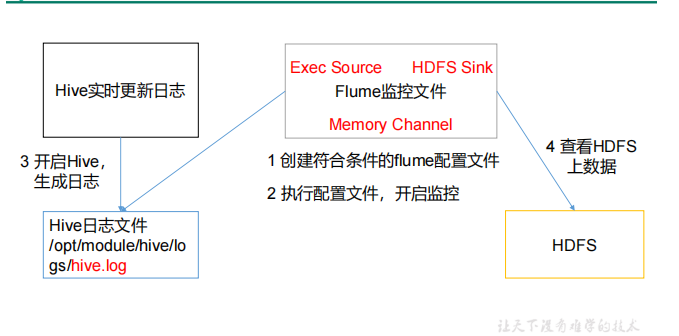
<span style="text-align: center;display:block;">实时监控单个追加文件</span></span>

* exec 即 execute 执行的意思。表示执行Linux 命令来读取文件
* 实现步骤
    1. 创建配置文件 `flume-file-hdfs.conf`
    2. 配置文件
    ```
    # Name the components on this agent
    a2.sources = r2
    a2.sinks = k2
    a2.channels = c2
    # Describe/configure the source
    a2.sources.r2.type = exec
    a2.sources.r2.command = tail -F /tmp/root/hive.log
    # Describe the sink
    a2.sinks.k2.type = hdfs
    a2.sinks.k2.hdfs.path = hdfs://mycluster/flume/%Y%m%d/%H
    #上传文件的前缀
    a2.sinks.k2.hdfs.filePrefix = logs- #是否按照时间滚动文件夹
    a2.sinks.k2.hdfs.round = true
    #多少时间单位创建一个新的文件夹
    a2.sinks.k2.hdfs.roundValue = 1
    #重新定义时间单位
    a2.sinks.k2.hdfs.roundUnit = hour
    #是否使用本地时间戳
    a2.sinks.k2.hdfs.useLocalTimeStamp = true
    #积攒多少个 Event 才 flush 到 HDFS 一次
    a2.sinks.k2.hdfs.batchSize = 100
    #设置文件类型，可支持压缩
    a2.sinks.k2.hdfs.fileType = DataStream
    #多久生成一个新的文件
    a2.sinks.k2.hdfs.rollInterval = 60
    #设置每个文件的滚动大小
    a2.sinks.k2.hdfs.rollSize = 134217700
    #文件的滚动与 Event 数量无关
    a2.sinks.k2.hdfs.rollCount = 0
    # Use a channel which buffers events in memory
    a2.channels.c2.type = memory
    a2.channels.c2.capacity = 1000
    a2.channels.c2.transactionCapacity = 100
    # Bind the source and sink to the channel
    a2.sources.r2.channels = c2
    a2.sinks.k2.channel = c2
    ```
    3. 运行flume
    4. 开启hive

### 实时监控目录下多个新文件

* 需求：使用 Flume 监听整个目录的文件，并上传至 HDFS
* 分析
<span style="text-align: center;display:block;">
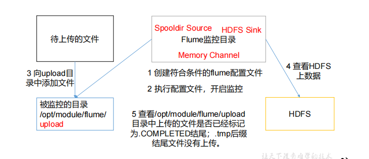
<span style="text-align: center;display:block;">实时读取目录文件到HDFS</span></span>

* 在使用 Spooling Directory Source 时，不要在监控目录中创建并持续修改文件；上传完成的文件会以.COMPLETED 结尾；被监控文件夹每 500 毫秒扫描一次文件变动。
* 实现步骤
    1. 创建配置文件 `flume-dir-hdfs.conf`
    2. 配置文件
    ```
    a3.sources = r3
    a3.sinks = k3
    a3.channels = c3
    # Describe/configure the source
    a3.sources.r3.type = spooldir
    a3.sources.r3.spoolDir = /tmp/uploads
    a3.sources.r3.fileSuffix = .COMPLETED
    a3.sources.r3.fileHeader = true
    #忽略所有以.tmp 结尾的文件，不上传
    a3.sources.r3.ignorePattern = ([^ ]*\.tmp)
    # Describe the sink
    a3.sinks.k3.type = hdfs
    a3.sinks.k3.hdfs.path = hdfs://mycluster/flume/upload/%Y%m%d/%H
    #上传文件的前缀
    a3.sinks.k3.hdfs.filePrefix = upload-
    a3.sinks.k3.hdfs.round = true
    #多少时间单位创建一个新的文件夹
    a3.sinks.k3.hdfs.roundValue = 1
    #重新定义时间单位
    a3.sinks.k3.hdfs.roundUnit = hour
    #是否使用本地时间戳
    a3.sinks.k3.hdfs.useLocalTimeStamp = true
    #积攒多少个 Event 才 flush 到 HDFS 一次
    a3.sinks.k3.hdfs.batchSize = 100
    #设置文件类型，可支持压缩
    a3.sinks.k3.hdfs.fileType = DataStream
    #多久生成一个新的文件
    a3.sinks.k3.hdfs.rollInterval = 60
    #设置每个文件的滚动大小大概是 128M
    a3.sinks.k3.hdfs.rollSize = 134217700
    #文件的滚动与 Event 数量无关
    a3.sinks.k3.hdfs.rollCount = 0
    # Use a channel which buffers events in memory
    a3.channels.c3.type = memory
    a3.channels.c3.capacity = 1000
    a3.channels.c3.transactionCapacity = 100
    # Bind the source and sink to the channel
    a3.sources.r3.channels = c3
    a3.sinks.k3.channel = c3
    ```
    3. 运行flume
    4. 添加文件

### 实时监控目录下的多个追加文件

* 需求:使用 Flume 监听整个目录的实时追加文件，并上传至 HDFS
* 分析
<span style="text-align: center;display:block;">

<span style="text-align: center;display:block;">实时读取目录文件到HDFS</span></span>

* 实现步骤
    1. 创建配置文件 `flume-taildir-hdfs.conf`
    2. 配置文件
    ```
    a3.sources = r3
    a3.sinks = k3
    a3.channels = c3
    # Describe/configure the source
    a3.sources.r3.type = TAILDIR
    a3.sources.r3.positionFile = /tmp/flume/tail_dir.json
    a3.sources.r3.filegroups = f1 f2
    a3.sources.r3.filegroups.f1 = /tmp/flume/files/.*file.*
    a3.sources.r3.filegroups.f2 = /tmp/flume/files2/.*log.*
    # Describe the sink
    a3.sinks.k3.type = hdfs
    a3.sinks.k3.hdfs.path = hdfs://mycluster/flume/upload2/%Y%m%d/%H
    #上传文件的前缀
    a3.sinks.k3.hdfs.filePrefix = upload
    #是否按照时间滚动文件夹
    a3.sinks.k3.hdfs.round = true
    #多少时间单位创建一个新的文件夹
    a3.sinks.k3.hdfs.roundValue = 1
    #重新定义时间单位
    a3.sinks.k3.hdfs.roundUnit = hour
    #是否使用本地时间戳
    a3.sinks.k3.hdfs.useLocalTimeStamp = true
    #积攒多少个 Event 才 flush 到 HDFS 一次
    a3.sinks.k3.hdfs.batchSize = 100
    #设置文件类型，可支持压缩
    a3.sinks.k3.hdfs.fileType = DataStream
    #多久生成一个新的文件
    a3.sinks.k3.hdfs.rollInterval = 60
    #设置每个文件的滚动大小大概是 128M
    a3.sinks.k3.hdfs.rollSize = 134217700
    #文件的滚动与 Event 数量无关
    a3.sinks.k3.hdfs.rollCount = 0
    # Use a channel which buffers events in memory
    a3.channels.c3.type = memory
    a3.channels.c3.capacity = 1000
    a3.channels.c3.transactionCapacity = 100
    # Bind the source and sink to the channel
    a3.sources.r3.channels = c3
    a3.sinks.k3.channel = c3
    ```

# Flume 进阶

## Flume 事务

<span style="text-align: center;display:block;">
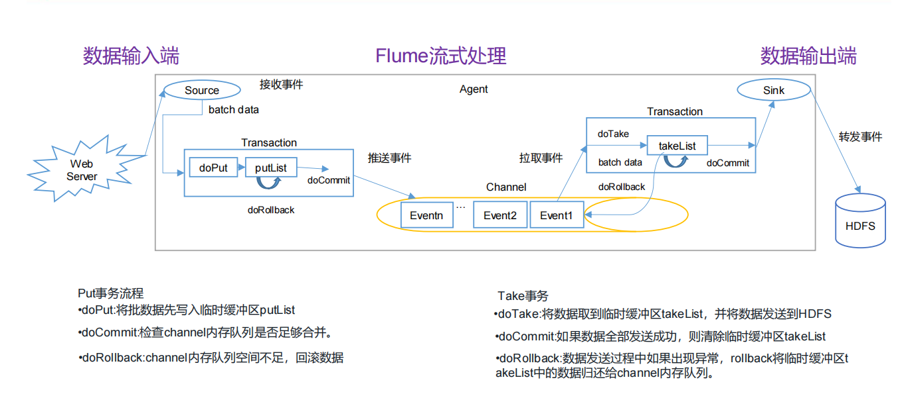
<span style="text-align: center;display:block;">Flume事务</span></span>

## Flume Agent 内部原理

<span style="text-align: center;display:block;">
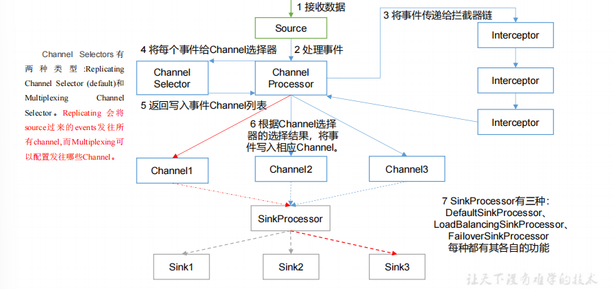
<span style="text-align: center;display:block;">Flume内部原理</span></span>

## Flume 拓扑结构

### 简单串联

<span style="text-align: center;display:block;">
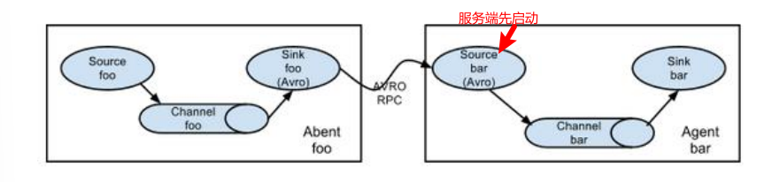
<span style="text-align: center;display:block;">简单串联</span></span>

### 复制和多路复用

<span style="text-align: center;display:block;">
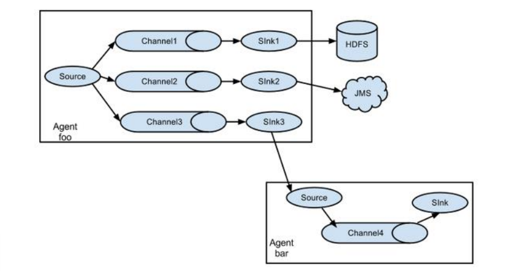
<span style="text-align: center;display:block;">复制和多路复用</span></span>

### 案例

* 需求：使用 Flume-1 监控文件变动，Flume-1 将变动内容传递给 Flume-2，Flume-2 负责存储到 HDFS。同时 Flume-1 将变动内容传递给 Flume-3，Flume-3 负责输出到 Local FileSystem。
* 分析
<span style="text-align: center;display:block;">
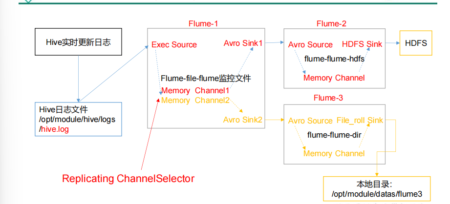
<span style="text-align: center;display:block;">复制和多路复用案例</span></span>

* 输出的本地目录必须是已经存在的目录，如果该目录不存在，并不会创建新的目录。
* 步骤
    1. 创建监控文件和存储路径
    2. master创建配置文件 `flume-file-flume.conf`
    ```
    # Name the components on this agent
    a1.sources = r1
    a1.sinks = k1 k2
    a1.channels = c1 c2
    # 将数据流复制给所有 channel
    a1.sources.r1.selector.type = replicating
    # Describe/configure the source
    a1.sources.r1.type = exec
    a1.sources.r1.command = tail -F /temp/root/hive.log
    a1.sources.r1.shell = /bin/bash -c
    # Describe the sink
    # sink 端的 avro 是一个数据发送者
    a1.sinks.k1.type = avro
    a1.sinks.k1.hostname = slave1
    a1.sinks.k1.port = 4141
    a1.sinks.k2.type = avro
    a1.sinks.k2.hostname = slave2
    a1.sinks.k2.port = 4141
    # Describe the channel
    a1.channels.c1.type = memory
    a1.channels.c1.capacity = 1000
    a1.channels.c1.transactionCapacity = 100
    a1.channels.c2.type = memory
    a1.channels.c2.capacity = 1000
    a1.channels.c2.transactionCapacity = 100
    # Bind the source and sink to the channel
    a1.sources.r1.channels = c1 c2
    a1.sinks.k1.channel = c1
    a1.sinks.k2.channel = c2
    ```
    3. slave1创建 `flume-flume-hdfs.conf`
    ```
    # Name the components on this agent
    a2.sources = r1
    a2.sinks = k1
    a2.channels = c1
    # Describe/configure the source
    # source 端的 avro 是一个数据接收服务
    a2.sources.r1.type = avro
    a2.sources.r1.bind = master
    a2.sources.r1.port = 4141
    # Describe the sink
    a2.sinks.k1.type = hdfs
    a2.sinks.k1.hdfs.path = hdfs://mycluster/flume2/%Y%m%d/%H
    #上传文件的前缀
    a2.sinks.k1.hdfs.filePrefix = flume2
    a2.sinks.k1.hdfs.round = true
    #多少时间单位创建一个新的文件夹
    a2.sinks.k1.hdfs.roundValue = 1
    #重新定义时间单位
    a2.sinks.k1.hdfs.roundUnit = hour
    #是否使用本地时间戳
    a2.sinks.k1.hdfs.useLocalTimeStamp = true
    #积攒多少个 Event 才 flush 到 HDFS 一次
    a2.sinks.k1.hdfs.batchSize = 100
    #设置文件类型，可支持压缩
    a2.sinks.k1.hdfs.fileType = DataStream
    #多久生成一个新的文件
    a2.sinks.k1.hdfs.rollInterval = 30
    #设置每个文件的滚动大小大概是 128M
    a2.sinks.k1.hdfs.rollSize = 134217700
    a2.sinks.k1.hdfs.rollCount = 0
    # Describe the channel
    a2.channels.c1.type = memory
    a2.channels.c1.capacity = 1000
    a2.channels.c1.transactionCapacity = 100
    # Bind the source and sink to the channel
    a2.sources.r1.channels = c1
    a2.sinks.k1.channel = c1
    ```
    4. slave2创建 `flume-flume-dir.conf` 
    ```
    # Name the components on this agent
    a3.sources = r1
    a3.sinks = k1
    a3.channels = c2
    # Describe/configure the source
    a3.sources.r1.type = avro
    a3.sources.r1.bind = master
    a3.sources.r1.port = 4141
    # Describe the sink
    a3.sinks.k1.type = file_roll
    a3.sinks.k1.sink.directory = /temp/flume3
    # Describe the channel
    a3.channels.c2.type = memory
    a3.channels.c2.capacity = 1000
    a3.channels.c2.transactionCapacity = 100
    # Bind the source and sink to the channel
    a3.sources.r1.channels = c2
    a3.sinks.k1.channel = c2
    ```
    5. 启动hadoop，执行配置文件
    6. 执行hive，并查看端口

### 负载均衡和故障转移

<span style="text-align: center;display:block;">
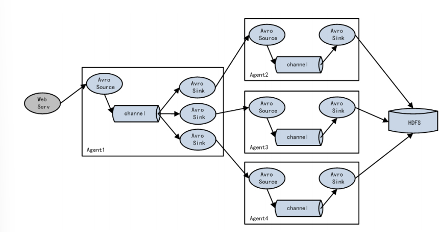
<span style="text-align: center;display:block;">负载均衡和故障转移</span></span>

### 案例

* 需求：使用 Flume1 监控一个端口，其 sink 组中的 sink 分别对接 Flume2 和 Flume3，采用FailoverSinkProcessor，实现故障转移的功能。
* 分析
<span style="text-align: center;display:block;">
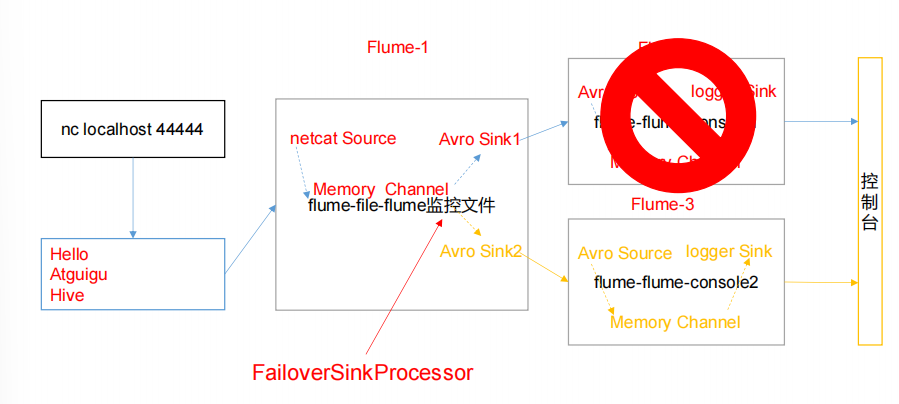
<span style="text-align: center;display:block;">故障转移</span></span>

* 步骤
    1. 创建 `flume-netcat-flume.conf`
    ```
    # Name the components on this agent
    a1.sources = r1
    a1.channels = c1
    a1.sinkgroups = g1
    a1.sinks = k1 k2
    # Describe/configure the source
    a1.sources.r1.type = netcat
    a1.sources.r1.bind = localhost
    a1.sources.r1.port = 44444
    a1.sinkgroups.g1.processor.type = failover
    a1.sinkgroups.g1.processor.priority.k1 = 5
    a1.sinkgroups.g1.processor.priority.k2 = 10
    a1.sinkgroups.g1.processor.maxpenalty = 10000
    # Describe the sink
    a1.sinks.k1.type = avro
    a1.sinks.k1.hostname = localhost
    a1.sinks.k1.port = 4141
    a1.sinks.k2.type = avro
    a1.sinks.k2.hostname = localhost
    a1.sinks.k2.port = 4142
    # Describe the channel
    a1.channels.c1.type = memory
    a1.channels.c1.capacity = 1000
    a1.channels.c1.transactionCapacity = 100
    # Bind the source and sink to the channel
    a1.sources.r1.channels = c1
    a1.sinkgroups.g1.sinks = k1 k2
    a1.sinks.k1.channel = c1
    a1.sinks.k2.channel = c1
    ```
    2. 创建 `flume-flume-console1.conf`
    ```
    # Name the components on this agent
    a2.sources = r1
    a2.sinks = k1
    a2.channels = c1
    # Describe/configure the source
    a2.sources.r1.type = avro
    a2.sources.r1.bind = localhost
    a2.sources.r1.port = 4141
    # Describe the sink
    a2.sinks.k1.type = logger
    # Describe the channel
    a2.channels.c1.type = memory
    a2.channels.c1.capacity = 1000
    a2.channels.c1.transactionCapacity = 100
    # Bind the source and sink to the channel
    a2.sources.r1.channels = c1
    a2.sinks.k1.channel = c1
    ```
    3. 创建 `flume-flume-console2.conf`
    ```
    # Name the components on this agent
    a3.sources = r1
    a3.sinks = k1
    a3.channels = c2
    # Describe/configure the source
    a3.sources.r1.type = avro
    a3.sources.r1.bind = localhost
    a3.sources.r1.port = 4142
    # Describe the sink
    a3.sinks.k1.type = logger
    # Describe the channel
    a3.channels.c2.type = memory
    a3.channels.c2.capacity = 1000
    a3.channels.c2.transactionCapacity = 100
    # Bind the source and sink to the channel
    a3.sources.r1.channels = c2
    a3.sinks.k1.channel = c2
    ```
    4. 执行配置文件
    5. netcat 发送内容

### 聚合

<span style="text-align: center;display:block;">
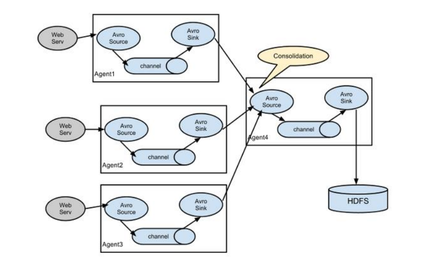
<span style="text-align: center;display:block;">聚合</span></span>

### 案例

* 需求： hadoop102 上的 Flume-1 监控文件/opt/module/group.log，hadoop103 上的 Flume-2 监控某一个端口的数据流，Flume-1 与 Flume-2 将数据发送给 hadoop104 上的 Flume-3，Flume-3 将最终数据打印
到控制台。
* 分析
<span style="text-align: center;display:block;">
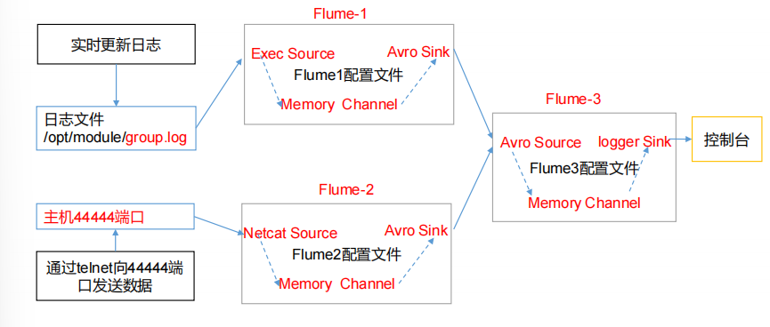
<span style="text-align: center;display:block;">聚合案例</span></span>

* 步骤
    1. slave1创建 `flume1-logger-flume.conf`
    ```
    # Name the components on this agent
    a1.sources = r1
    a1.sinks = k1
    a1.channels = c1
    # Describe/configure the source
    a1.sources.r1.type = exec
    a1.sources.r1.command = tail -F /temp/group.log
    a1.sources.r1.shell = /bin/bash -c
    # Describe the sink
    a1.sinks.k1.type = avro
    a1.sinks.k1.hostname = master
    a1.sinks.k1.port = 4141
    # Describe the channel
    a1.channels.c1.type = memory
    a1.channels.c1.capacity = 1000
    a1.channels.c1.transactionCapacity = 100
    # Bind the source and sink to the channel
    a1.sources.r1.channels = c1
    a1.sinks.k1.channel = c1
    ```
    2. slave2 创建 `flume2-netcat-flume.conf`
    ```
    # Name the components on this agent
    a2.sources = r1
    a2.sinks = k1
    a2.channels = c1
    # Describe/configure the source
    a2.sources.r1.type = netcat
    a2.sources.r1.bind = slave2
    a2.sources.r1.port = 44444
    # Describe the sink
    a2.sinks.k1.type = avro
    a2.sinks.k1.hostname = master
    a2.sinks.k1.port = 4141
    # Use a channel which buffers events in memory
    a2.channels.c1.type = memory
    a2.channels.c1.capacity = 1000
    a2.channels.c1.transactionCapacity = 100
    # Bind the source and sink to the channel
    a2.sources.r1.channels = c1
    a2.sinks.k1.channel = c1
    ```
    3. master 创建 flume3-flume-logger.conf
    ```
    # Name the components on this agent
    a3.sources = r1
    a3.sinks = k1
    a3.channels = c1
    # Describe/configure the source
    a3.sources.r1.type = avro
    a3.sources.r1.bind = master
    a3.sources.r1.port = 4141
    # Describe the sink
    a3.sinks.k1.type = logger
    # Describe the channel
    a3.channels.c1.type = memory
    a3.channels.c1.capacity = 1000
    a3.channels.c1.transactionCapacity = 100
    # Bind the source and sink to the channel
    a3.sources.r1.channels = c1
    a3.sinks.k1.channel = c1
    ```
    4. 执行配置文件
    5. 在 slave1 上向/opt/module 目录下的 group.log 追加内容
    6. 在 slave2 上向 44444 端口发送数据
    7. 检查 master 上数据

## 自定义 Interceptor

* 需求：使用 Flume 采集服务器本地日志，需要按照日志类型的不同，将不同种类的日志发往不同的分析系统。
* 分析
<span style="text-align: center;display:block;">
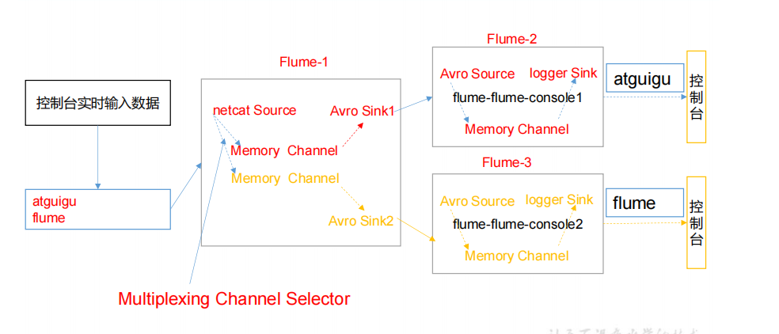
<span style="text-align: center;display:block;">自定义Interceptor</span></span>

* 步骤
    1. 并引入以下依赖
    ```xml
    <dependency>
        <groupId>org.apache.flume</groupId>
        <artifactId>flume-ng-core</artifactId>
        <version>1.7.0</version>
    </dependency>
    ```
    2. 定义 CustomInterceptor 类并实现 Interceptor 接口
    ```java
    package org.flume.interceptor;
    import org.apache.flume.Context;
    import org.apache.flume.Event;
    import org.apache.flume.interceptor.Interceptor;
    import java.util.ArrayList;
    import java.util.List;
    import java.util.Map;
    public class TypeInterceptor implements Interceptor {
        //声明一个存放事件的集合
        private List<Event> addHeaderEvents;
        @Override
        public void initialize() {
            //初始化存放事件的集合
            addHeaderEvents = new ArrayList<>();
        }
        //单个事件拦截
        @Override
        public Event intercept(Event event) {
            //1.获取事件中的头信息
            Map<String, String> headers = event.getHeaders();
            //2.获取事件中的 body 信息
            String body = new String(event.getBody());
            //3.根据 body 中是否有"atguigu"来决定添加怎样的头信息
            if (body.contains("atguigu")) {
                //4.添加头信息
                headers.put("type", "first");
            } else {
                //4.添加头信息
                headers.put("type", "second");
            }
            return event;
        }
        //批量事件拦截
        @Override
        public List<Event> intercept(List<Event> events) {
            //1.清空集合
            addHeaderEvents.clear();
            //2.遍历 events
            for (Event event : events) {
                //3.给每一个事件添加头信息
                addHeaderEvents.add(intercept(event));
            }
            //4.返回结果
            return addHeaderEvents;
        }
        @Override
        public void close() {
        }
        public static class Builder implements Interceptor.Builder {
            @Override
            public Interceptor build() {
                return new TypeInterceptor();
            }
            @Override
            public void configure(Context context) {
            }
        } 
    }
    ```
    3. master编辑 flume 配置文件
    ```
    # Name the components on this agent
    a1.sources = r1
    a1.sinks = k1 k2
    a1.channels = c1 c2
    # Describe/configure the source
    a1.sources.r1.type = netcat
    a1.sources.r1.bind = localhost
    a1.sources.r1.port = 44444
    a1.sources.r1.interceptors = i1
    a1.sources.r1.interceptors.i1.type = org.flume.interceptor.CustomInterceptor$Builder
    a1.sources.r1.selector.type = multiplexing
    a1.sources.r1.selector.header = type
    a1.sources.r1.selector.mapping.first = c1
    a1.sources.r1.selector.mapping.second = c2
    # Describe the sink
    a1.sinks.k1.type = avro
    a1.sinks.k1.hostname = slave1
    a1.sinks.k1.port = 4141
    a1.sinks.k2.type=avro
    a1.sinks.k2.hostname = slave2
    a1.sinks.k2.port = 4241
    # Use a channel which buffers events in memory
    a1.channels.c1.type = memory
    a1.channels.c1.capacity = 1000
    a1.channels.c1.transactionCapacity = 100
    # Use a channel which buffers events in memory
    a1.channels.c2.type = memory
    a1.channels.c2.capacity = 1000
    a1.channels.c2.transactionCapacity = 100
    # Bind the source and sink to the channel
    a1.sources.r1.channels = c1 c2
    a1.sinks.k1.channel = c1
    a1.sinks.k2.channel = c2
    ```
    4. slave1 编辑文件
    ```
    a1.sources = r1
    a1.sinks = k1
    a1.channels = c1
    a1.sources.r1.type = avro
    a1.sources.r1.bind = slave1
    a1.sources.r1.port = 4141
    a1.sinks.k1.type = logger
    a1.channels.c1.type = memory
    a1.channels.c1.capacity = 1000
    a1.channels.c1.transactionCapacity = 100
    a1.sinks.k1.channel = c1
    a1.sources.r1.channels = c1
    ```
    5. slave2 编辑文件
    ```
    a1.sources = r1
    a1.sinks = k1
    a1.channels = c1
    a1.sources.r1.type = avro
    a1.sources.r1.bind = slave2
    a1.sources.r1.port = 4241
    a1.sinks.k1.type = logger
    a1.channels.c1.type = memory
    a1.channels.c1.capacity = 1000
    a1.channels.c1.transactionCapacity = 100
    a1.sinks.k1.channel = c1
    a1.sources.r1.channels = c1
    ```
    6. 启动flume进程（先启动slave1和salve2的）
    7. master nc 发送数据

## 自定义 Source

* 自定义MySource 需要继承 **AbstractSource 类并实现 Configurable 和 PollableSource 接口**
* 实现相应方法：
* 使用场景：读取 MySQL 数据或者其他文件系统。

|方法|说明|
| :-- | :-- |
|getBackOffSleepIncrement()|backoff 步长|
|getMaxBackOffSleepInterval()|backoff 最长时间|
|configure(Context context)|初始化 context（读取配置文件内容）|
|process()|获取数据封装成 event 并写入 channel，这个方法将被循环调用。|

* 需求：使用 flume 接收数据，并给每条数据添加前缀，输出到控制台。前缀可从 flume 配置文件中配置。
* 分析：process() 得到数据，由于没有数据，所以**模拟生成**
* 步骤
    1. 导入 pom 依赖
    ```xml
    <dependency>
        <groupId>org.apache.flume</groupId>
        <artifactId>flume-ng-core</artifactId>
        <version>1.7.0</version>
    </dependency>
    ```
    2. 编写代码
    ```java
    package org.flume.mysources;
    import org.apache.flume.Context;
    import org.apache.flume.EventDeliveryException;
    import org.apache.flume.PollableSource;
    import org.apache.flume.conf.Configurable;
    import org.apache.flume.event.SimpleEvent;
    import org.apache.flume.source.AbstractSource;
    import java.util.HashMap;
    public class MySource extends AbstractSource implements Configurable, PollableSource {
        //定义配置文件将来要读取的字段
        private Long delay;
        private String field;
        //初始化配置信息
        @Override
        public void configure(Context context) {
            delay = context.getLong("delay");
            field = context.getString("field", "Hello!");
        }
        @Override
        public Status process() throws EventDeliveryException {
            try {
                //创建事件头信息
                HashMap<String, String> hearderMap = new HashMap<>();
                //创建事件
                SimpleEvent event = new SimpleEvent();
                //循环封装事件
                for (int i = 0; i < 5; i++) {
                    //给事件设置头信息
                    event.setHeaders(hearderMap);
                    //给事件设置内容
                    event.setBody((field + i).getBytes());
                    //将事件写入 channel
                    getChannelProcessor().processEvent(event);
                    Thread.sleep(delay);
                }
            } catch (Exception e) {
                e.printStackTrace();
                return Status.BACKOFF;
            }
                return Status.READY;
        }
        @Override
        public long getBackOffSleepIncrement() {
            return 0;
        }
        @Override
        public long getMaxBackOffSleepInterval() {
            return 0;
        } 
    }
    ```
    3. 测试, 打包，配置
    ```
    # Name the components on this agent
    a1.sources = r1
    a1.sinks = k1
    a1.channels = c1
    a1.sources.r1.channels = c1
    a1.sinks.k1.channel = c1
    # Describe/configure the source
    a1.sources.r1.type = org.flume.mysources.MySource
    a1.sources.r1.delay = 1000
    #a1.sources.r1.field = ciaran
    # Describe the sink
    a1.sinks.k1.type = logger
    # Use a channel which buffers events in memory
    a1.channels.c1.type = memory
    a1.channels.c1.capacity = 1000
    a1.channels.c1.transactionCapacity = 100
    ```
    4. 开启任务 `bin/flume-ng agent -c conf/ -f conf/mysource.conf -n a1 -Dflume.root.logger=INFO,console`

## 自定义 Sink

* 自定义MySink 需要继承 **AbstractSink 类并实现 Configurable 接口**。
* 使用场景：读取 Channel 数据写入 MySQL 或者其他文件系统
* 实现相应方法：

|方法|说明|
| :-- | :-- |
|configure(Context context)|初始化 context（读取配置文件内容）|
|process()|从 Channel 读取获取数据（event），这个方法将被循环调用。|

* 需求: 使用 flume 接收数据，并在 Sink 端给每条数据添加前缀和后缀，输出到控制台(LOG类型)。前后缀可在 flume 任务配置文件中配置。
* 分析
<span style="text-align: center;display:block;">
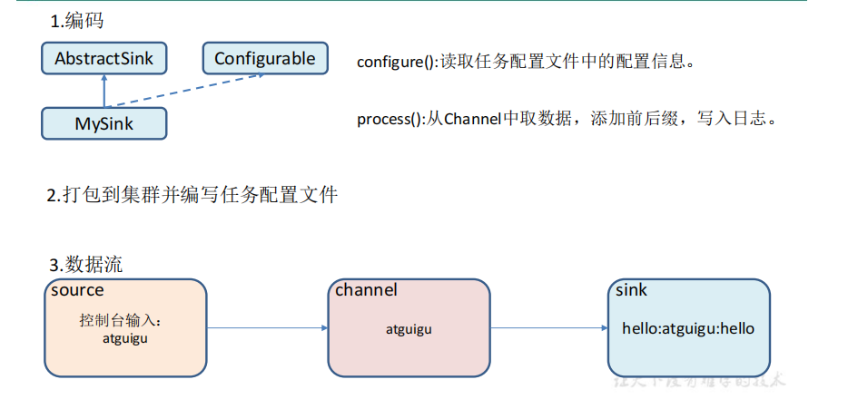
<span style="text-align: center;display:block;">自定义Sink</span></span>

* 编码
```java
package org.flume.sinks;
import org.apache.flume.*;
import org.apache.flume.conf.Configurable;
import org.apache.flume.sink.AbstractSink;
import org.slf4j.Logger;
import org.slf4j.LoggerFactory;
public class MySink extends AbstractSink implements Configurable {
    //创建 Logger 对象
    private static final Logger LOG = LoggerFactory.getLogger(AbstractSink.class);
    private String prefix;
    private String suffix;
    @Override
    public Status process() throws EventDeliveryException {
        //声明返回值状态信息
        Status status;
        //获取当前 Sink 绑定的 Channel
        Channel ch = getChannel();
        //获取事务
        Transaction txn = ch.getTransaction();
        //声明事件
        Event event;
        //开启事务
        txn.begin();
        //读取 Channel 中的事件，直到读取到事件结束循环
        while (true) {
            event = ch.take();
            if (event != null) {
                break;
            }
        }
        try {
            //处理事件（打印）
            LOG.info(prefix + new String(event.getBody()) + suffix);
            //事务提交
            txn.commit();
            status = Status.READY;
        } catch (Exception e) {
            //遇到异常，事务回滚
            txn.rollback();
            status = Status.BACKOFF;
        } finally {
            //关闭事务
            txn.close();
        }
        return status;
    }
    @Override
    public void configure(Context context) {
        //读取配置文件内容，有默认值
        prefix = context.getString("prefix", "hello:");
        //读取配置文件内容，无默认值
        suffix = context.getString("suffix");
    } 
}
```

* 测试，打包，配置文件
```
# Name the components on this agent
a1.sources = r1
a1.sinks = k1
a1.channels = c1
# Describe/configure the source
a1.sources.r1.type = netcat
a1.sources.r1.bind = localhost
a1.sources.r1.port = 44444
# Describe the sink
a1.sinks.k1.type = org.flume.sinks.MySink
#a1.sinks.k1.prefix = ciaran:
a1.sinks.k1.suffix = :ciaran
# Use a channel which buffers events in memory
a1.channels.c1.type = memory
a1.channels.c1.capacity = 1000
a1.channels.c1.transactionCapacity = 100
# Bind the source and sink to the channel
a1.sources.r1.channels = c1
a1.sinks.k1.channel = c1
```
* 开启任务

## Flume 数据流监控

### Ganglia 的安装与部署

Ganglia 由 gmond、gmetad 和 gweb 三部分组成。
* gmond（Ganglia Monitoring Daemon）是一种**轻量级服务**，安装在每台需要收集指标数据的节点主机上。使用 gmond，你可以很容易收集很多系统指标数据，如 CPU、内存、磁盘、网络和活跃进程的数据等。
* gmetad（Ganglia Meta Daemon）整合所有信息，并将其以 **RRD 格式存储至磁盘的服务**。
* gweb（Ganglia Web）Ganglia **可视化工具**，gweb 是一种利用浏览器显示 gmetad 所存储数据的 PHP 前端。在 Web 界面中以图表方式展现集群的运行状态下收集的多种不同指标数据

### 安装 ganglia

* 规划

|主机|规划|
| :-- | :-- |
|master|web,gmetad,gmod|
|slave1|gmod|
|slave2|gmod|

* 安装epel-release ` yum -y install epel-release`
* 在 master 安装 `yum -y install ganglia-gmetad ganglia-web ganglia-gmond`
* 在 slave1，slave2 安装 `yum -y install ganglia-gmond`
* 在 master 修改配置文件 `/etc/httpd/conf.d/ganglia.conf`
```conf
<Location /ganglia>
  #Order deny,allow
  Require ip 192.168.150.1
  #Deny from all
  #Allow from 0.0.0.0
  #Allow from ::1
  # Allow from .example.com
</Location>
```
* 在 master 修改 `/etc/ganglia/gmetad.conf`
```conf
data_source "my cluster" master
```
* 在 master 修改配置文件 `/etc/selinux/config`
```conf
# This file controls the state of SELinux on the system.
# SELINUX= can take one of these three values:
# enforcing - SELinux security policy is enforced.
# permissive - SELinux prints warnings instead of enforcing.
# disabled - No SELinux policy is loaded.
SELINUX=disabled
# SELINUXTYPE= can take one of these two values:
# targeted - Targeted processes are protected,
# mls - Multi Level Security protection.
SELINUXTYPE=targeted
```
* selinux 生效**需要重启**，如果此时不想重启，可以使用一下命令临时生效 `sudo setenforce 0`
* 在 所有主机 修改 `/etc/ganglia/gmond.conf`
```conf
cluster {
    name = "my cluster"
    owner = "unspecified"
    latlong = "unspecified"
    url = "unspecified"
}
udp_send_channel {
    # 数据发送给 master
    host = master
    port = 8649
    ttl = 1
}
udp_recv_channel {
    port = 8649
    # 接收来自任意连接的数据
    bind = 0.0.0.0
    retry_bind = true
}
```
* 所用机器 启动 ganglia `systemctl start gmond`
* master 启动 `systemctl start httpd`,`systemctl start gmetad`
* 打开网页浏览 ganglia 页面 `http://192.168.150.201/ganglia`
* 如果完成以上操作依然出现权限不足错误，请修改/var/lib/ganglia 目录的权限 `chmod -R 777 /var/lib/ganglia`

### 操作 Flume 测试监控

* 启动任务 
`bin/flume-ng agent -c conf/  -n a1  -f conf/flume-netcat-logger.conf  -Dflume.root.logger=INFO,console  -Dflume.monitoring.type=ganglia  -Dflume.monitoring.hosts=master:8649`
* 发送数据观察 ganglia 监测图 `nc localhost 44444`
* 图例说明

|字段（图标名称）|字段含义|
| :-- | :-- |
|EventPutAttemptCount| source 尝试写入 channel 的事件总数量|
|EventPutSuccessCount| 成功写入 channel 且提交的事件总数量|
|EventTakeAttemptCount| sink 尝试从 channel 拉取事件的总数量。|
|EventTakeSuccessCount| sink 成功读取的事件的总数量|
|StartTime| channel 启动的时间（毫秒）|
|StopTime| channel 停止的时间（毫秒）|
|ChannelSize| 目前 channel 中事件的总数量|
|ChannelFillPercentage| channel 占用百分比|
|ChannelCapacity| channel 的容量|

# 企业真实面试题（重点）

##  你是如何实现 Flume 数据传输的监控的 

使用第三方框架 Ganglia 实时监控 Flume

## Flume 的 Source，Sink，Channel 的作用？你们 Source 是什么类型？

* 作用 
    1. Source 组件是专门用来**收集数据**的，可以处理**各种类型、各种格式的日志数据**，包括 avro、thrift、exec、jms、spooling directory、netcat、sequence generator、syslog、http、legacy
    2. Channel 组件对采集到的数据进行**缓存**，可以存放在 **Memory 或 File** 中。
    3. Sink 组件是用于把**数据发送到目的地**的组件，目的地包括 Hdfs、Logger、avro、thrift、ipc、file、Hbase、solr、自定义。
* 我公司采用的 Source 类型为：
    1. 监控后台日志：exec
    2. 监控后台产生日志的端口：netcat

## Flume 的 Channel Selectors

Channel Selectors，可以让**不同的项目日志**通过**不同的Channel到不同的Sink**中去。官方文档上Channel Selectors 有两种类型:Replicating Channel Selector(复制模式，默认)和Multiplexing Channel Selector(选择分发模式)

## Flume 参数调优

|组件|参数|调优|
| :-- | :-- | :-- |
|Source|Source 个数|增加 Source 个数。当某一个目录产生的文件过多时需要将这个文件目录**拆分成多个文件目录**，同时配置好**多个 Source** 以保证 **Source 有足够的能力获取到新产生的数据**|
|Source|batchSize|决定 Source **一次批量运输到 Channel 的 event 条数**，适当调大这个参数可以**提高** Source 搬运 Event 到 Channel 时的**性能**|
|Channel|type|选择 memory 时 Channel 的性能最好。使用 **file Channel** 时 dataDirs 配置**多个不同盘下的目录**可以提高性能|
|Channel|Capacity|决定 Channel 可**容纳**最大的 event 条数|
|Channel|transactionCapacity|决定每次 Source 往 channel 里面**写**的最大 event 条数和每次 Sink 从 channel 里面读的最大event 条数。**transactionCapacity 需要大于 Source 和 Sink 的 batchSize 参数**|
|Sink|Sink 的个数|增加 Sink 消费 event 的能力。Sink 也不是越多越好够用就行，过多的 Sink 会占用系统资源，造成系统资源不必要的浪费|
|Sink|batchSize|决定 Sink **一次批量读取到的 event 条数**，适当调大这个参数可以**提高** Sink读取**性能**|

## Flume 的事务机制

Flume 的事务机制（**类似数据库的事务机制**）：Flume 使用**两个独立的事务**分别负责事件传递
* Soucrce 到 Channel
* Channel 到 Sink

比如 spooling directory source 为文件的每一行创建一个事件，一旦事务中所有的事件全部传递到 Channel 且提交成功，那么 Soucrce 就将**该文件标记为完成**。
同理，事务以类似的方式处理从 Channel 到 Sink 的传递过程，如果因为某种原因使得事件无法记录，那么事务**将会回滚**。且所有的事件都会保持到 Channel 中，等待重新传递。

## Flume 采集数据会丢失吗

根据 Flume 的架构原理，Flume 是不太可能丢失数据的，其**内部有完善的事务机制**，Source 到 Channel 是事务性的，Channel 到 Sink 是事务性的，因此这两个环节不会出现数据的丢失

可能丢失数据有以下情况
* **Channel 采用 memoryChannel**，agent 宕机导致数据丢失
* **Channel 存储数据已满**，导致 Source 不再写入，未写入的数据丢失。

Flume有**可能造成数据的重复**，例如数据已经成功由 Sink 发出，但是**没有接收到响应，Sink 会再次发送数据**，此时可能会导致数据的重复。

