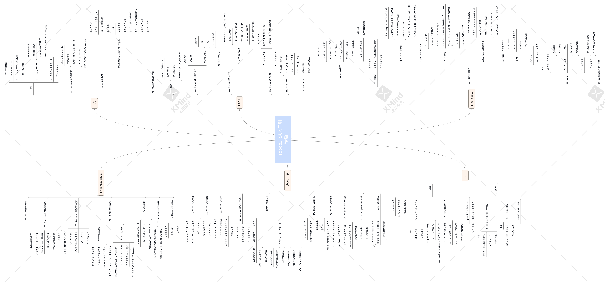
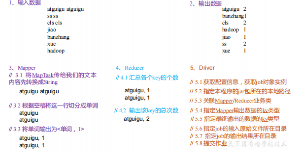
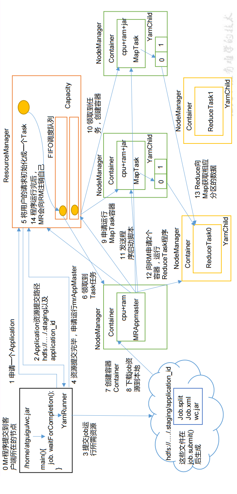
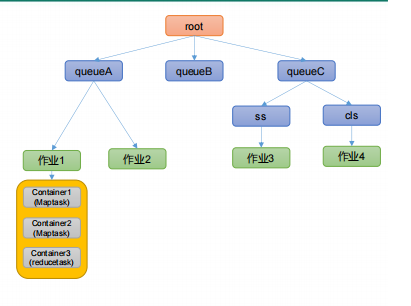
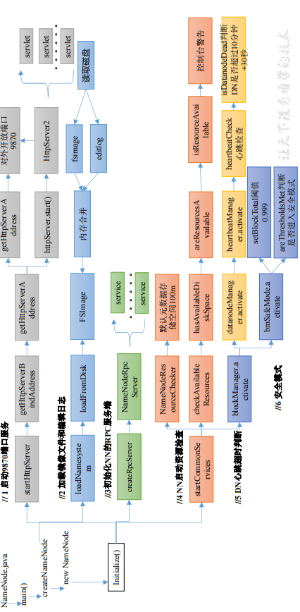

[toc]

<span style="text-align: center;display:block;">
</span>

# 大数据概念
<span id="大数据概念"></span>

**大数据（Big Data）：指无法在一定时间范围内用常规软件工具进行*捕捉、管理和处理* 的数据集合，是需要新处理模式才能具有更强的决策力、洞察发现力和流程优化能力的*海量、高增长率和多样化* 的信息资产。**

---

**大数据主要解决，海量数据的采集、存储和分析计算问题。**
## 基本数据单位
<span id="基本数据单位"></span>

---

按顺序给出数据存储单位：bit、Byte、KB、MB、GB、TB、PB、EB、ZB、YB、BB、NB、DB。

---

|&#x1F308;|&#x1F308;|
| :---: | :------: |
|  1P  |  1024T  |
|  1T  |  1024G  |
|  1G  |  1024M  |
|  1MB  |  1024K  |
|  1K  | 1024Byte |
| 1Byte |   8bit   |

## 大数据特点
<span id="大数据特点"></span>

1. Volume（大量）
2. Velocity（高速）
3. Variety（多样）
4. Value（低价值密度）
5. ..

## 大数据应用场景
<span id="大数据应用场景"></span>

* 推荐(视频，广告，零售)
* 物流
* 保险
* 金融
* 房产
* 人工智能 + 5G + 物联网

## 大数据技术生态体系
<span id="大数据技术生态体系"></span>

<span style="text-align: center;display:block;">

<span style="text-align: center;display:block;">大数据技术生态体系</span></span>

## Hadoop 优势（4 高）
<span id="Hadoop 优势"></span>

* 高可靠
* 高扩展
* 高效性
* 高容错性

## Hadoop 组成（面试重点）
<span id="Hadoop 组成"></span>

<span style="text-align: center;display:block;">

<span style="text-align: center;display:block;">Hadoop1.x、Hadoop2.x、Hadoop3.x区别</span>
</span>

## 常用端口号

|功能|2.x端口|3.x端口|
| :--: | :--: | :--: |
|HDFS NameNode 内部通常端口|8020/9000|8020/9000/9820|
|HDFS NameNode 对用户的查询端口|50070|9870|
|Yarn查看任务运行情况|8088|8088|
|历史服务器|19888|19888|

## 常用的配置文件


|2.x|3.x|
| :--: | :--: |
|core-site.xml|core-site.xml|
|hdfs-site.xml|hdfs-site.xml|
|yarn-site.xml|yarn-site.xml|
|mapred-site.xml|mapred-site.xml|
|slaves|workers|

## Hadoop安装

[Hadoop单机环境搭建](https://github.com/heibaiying/BigData-Notes/blob/master/notes/installation/Hadoop单机环境搭建.md)
[Hadoop集群环境搭建](https://github.com/heibaiying/BigData-Notes/blob/master/notes/installation/Hadoop集群环境搭建.md)

# HDFS
<span id="HDFS"></span>

## HDFS 产生背景
<span id="HDFS 产生背景"></span>

* 随着数据量越来越大，在一个操作系统存不下所有的数据，那么就分配到更多的操作系统管理的磁盘中，但是不方便管理和维护，迫切**需要一种系统来管理多台机器上的文件**，这就是*分布式文件管理系统*。HDFS 只是*分布式文件管理系统中的一种*。

## HDFS 定义
<span id="HDFS 定义"></span>

* *HDFS（Hadoop Distributed File System）*，**它是一个文件系统**，用于存储文件，**通过目录树来定位文件**；其次，它是分布式的，由*很多服务器联合起来实现其功能*，集群中的服务器有各自的角色。
* HDFS 的使用场景：适合**一次写入，多次读出**的场景。一个文件经过创建、写入和关闭之后就不需要改变

## HDFS 优缺点
<span id="HDFS 优缺点"></span>

### HDFS优点
<span id="HDFS优点"></span>

1. 高容错性
2. 适合处理大数据
3. 可构建在**廉价机器**上

### HDFS缺点
<span id="HDFS缺点"></span>

1. **不适合低延时数据访问**，比如毫秒级的存储数据，是做不到的。
2. **无法高效的对大量小文件进行存储。** 会占用大量NN内存，增加寻址时间
3. **不支持并发写入、文件随机修改**。仅支持数据append（追加）

## HDFS 组成架构
<span id="HDFS 组成架构"></span>

<span style="text-align: center;display:block;">

<span style="text-align: center;display:block;">HDFS 组成架构</span></span>

1. NameNode（nn）：就是Master，它是一个**主管、管理者**       
    * 管理HDFS的名称空间；
    * 配置副本策略； 
    * 管理数据块（Block）映射信息； 
    * 处理客户端读写请求。
2. DataNode：就是**Slave**。NameNode下达命令，DataNode执行实际的操作。 
    * 存储实际的数据块；
    * 执行数据块的读/写操作
3. Client：就是**客户端**。
    * 文件切分。文件上传HDFS的时候，Client将文件切分成一个一个的Block，然后进行上传； 
    * 与NameNode交互，获取文件的位置信息；
    * 与DataNode交互，读取或者写入数据；
    * Client提供一些命令来管理HDFS，比如NameNode格式化； 
    * Client可以通过一些命令来访问HDFS，比如对HDFS增删查改操作；
4. Secondary NameNode：并非NameNode的热备。当NameNode挂掉的时候，它**并不能马上替换NameNode**并提供服务。
    * 辅助NameNode，分担其工作量，比如定期合并Fsimage和Edits，并推送给NameNode
    * 在紧急情况下，可辅助恢复NameNode。

## HDFS 文件块大小（面试重点）
<span id="HDFS 文件块大小"></span>

* **HDFS中的文件在物理上是分块存储（Block）**
    * 默认大小在Hadoop2.x/3.x版本中是128M，1.x版本中是64M。
* HDFS的块设置太小，会**增加寻址时间**，程序一直在找块的开始位置；
* 如果块设置的太大，从**磁盘传输数据的时间会明显大于定位这个块开始位置所需的时间**。导致程序在处理这块数据时，会非常慢。
* **总结：HDFS块的大小设置主要取决于磁盘传输速率。**

## HDFS 的 Shell 操作（开发重点）
<span id="HDFS 的 Shell 操作"></span>

### HDFS常用命令(hadoop fs)
<span id="HDFS常用命令"></span>

* 上传
    * -moveFromLocal：从本地剪切粘贴到 HDFS
    * -copyFromLocal：从本地文件系统中拷贝文件到 HDFS 路径去
    * -put：等同于 copyFromLocal，生产环境更习惯用 put
    * -appendToFile：追加一个文件到已经存在的文件末尾
* 下载
    * -copyToLocal：从 HDFS 拷贝到本地
    * -get：等同于 copyToLocal，生产环境更习惯用 get
* HDFS 直接操作
    * -ls: 显示目录信息
    * -cat：显示文件内容
    * -chgrp、-chmod、-chown：Linux 文件系统中的用法一样，修改文件所属权限
    * -mkdir：创建路径
    * -cp：从 HDFS 的一个路径拷贝到 HDFS 的另一个路径
    * -mv：在 HDFS 目录中移动,重命名文件
    * -tail：显示一个文件的末尾 *1kb* 的数据
    * -rm：删除文件或文件夹
    * -rm -r：*递归*删除目录及目录里面内容
    * -du 统计文件夹的大小信息
    * -setrep：设置 HDFS 中文件的副本数量

## HDFS API操作
<span id="HDFS API操作"></span>

### MAVEN的常用依赖
<span id="MAVEN的常用依赖"></span>

```xml
    <dependency>
      <groupId>junit</groupId>
      <artifactId>junit</artifactId>
      <version>4.11</version>
      <scope>test</scope>
    </dependency>
    <!-- <dependency> -->
    <!-- <groupId>org.slf4j</groupId>
    <artifactId>slf4j-log4j12</artifactId>
    <version>1.7.30</version>
    </dependency>
    <dependency>
        <groupId>org.apache.logging.log4j</groupId>
        <artifactId>log4j-core</artifactId>
        <version>2.14.1</version>
    </dependency>
    <dependency>
        <groupId>org.apache.logging.log4j</groupId>
        <artifactId>log4j-api</artifactId>
        <version>2.14.1</version>
    </dependency> -->
    <!-- hadoop整合 -->
      <dependency>
        <groupId>org.apache.hadoop</groupId>
        <artifactId>hadoop-client</artifactId>
        <version>${hadoop.version}</version>
      </dependency>
      <dependency>
        <groupId>org.apache.hadoop</groupId>
        <artifactId>hadoop-common</artifactId>
        <version>${hadoop.version}</version>
      </dependency>
      <dependency>
        <groupId>org.apache.hadoop</groupId>
        <artifactId>hadoop-hdfs</artifactId>
        <version>${hadoop.version}</version>
      </dependency>
```

### HDFSClient（客户端代码常用套路）
<span id="HDFSClient"></span>

1. 获取一个客户端对象

   ```java
   // 连接的集群nn地址,zookeeper地址

   String uriName = "hdfs://master:8020"
   URI uri = new URI(uriName);
   Configuration configuration = new Configuration();

   // 可以配置用set
   // configuration.set("dfs.replication", "2");

   String user = "root";
   fs = FileSystem.get(uri, configuration, user);
   ```
   >  参数优先级(优先级从左到右增加)
   >  **hdfs-default.xml => hdfs-site.xml=> 在项目资源目录下的配置文件 =》代码里面的配置**
2. 执行相关的操作命令
    - 上传
        ```java
        public void Put() throws IOException {
                fs.copyFromLocalFile(是否删除原数据, 是否允许覆盖, 原数据路径(new Path), 目的地路径(new Path));
            }
        ```

        ```java
        public void Put2() throws IOException {
                FSDataOutputStream fos = fs.create(new Path("/input"));
                fos.write("hello world".getBytes());
            }
        ```
    - 创建目录
        ```java
        public void mkdir() throws URISyntaxException, IOException, InterruptedException {
                fs.mkdirs(new Path("/xiyou/huaguoshan1"));
            }
        ```
    - 文件下载
        ```java
        public void Get() throws IOException {
                fs.copyToLocalFile(原文件是否删除, 原文件路径HDFS, 目标地址路径, 是否使用RawLocalFileSystem(RawLocalFileSystem是非crc文件系统。因此，它不会在本地创建任何crc(校验)文件));
            }
        ```    
    -  删除
        ```java
        fs.delete(new Path("/jdk-8u212-linux-x64.tar.gz"), 是否递归删除);
        ```
    - 文件的更名和移动
        ```java
        fs.rename(new Path("/input/word.txt"), new Path("/input/ss.txt"));
        ```
    - 获取文件详细信息
        ```java
        // 获取所有文件信息
        RemoteIterator<LocatedFileStatus> listFiles = fs.listFiles(new Path("/"), true);

        // 遍历文件
        while (listFiles.hasNext()) {
            LocatedFileStatus fileStatus = listFiles.next();

            System.out.println("==========" + fileStatus.getPath() + "=========");
            System.out.println(fileStatus.getPermission());
            System.out.println(fileStatus.getOwner());
            System.out.println(fileStatus.getGroup());
            System.out.println(fileStatus.getLen());
            System.out.println(fileStatus.getModificationTime());
            System.out.println(fileStatus.getReplication());
            System.out.println(fileStatus.getBlockSize());
            System.out.println(fileStatus.getPath().getName());

            // 获取块信息
            BlockLocation[] blockLocations = fileStatus.getBlockLocations();

            System.out.println(Arrays.toString(blockLocations));
        ```

    -  判断是文件夹还是文件
        ```java
        FileStatus[] listStatus = fs.listStatus(new Path("/"));

        for (FileStatus status : listStatus) {

            if (status.isFile()) {
                System.out.println("文件：" + status.getPath().getName());
            } else {
                System.out.println("目录：" + status.getPath().getName());
            }
        }
        ```
3. 关闭资源
    ```java
    fs.close();
    ```

## HDFS 的读写流程（面试重点）
<span id="HDFS 的读写流程"></span>

### HDFS 写数据流程
<span id="HDFS 写数据流程"></span>

<span style="text-align: center;display:block;">

<span style="text-align: center;display:block;">HDFS的写数据流程</span></span>

1. 客户端通过 *Distributed FileSystem 模块*向 **NameNode**请求上传文件
2. NameNode 检查*目标文件*是否已存在，*父目录*是否存在。**返回是否可以上传**
3. 客户端请求**第一个 Block** 上传到**哪几个** DataNode 服务器上。
    * 副本存储节点选择
        * 本地节点
        * 其他机架一个节点
        * 其他机架另一个节点
4. NameNode 返回 **3**(*具体不一样*) 个 DataNode 节点，分别为 dn1、dn2、dn3。
5. 客户端通过 *FSDataOutputStream 模块* 请求 **dn1**上传数据，dn1收到请求会**继续调用dn2**，然后 *dn2* **调用 dn3**，将这个**通信管道**建立完成
6. dn1、dn2、dn3 **逐级应答**客户端。
7. 客户端开始往 **dn1** 上传**第一个 Block**（先从磁盘读取数据放到**一个本地内存缓存**），以 **Packet**为单位，dn1 收到*一个 Packet 就会传给 dn2*，*dn2 传给 dn3*；dn1 **每传一个 packet会放入一个应答队列等待应答**。
    * Packet内容(64K)：
        * chunk: *真实数据* 512Byte 
        * chunksum: *校验数据* 4Byte
        * 真实数据与校验值数据的比值为128:1
8. 当一个 Block 传输完成之后，客户端*再次请求* NameNode 上传*第二个 Block 的服务器*。（**重复执行 3-7 步**）。
9. 客户端关闭 *FSDataOutputStream 模块* 

### 网络拓扑-节点距离计算
<span id="网络拓扑-节点距离计算"></span>

* 在 HDFS 写数据的过程中，NameNode 会选择距离待上传数据**最近距离**的 DataNode 接收数据。
* 节点距离：两个节点到达**最近的共同祖先**的距离**总和**。
* 假设有数据中心 d1 机架 r1 中的节点 n1。该节点可以表示为/d1/r1/n1

<span style="text-align: center;display:block;">

<span style="text-align: center;display:block;">网络拓扑-节点距离计算</span></span>

### 机架感知（副本存储节点选择）
<span id="机架感知"></span>

* 机架感知说明
    * 官方说明
        <p>For the common case, when the replication factor is three, HDFS’s placement policy is to put one replica on the local machine if the writer is on a datanode, otherwise on a random datanode, another replica on a node in a different (remote) rack, and the last on a different node in the same remote rack.</p>
    * 代码说明
        * Crtl + n 查找 **BlockPlacementPolicyDefault**，在该类中查找 **chooseTarget** 方法。**看不懂，以后再看**
        ```java
                if (numOfResults == 0) {
                    writer = this.chooseLocalStorage((Node)writer, excludedNodes, blocksize, maxNodesPerRack, results, avoidStaleNodes, storageTypes, true).getDatanodeDescriptor();
                    --numOfReplicas;
                    if (numOfReplicas == 0) {
                        return (Node)writer;
                    }
                }

                DatanodeDescriptor dn0 = ((DatanodeStorageInfo)results.get(0)).getDatanodeDescriptor();
                if (numOfResults <= 1) {
                    this.chooseRemoteRack(1, dn0, excludedNodes, blocksize, maxNodesPerRack, results, avoidStaleNodes, storageTypes);
                    --numOfReplicas;
                    if (numOfReplicas == 0) {
                        return (Node)writer;
                    }
                }

                if (numOfResults <= 2) {
                    DatanodeDescriptor dn1 = ((DatanodeStorageInfo)results.get(1)).getDatanodeDescriptor();
                    if (this.clusterMap.isOnSameRack(dn0, dn1)) {
                        this.chooseRemoteRack(1, dn0, excludedNodes, blocksize, maxNodesPerRack, results, avoidStaleNodes, storageTypes);
                    } else if (newBlock) {
                        this.chooseLocalRack(dn1, excludedNodes, blocksize, maxNodesPerRack, results, avoidStaleNodes, storageTypes);
                    } else {
                        this.chooseLocalRack((Node)writer, excludedNodes, blocksize, maxNodesPerRack, results, avoidStaleNodes, storageTypes);
                    }

                    --numOfReplicas;
                    if (numOfReplicas == 0) {
                        return (Node)writer;
                    }
                }
        ```
* 副本节点选择

<span style="text-align: center;display:block;">

<span style="text-align: center;display:block;">副本节点选择</span></span>

### HDFS 读数据流程
<span id="HDFS 读数据流程"></span>

<span style="text-align: center;display:block;">

<span style="text-align: center;display:block;">HDFS 读数据流程</span></span>

1. 客户端通过 *DistributedFileSystem* 向 NameNode 请求下载文件，NameNode 通过**查询元数据，找到文件块所在的 DataNode 地址**。
2. 挑选 DataNode（**就近原则，然后随机**）服务器，请求读取数据。
3. 客户端通过 FSDataInputStream 向 DataNode请求数据。
4. DataNode 开始传输数据给客户端（从磁盘里面读取数据输入流，以 **Packet 为单位**来做校验）。
5. 客户端以 Packet 为单位接收，**先在本地缓存，然后写入目标文件**。
6. **重复4~5步**，直到所有块接收完。
7. 关闭 FSDataInputStream


## NameNode 和 SecondaryNameNode
<span id="NameNode 和 SecondaryNameNode"></span>

### NN 和 2NN 工作机制
<span id="NN 和 2NN 工作机制"></span>

* *FsImage*：元数据需要存放在**内存**中。但如果只存在内存中，一旦断电，元数据丢失，整个集群就无法工作了。因此产生在**磁盘中备份元数据的FsImage**。
* *Edits*：如果同时更新 FsImage，就会导致效率过低，但如果不更新，就会发生一致性问题。因此，引入 **Edits** 文件（**只进行追加操作，效率很高**）。每当元数据有更新或者添加元数据时，修改内存中的元数据并追加到 Edits 中。
* *FsImage 和 Edits 的合并*：如果长时间添加数据到 Edits 中，会导致该文件数据过大，效率降低。需要**定期进行 FsImage 和 Edits 的合并**。
* *SecondaryNamenode*：因此，引入一个新的节点**SecondaryNamenode**，专门用于 **FsImage 和 Edits 的合并**。

<span style="text-align: center;display:block;">

<span style="text-align: center;display:block;">2NN工作机制</span></span>

* 第一阶段：NameNode 启动
    1. **第一次启动** NameNode 格式化后，**创建 Fsimage 和 Edits 文件**。如果**不是第一次启动**，**直接加载**编辑日志和镜像文件到内存。
    2. 客户端对元数据进行增删改的请求。
    3. NameNode 记录操作日志，**更新滚动(Edits)日志**。
    4. NameNode 在内存中对元数据进行增删改。
* 第二阶段：Secondary NameNode 工作
    1. Secondary NameNode 询问 NameNode 是否需要 CheckPoint。直接带回 NameNode是否检查结果。
        * CheckPoint触发条件：
            * 定时时间到
            * Edits中的数据满了
    2. Secondary NameNode 请求执行 CheckPoint。
    3. NameNode 滚动正在写的 Edits 日志。
    4. 将**滚动前的编辑日志和镜像文件**拷贝到 Secondary NameNode。
    5. Secondary NameNode 加载编辑日志和镜像文件**到内存**，并合并。
    6. 生成新的镜像文件 **fsimage.chkpoint**。
    7. 拷贝 fsimage.chkpoint 到 NameNode。
    8. NameNode 将 fsimage.chkpoint **重新命名**成 fsimage + **特定后缀**。

### Fsimage 和 Edits 解析
<span id="Fsimage 和 Edits 解析"></span>

<span style="text-align: center;display:block;">

<span style="text-align: center;display:block;">Fsimage和Edits</span></span>

* oiv 将 fsimage 转化为 文件
    * hdfs oiv -p 文件类型 -i 镜像文件 -o 转换后文件输出路径
    * `hdfs oiv -p XML -i fsimage_0000000000000000025 -o /root/fsimage.xml`
    * 在集群启动后，要求 DataNode 上报数据块信息，并间隔一段时间后再次上报。
* oev 查看 Edits 文件
    * hdfs oev -p 文件类型 -i 编辑日志 -o 转换后文件输出路径
    * `hdfs oev -p XML -i edits_0000000000000000012-0000000000000000013 -o /root/edits.xml`
    
### CheckPoint 时间设置
<span id="CheckPoint 时间设置"></span>

* 通常情况下，SecondaryNameNode 每隔**一小时**执行一次。
* `dfs.namenode.checkpoint.check.period`的时间检查一次操作次数，当操作次数达到`dfs.namenode.checkpoint.txns`时，SecondaryNameNode 执行一次。

## DataNode
<span id="DataNode"></span>

###  DataNode 工作机制
<span id="DataNode 工作机制"></span>

<span style="text-align: center;display:block;">

<span style="text-align: center;display:block;">DataNode工作机制</span></span>

1. 一个数据块在 DataNode 上以**文件形式**存储在磁盘上，包括**两个文件**，一个是**数据本身**，一个是**元数据包括数据块的长度，块数据的校验和，以及时间戳**。
2. DataNode 启动后向 **NameNode 注册**，通过后，**默认周期性 6 小时**的向 NameNode 上报所有的块信息。
    * `dfs.blockreport.intervalMsec` DN 向 NN 汇报当前解读信息的时间间隔
    * `dfs.datanode.directoryscan.interval` DN 扫描自己节点块信息列表的时间
3. 心跳是**每 3 秒**一次，心跳返回结果带有 **NameNode 给该 DataNode 的命令**如复制块数据到另一台机器，或删除某个数据块。如果**超过 10 分钟**没有收到某个 DataNode 的心跳，则认为该节点不可用。
4. 集群运行中可以**安全加入和退出**一些机器。

### 数据完整性
<span id="数据完整性"></span>

1. 当 DataNode 读取 Block 的时候，它会**计算 CheckSum**。
2. 如果计算后的 CheckSum，与 Block 创建时值**不一样**，说明 Block 已经**损坏**。
3. Client 读取**其他 DataNode**上的 Block
4. 常见的校验算法 `crc（32），md5（128），sha1（160）`
5. DataNode 在其文件创建后**周期验证** CheckSum

<span style="text-align: center;display:block;">

<span style="text-align: center;display:block;">数据完整性(crc算法)</span></span>

### 掉线时限参数设置
<span id="掉线时限参数设置"></span>

1. DataNode进程死亡或者网络故障造成DataNode无法与NameNode通信
2. 2、NameNode**不会立即**把该节点判定为死亡，要经过一段时间，这段时间暂称作**超时时长**。默认为**10分钟+30秒**。
3. TimeOut 计算公式 `TimeOut = 2 * dfs.namenode.heartbeat.recheck-interval + 10 * dfs.heartbeat.interval`
    * `dfs.namenode.heartbeat.recheck-interval`: 5min
    * `dfs.heartbeat.interval`: 3s
    * heartbeat.recheck.interval 的单位为**毫秒**，dfs.heartbeat.interval 的单位为**秒**

# MapReduce
<span id="MapReduce"></span>

## MapReduce 概述
<span id="MapReduce 概述"></span>

* MapReduce 是一个**分布式运算程序**的编程框架
* MapReduce 核心功能是将用户编写的**业务逻辑代码**和自带默认组件**整合**成一个完整的**分布式运算程序**，**并发**运行在一个 **Hadoop 集群**上。

## MapReduce 优缺点
<span id="MapReduce 优缺点"></span>

* **优点：** 
    * MapReduce 易于编程‘
    * 良好的扩展性
    * 高容错性
    * 适合 **PB** 级以上海量数据的离线处理
* **缺点：**
    * 不擅长实时计算，流式计算，DAG(有向无环图)计算。

## MapReduce 核心思想
<span id="MapReduce 核心思想"></span>

<span style="text-align: center;display:block;">

<span style="text-align: center;display:block;">MapReduce 核心思想</span></span>

1. 分布式的运算程序往往需要分成至少 2 个阶段。(**Map和Reduce**)
2. 第一个阶段的 MapTask 并发实例，完全**并行运行**，**互不相干**。
3. 第二个阶段的 ReduceTask 并发实例**互不相干**，但是他们的**数据依赖于**上一个阶段的**所有 MapTask** 并发实例的**输出**。
4. MapReduce 编程模型**只能**包含**一个 Map 阶段和一个 Reduce 阶段**，如果用户的业务逻辑非常复杂，那就只能多个 MapReduce 程序，串行运行。

## MapReduce 进程
<span id="MapReduce 进程"></span>

* 一个完整的 MapReduce 程序在分布式运行时有**三类**实例进程：
    * MrAppMaster：负责整个程序的**过程调度及状态协调**。
    * MapTask：负责 **Map 阶段**的整个数据处理流程。
    * ReduceTask：负责 **Reduce 阶段**的整个数据处理流程。

## 常用数据序列化类型
<span id="常用数据序列化类型"></span>

|Java 类型|Hadoop Writable 类型|
| :--: | :--: |
|Boolean | BooleanWritable|
|Byte | ByteWritable|
|Int | IntWritable|
|Float | FloatWritable|
|Long | LongWritable|
|Double | DoubleWritable|
|String | Text|
|Map | MapWritable|
|Array | ArrayWritable|
|Null | NullWritable|

## MapReduce 编程规范
<span id="MapReduce 编程规范"></span>

1. Mapper阶段
    * 用户自定义的Mapper要**继承Mapper父类**
    * Mapper的输入数据是**KV对**的形式（KV的类型可自定义）
    * Mapper中的业务逻辑写在**map()方法**中
    * Mapper的输出数据是**KV对**的形式（KV的类型可自定义）
    * map()方法（MapTask进程）对**每一个**<K,V>**调用一次**
2. Reducer阶段
    * 用户自定义的Reducer要**继承Reducer父类**
    * Reducer的输入数据类型对应**Mapper的输出数据类型**，也是KV
    * Reducer的业务逻辑写在**reduce()方法**中
    * ReduceTask进程对**每一组相同k**的<k,v>组**调用一次**reduce()方法
3. Driver阶段
    * 相当于YARN集群的客户端，用于提交我们整个程序到YARN集群，提交的是封装了MapReduce程序**相关运行参数的job对象**

## WordCount 案例实操
<span id="WordCount 案例实操"></span>

* 需求
    * 在给定的文本文件中统计输出每一个单词出现的总次数
    * 期望输出：atguigu 2 banzhang 1 cls 2 hadoop 1 jiao 1 ss 2 xue 1
* 需求分析
    <span style="text-align: center;display:block;">
    
    <span style="text-align: center;display:block;">WC实操需求分析</span></span>
* 环境准备
    ```xml
        <dependencies>
        <dependency>
            <groupId>org.apache.hadoop</groupId>
            <artifactId>hadoop-client</artifactId>
            <version>${hadoop.version}</version>
        </dependency>
        <dependency>
            <groupId>org.apache.hadoop</groupId>
            <artifactId>hadoop-common</artifactId>
            <version>${hadoop.version}</version>
        </dependency>
        <dependency>
            <groupId>org.apache.hadoop</groupId>
            <artifactId>hadoop-hdfs</artifactId>
            <version>${hadoop.version}</version>
        </dependency>
        <dependency>
        <groupId>junit</groupId>
        <artifactId>junit</artifactId>
        <version>4.12</version>
        </dependency>
        <dependency>
        <groupId>org.slf4j</groupId>
        <artifactId>slf4j-log4j12</artifactId>
        <version>1.7.30</version>
        </dependency>
        </dependencies>
        <plugins>
        <plugin>
            <artifactId>maven-assembly-plugin</artifactId>
            <configuration>
                <descriptorRefs>
                    <descriptorRef>jar-with-dependencies</descriptorRef>
                </descriptorRefs>
            </configuration>
            <executions>
                <execution>
                    <id>make-assembly</id>
                    <phase>package</phase>
                    <goals>
                        goal>single</goal>
                    </goals>
                </execution>
            </executions>
        </plugin>
        </plugins>
    ```

* 代码编写

    1. 编写 Mapper 类

        ```java
            import java.io.IOException;
            import org.apache.hadoop.io.IntWritable;
            import org.apache.hadoop.io.LongWritable;
            import org.apache.hadoop.io.Text;
            import org.apache.hadoop.mapreduce.Mapper;
            public class WordCountMapper extends Mapper<LongWritable, Text, Text, 
            IntWritable>{
                Text k = new Text();
                IntWritable v = new IntWritable(1);
                @Override
                protected void map(LongWritable key, Text value, Context context)
                throws IOException, InterruptedException {
                    // 1 获取一行
                    String line = value.toString();
                    // 2 切割
                    String[] words = line.split(" ");
                    // 3 输出
                    for (String word : words) {
                        k.set(word);
                        context.write(k, v);
                    } 
                } 
            }
        ```
    2. 编写 Reducer 类

        ```java
            import java.io.IOException;
            import org.apache.hadoop.io.IntWritable;
            import org.apache.hadoop.io.Text;
            import org.apache.hadoop.mapreduce.Reducer;
            public class WordCountReducer extends Reducer<Text, IntWritable, Text, 
            IntWritable>{
                int sum;
                IntWritable v = new IntWritable();
                @Override
                protected void reduce(Text key, Iterable<IntWritable> values,Context 
                context) throws IOException, InterruptedException {
                    // 1 累加求和
                    sum = 0;
                    for (IntWritable count : values) {
                        sum += count.get();
                    }
                    // 2 输出
                    v.set(sum);
                    context.write(key,v);
                }
            }
        ```
    3. 编写 Driver 驱动类

        ```java
            import java.io.IOException;
            import org.apache.hadoop.conf.Configuration;
            import org.apache.hadoop.fs.Path;
            import org.apache.hadoop.io.IntWritable;
            import org.apache.hadoop.io.Text;
            import org.apache.hadoop.mapreduce.Job;
            import org.apache.hadoop.mapreduce.lib.input.FileInputFormat;
            import org.apache.hadoop.mapreduce.lib.output.FileOutputFormat;
            public class WordCountDriver {
                public static void main(String[] args) throws IOException, 
                ClassNotFoundException, InterruptedException {
                    // 1 获取配置信息以及获取 job 对象
                    Configuration conf = new Configuration();
                    Job job = Job.getInstance(conf);
                    // 2 关联本 Driver 程序的 jar
                    job.setJarByClass(WordCountDriver.class);
                    // 3 关联 Mapper 和 Reducer 的 jar
                    job.setMapperClass(WordCountMapper.class);
                    job.setReducerClass(WordCountReducer.class);
                    // 4 设置 Mapper 输出的 kv 类型
                    job.setMapOutputKeyClass(Text.class);
                    job.setMapOutputValueClass(IntWritable.class);
                    // 5 设置最终输出 kv 类型
                    job.setOutputKeyClass(Text.class);
                    job.setOutputValueClass(IntWritable.class);
                    // 6 设置输入和输出路径
                    FileInputFormat.setInputPaths(job, new Path(args[0]));
                    FileOutputFormat.setOutputPath(job, new Path(args[1]));
                    // 7 提交 job
                    boolean result = job.waitForCompletion(true);
                    System.exit(result ? 0 : 1);
                } 
            }

        ```

* 本地测试
    1. 需要首先配置好 HADOOP_HOME 变量以及 Windows 运行依赖
    2. 在 IDEA/Eclipse 上运行程序

* 提交到集群测试
    1. 用 maven 打 jar 包，需要添加的打包插件依赖,在环境准备中准备好
    2. 将程序打成 jar 包(插件中的打包)
    3. 提交jar到集群
    4. 启动hadoop
    5. 执行程序 `hadoop jar xx.jar 包名.类名 参数1 参数2 ...`


## Hadoop 序列化
<span id="Hadoop 序列化"></span>

* *什么是序列化*:把内存中的对象，转换成**字节序列**（或其他数据传输协议）**以便于**存储到磁盘（持久化）和网络传输。
* *什么是反序列化*:将收到字节序列（或其他数据传输协议）或者是磁盘的持久化数据，**转换成内存中的对象**
* *为什么要序列化*:序列化可以存储“活的”对象，可以将“活的”对象发送到远程计算机。
* *Hadoop 序列化特点*:紧凑，快速，互操作。

---

* 自定义 bean 对象实现序列化接口（Writable）
    1. 必须实现 **Writable 接口**
    2. 反序列化时，需要反射调用空参构造函数，所以**必须有空参构造**
    3. 重写序列化方法 `public void write(DataOutput out) throws IOException`
    4. 重写反序列化方法 `public void readFields(DataInput in) throws IOException`
    5. 注意反序列化的顺序和序列化的顺序**完全一致**
    6. 要想把结果显示在文件中，需要**重写 toString()方法**，可用"\t"分开，方便后续用。
    7. 如果需要将自定义的 bean 放在 **key 中传输**，则还需要实现 **Comparable 接口**，因为MapReduce 框中的 Shuffle 过程要求对 key 必须能排序。`public int compareTo(FlowBean o)`

---

* 序列化案例实操

    * 需求
        <span style="text-align: center;display:block;">
        
        <span style="text-align: center;display:block;">序列化实操需求</span></span>
    * 需求分析
        <span style="text-align: center;display:block;">
        
        <span style="text-align: center;display:block;">序列化实操需求分析</span></span>
    * 编写程序
        1. 编写流量统计的 Bean 对象
            ```java
                import org.apache.hadoop.io.Writable;
                import java.io.DataInput;
                import java.io.DataOutput;
                import java.io.IOException;
                //1 继承 Writable 接口
                public class FlowBean implements Writable {
                    private long upFlow; //上行流量
                    private long downFlow; //下行流量
                    private long sumFlow; //总流量
                    //2 提供无参构造
                    public FlowBean() {
                    }
                    //3 提供三个参数的 getter 和 setter 方法
                    public long getUpFlow() {
                        return upFlow;
                    }
                    public void setUpFlow(long upFlow) {
                        this.upFlow = upFlow;
                    }
                    public long getDownFlow() {
                        return downFlow;
                    }
                    public void setDownFlow(long downFlow) {
                        this.downFlow = downFlow;
                    }
                    public long getSumFlow() {
                        return sumFlow;
                    }
                    public void setSumFlow(long sumFlow) {
                        this.sumFlow = sumFlow;
                    }
                    public void setSumFlow() {
                        this.sumFlow = this.upFlow + this.downFlow;
                    }
                    //4 实现序列化和反序列化方法,注意顺序一定要保持一致
                    @Override
                    public void write(DataOutput dataOutput) throws IOException {
                        dataOutput.writeLong(upFlow);
                        dataOutput.writeLong(downFlow);
                        dataOutput.writeLong(sumFlow);
                    }
                    @Override
                    public void readFields(DataInput dataInput) throws IOException {
                        this.upFlow = dataInput.readLong();
                        this.downFlow = dataInput.readLong();
                        this.sumFlow = dataInput.readLong();
                    }
                    //5 重写 ToString
                    @Override
                    public String toString() {
                        return upFlow + "\t" + downFlow + "\t" + sumFlow;
                    } 
                }
            ```
        2. 编写 Mapper 类
            ```java
                import org.apache.hadoop.io.LongWritable;
                import org.apache.hadoop.io.Text;
                import org.apache.hadoop.mapreduce.Mapper;
                import java.io.IOException;
                public class FlowMapper extends Mapper<LongWritable, Text, Text, FlowBean> 
                {
                    private Text outK = new Text();
                    private FlowBean outV = new FlowBean();
                    @Override
                    protected void map(LongWritable key, Text value, Context context) 
                    throws IOException, InterruptedException {
                        //1 获取一行数据,转成字符串
                        String line = value.toString();
                        //2 切割数据
                        String[] split = line.split("\t");
                        //3 抓取我们需要的数据:手机号,上行流量,下行流量
                        String phone = split[1];
                        String up = split[split.length - 3];
                        String down = split[split.length - 2];
                        //4 封装 outK outV
                        outK.set(phone)
                        outV.setUpFlow(Long.parseLong(up));
                        outV.setDownFlow(Long.parseLong(down));
                        outV.setSumFlow();
                        //5 写出 outK outV
                        context.write(outK, outV);
                    } 
                }
            ```
        3. 编写 Reducer 类
            ```java
                import org.apache.hadoop.io.Text;
                import org.apache.hadoop.mapreduce.Reducer;
                import java.io.IOException;
                public class FlowReducer extends Reducer<Text, FlowBean, Text, FlowBean> 
                {
                    private FlowBean outV = new FlowBean();
                    @Override
                    protected void reduce(Text key, Iterable<FlowBean> values, Context 
                    context) throws IOException, InterruptedException {
                        long totalUp = 0;
                        long totalDown = 0;
                        //1 遍历 values,将其中的上行流量,下行流量分别累加
                        for (FlowBean flowBean : values) {
                            totalUp += flowBean.getUpFlow();
                            totalDown += flowBean.getDownFlow();
                        }
                        //2 封装 outKV
                        outV.setUpFlow(totalUp);
                        outV.setDownFlow(totalDown);
                        outV.setSumFlow();
                        //3 写出 outK outV
                        context.write(key,outV);
                    } 
                }
            ```
        5. 编写 Driver 驱动类
            ```java
                import org.apache.hadoop.conf.Configuration;
                import org.apache.hadoop.fs.Path;
                import org.apache.hadoop.io.Text;
                import org.apache.hadoop.mapreduce.Job;
                import org.apache.hadoop.mapreduce.lib.input.FileInputFormat;
                import org.apache.hadoop.mapreduce.lib.output.FileOutputFormat;
                import java.io.IOException;
                public class FlowDriver {
                    public static void main(String[] args) throws IOException, 
                    ClassNotFoundException, InterruptedException {
                        //1 获取 job 对象
                        Configuration conf = new Configuration();
                        Job job = Job.getInstance(conf);
                        //2 关联本 Driver 类
                        job.setJarByClass(FlowDriver.class);
                        //3 关联 Mapper 和 Reducer
                        job.setMapperClass(FlowMapper.class);
                        job.setReducerClass(FlowReducer.class);
                        
                        //4 设置 Map 端输出 KV 类型
                        job.setMapOutputKeyClass(Text.class);
                        job.setMapOutputValueClass(FlowBean.class);
                        
                        //5 设置程序最终输出的 KV 类型
                        job.setOutputKeyClass(Text.class);
                        job.setOutputValueClass(FlowBean.class);
                        
                        //6 设置程序的输入输出路径
                        FileInputFormat.setInputPaths(job, new Path("D:\\inputflow"));
                        FileOutputFormat.setOutputPath(job, new Path("D:\\flowoutput"));
                        
                        //7 提交 Job
                        boolean b = job.waitForCompletion(true);
                        System.exit(b ? 0 : 1);
                    } 
                }
            ```


## MapReduce 框架原理（重点）
<span id="MapReduce 框架原理"></span>

<span style="text-align: center;display:block;">

<span style="text-align: center;display:block;">MapReduce框架原理</span></span>

### InputFormat 数据输入
<span id="InputFormat 数据输入"></span>

* **MapTask 的并行度**决定 Map 阶段的**任务处理并发度**，进而影响到整个 Job 的处理速度。
* 对于不同数据大小的数据，启动多少个MapTask有专门的机制

#### MapTask 并行度决定机制
<span id="MapTask 并行度决定机制"></span>

* 数据块：Block 是 HDFS 物理上把数据分成一块一块。数据块是**HDFS 存储数据单位**。
* 数据切片：数据切片只是在**逻辑上**对输入进行**分片**，并不会在磁盘上将其切分成片进行存储。数据切片是 MapReduce 程序**计算输入数据的单位**，一个切片会**对应**启动一个 MapTask。
* 默认切片大小=**BlockSize**
* 切片时不考虑数据集整体，而是逐个针对每一个文件**单独切片**
* 一个Job的Map阶段并行度由客户端在**提交Job时的切片数决定**

<span style="text-align: center;display:block;">

<span style="text-align: center;display:block;">MapTask并行度决定机制</span></span>

#### Job 提交流程源码
<span id="Job 提交流程源码"></span>

* Job 提交流程源码详解
    ```mermaid
    graph TD
    waitForCompletion -->|1.调用| submit 
    submit  -->|2.调用| connect 
    connect -->|3.返回| submit 
    submit -->|4.调用| submitJobInternal
    submitJobInternal -->|5.调用| writeSplits
    writeSplits -->|6.调用| writeNewSplits/writeOldSplits
    writeNewSplits/writeOldSplits -->|7.返回| writeSplits
    writeSplits -->|8.返回| submitJobInternal
    submitJobInternal -->|9.返回| submit
    submit -->|10.返回| waitForCompletion
    ```
    * 以下为部分代码
    ```java

        JobStatus submitJobInternal(Job job, Cluster cluster) throws ClassNotFoundException, InterruptedException, IOException {
        // 创建给集群提交数据的 Stag 路径
            Path jobStagingArea = JobSubmissionFiles.getStagingDir(cluster, conf);
            // 获取 jobid ，并创建 Job 路径
            JobID jobId = this.submitClient.getNewJobID();
            // 拷贝 jar 包到集群
            this.copyAndConfigureFiles(job, submitJobDir);
            // 计算切片，生成切片规划文件
            int maps = this.writeSplits(job, submitJobDir);
            // 向 Stag 路径写 XML 配置文件
            this.writeConf(conf, submitJobFile);
            // 提交 Job,返回提交状态
            status = this.submitClient.submitJob(jobId, submitJobDir.toString(), job.getCredentials());
        }

        private int writeSplits(JobContext job, Path jobSubmitDir) throws IOException, InterruptedException, ClassNotFoundException {
            JobConf jConf = (JobConf)job.getConfiguration();
            int maps;
            if (jConf.getUseNewMapper()) {
                maps = this.writeNewSplits(job, jobSubmitDir);
            } else {
                maps = this.writeOldSplits(jConf, jobSubmitDir);
            }

            return maps;
        }

        private <T extends InputSplit> int writeNewSplits(JobContext job, Path jobSubmitDir) throws IOException, InterruptedException, ClassNotFoundException {
            //切片
            input.getSplits(job);
        }
    ```
    <span style="text-align: center;display:block;">
    
    <span style="text-align: center;display:block;">Job提交流程源码解析</span></span>

#### FileInputFormat 切片机制及源码解析
<span id="FileInputFormat 切片机制及源码解析"></span>

1. 程序先找到你数据存储的目录。 
2. 开始**遍历处理**（规划切片）目录下的每一个文件
3. 遍历第一个文件ss.txt
    1. 获取文件大小`fs.sizeOf(ss.txt)`
    2. **计算切片大小**
        * **`computeSplitSize(Math.max(minSize,Math.min(maxSize,blocksize)))=blocksize=128M`**
        * `minSize 默认为 1` 参数如果**调得比blockSize大**，则会让**切片变大**，而且就等于配置的这个参数的值。
        * `maxSize 默认为 Long.MAXVALUE` 参数**调的比blockSize小**，则可以让**切片变得比blockSize还小**。
    3. 默认情况下，**切片大小=blocksize**
    4. 开始切，形成第1个切片：ss.txt—0:128M 第2个切片ss.txt—128:256M 第3个切片ss.txt—256M:300M
        * 每次切片时，都要判断**切完剩下的部分是否大于块的1.1倍**，**不大于**1.1倍就**划分一块切片**
    5. 将切片信息写到**一个切片规划文件**中
    6. 整个切片的核心过程在**getSplit()方法**方法中完成
    7. InputSplit只**记录**了切片的元数据信息，比如**起始位置、长度以及所在的节点列表**等。
4. 提交切片规划文件到YARN上，YARN上的**MrAppMaster**就可以根据切片规划文件**计算开启**MapTask个数。
<span style="text-align: center;display:block;">

<span style="text-align: center;display:block;">FileInputFormat切片机制</span></span>
* FileInputFormat 常见的接口实现类包括：**TextInputFormat**、**KeyValueTextInputFormat**、**NLineInputFormat**、**CombineTextInputFormat** 和**自定义 InputFormat**

#### TextInputFormat
<span id="TextInputFormat"></span>

* FileInputFormat 默认实现类
* **按行读取每条记录**。
    * **键是存储该行*在整个文件中* (从0开始)的起始字节*偏移量* (包括任何行终止符)**， LongWritable 类型。
    * **值是这行的内容**，**不包括任何行终止符**（换行符和回车符），Text 类型。
* 不管文件**多小**，都会是一个单独的切片,会产生**大量**的MapTask

<span style="text-align: center;display:block;">

<span style="text-align: center;display:block;">TextInputFormat切片实例</span></span>

#### CombineTextInputFormat 切片机制
<span id="CombineTextInputFormat 切片机制"></span>

* 用于**小文件过多的**场景。它可以将多个小文件从逻辑上规划到
一个切片中，这样，多个小文件就可以交给一个 MapTask 处理。
* 虚拟存储切片最大值设置:
    * `CombineTextInputFormat.setMaxInputSplitSize(job, 4194304);// 4m`
    * 注意：虚拟存储切片最大值设置**最好根据实际的小文件大小**情况来设置具体的值。
    * 生成切片过程包括：**虚拟存储过程**和**切片过程**二部分。
* 虚拟存储过程
    1. 将输入目录下所有文件大小，依次和设置的 setMaxInputSplitSize 值比较。
        * 如果**不大于设置的最大值**，逻辑上划分一个块。
        * 如果输入文件大于设置的最大值且**大于两倍**，那么以**最大值切割一块**，**剩余部分**再与setMaxInputSplitSize比较，划分。
        * 当剩余数据大小超过设置的最大值且**不大于最大值 2 倍**，此时将文件**均分**成 2 个虚拟存储块（防止出现太小切片）。
        * 例如 setMaxInputSplitSize 值为 4M，输入文件大小为 8.02M，则先逻辑上分成一个4M。剩余的大小为 4.02M，如果按照 4M 逻辑划分，就会出现 0.02M 的小的虚拟存储文件，所以将剩余的 4.02M 文件切分成（2.01M 和 2.01M）两个文件。
* 切片过程
    * 判断虚拟存储的文件大小**是否大于** setMaxInputSplitSize 值
        * **大于等于**则**单独**形成一个切片。
        * 如果**不大于**则跟下一个虚拟存储文件进行**合并**，共同**形成一个切片**。
    * 有 4 个小文件大小分别为 1.7M、5.1M、3.4M 以及 6.8M 这四个小文件，则虚拟存储之后形成 6 个文件块，大小分别为：1.7M，（2.55M、2.55M），3.4M 以及（3.4M、3.4M）最终会形成 3 个切片，大小分别为： （1.7+2.55）M，（2.55+3.4）M，（3.4+3.4）M

#### CombineTextInputFormat 案例实操
<span id="CombineTextInputFormat 案例实操"></span>

* 需求
    * 将输入的大量小文件合并成一个切片统一处理。
    * 输入数据 ： 4个小文件
    * 期望 ： 期望一个切片处理 4 个文件
* 实现过程
    * 不做任何处理：切片个数为4
    * 在 WordcountDriver 中增加如下代码，运行程序，并观察运行的切片个数为 3。`CombineTextInputFormat.setMaxInputSplitSize(job, 4194304);//4m`
    * 在 WordcountDriver 中增加如下代码，运行程序，并观察运行的切片个数为 1。`CombineTextInputFormat.setMaxInputSplitSize(job, 20971520);//20m`

### MapReduce 工作流程
<span id="MapReduce工作流程"></span>


> **Shuffle过程在map和reduce之中，下一小节详细说明**

<span style="text-align: center;display:block;">

<span style="text-align: center;display:block;">MapReduce工作流程1</span></span>

* 以下为图片标号注释
    1. 客户端根据**文本划分切片**，形成任务分配规划
    2. 提交信息包括 Job.split，wc.jar(**本体模式不提交**), Job.xml
    3. Yarn 开启**MrappMaster** -> **计算开启mask数**
    4. MapTask 的 InputFormat(默认的TextInputFormat)`RecoderReader`读取KV对。
    5. MapTask 的 Mapper 的逻辑运算出后 **传递给outputCollector**,写入环形缓冲区。

<span style="text-align: center;display:block;">

<span style="text-align: center;display:block;">MapReduce工作流程2</span></span>

* 以下为部分注释
    1. Reduce 接收 **Shuffle过程分组数据**，通过逻辑代码，之后将数据传递给**OutPutFomat**
    2. OutPutFomat通过`RecordWriter.write(k,v)`写入到磁盘

### Shuffle 机制
<span id="Shuffle机制"></span>

#### Shuffle 过程详解

<span style="text-align: center;display:block;">

<span style="text-align: center;display:block;">Shuffle机制</span></span>

1. MapTask 收集我们的 map()方法输出的 kv 对，放到**内存缓冲区**中
    <span style="text-align: center;display:block;">
    </span>
    * 环形缓冲区 **左边存索引 右边存数据** ，当数据达到**80%**， 开始**反向写数据**，之前数据**开始溢写**，这样做**不用等待溢写**，提高效率。
    * 索引包括：index，partition，keystart，valstart
    * partiton在环形缓冲区通过hash(或其他)计算出
    * 指针equator限定索引与数据的分界
2. 从内存缓冲区**不断溢出**本地磁盘文件，可能会溢出**多个文件**
    * **溢出前会进行分区快速排序, 比较key值，交换keystart，valuestart**
    * Shuffle 中的缓冲区大小会影响到 MapReduce 程序的执行效率，原则上说，**缓冲区越大**，磁盘 io 的**次数越少**，执行速度就**越快**。
    * 缓冲区的大小可以通过参数调整，参数：**mapreduce.task.io.sort.mb** 默认 **100M**。
3. 多个溢出文件会被**合并,归并排序**成大的溢出文件(**可通过combine合并，提前部分聚合**)
    * 阈值`mapreduce.task.io.sort.factor`（默认 **10**）
    * 在溢出过程及合并的过程中，都要调用 Partitioner 进行**分区**和针对 key 进行**排序**
    * 溢出文件可**压缩**
    * 当所有数据处理完成后，MapTask 对所有临时文件进行一次合并，以确保最终**只会生成一个数据文件**(包括一个索引文件)。
4. Map结束后，**MrAppMaster**启动相应数量的ReduceTask，并**告知数据分区**
5. ReduceTask 根据自己的**分区号**，去**各个** MapTask 机器上取**相应的结果**分区数据
6. ReduceTask 会抓取到同一个分区的来自不同 MapTask 的结果文件，存在内存，内存不够，溢写磁盘，ReduceTask 会将这些文件**再进行合并**（**归并排序**）
7. 合并成大文件后，Shuffle 的过程也就**结束**了，后面进入 ReduceTask 的逻辑运算过程（从文件中取出一个一个的键值对 Group，**调用用户自定义的 reduce()方法**）

#### Partition 分区

* 求将统计结果按照条件输出到不同文件中
* 默认Partitioner分区(**Hash**)
    ```java
    public class HashPartitioner<K, V> extends Partitioner<K, V> {
        public int getPartition(K key, V value, int numReduceTasks) {
            return (key.hashCode() & Integer.MAX_VALUE) % numReduceTasks; 
        } 
    }
    ```
* 自定义Partitioner
    1. 继承**Partitioner**，重写**getPartition()方法**
    2. 设置自定义Partitioner`job.setPartitionerClass(CustomPartitioner.class);`
    3. 设置相应数量的**ReduceTask**`job.setNumReduceTasks(5);`
        * 如果ReduceTask的数量 **> getPartition的结果数**，则会多产生几个空的输出文件part-r-000xx；
        * 如果**1** < ReduceTask的数量 < **getPartition的结果数**，则有一部分分区数据无处安放，会**Exception**；
        * 如果ReduceTask的数量 = **1**，则不管MapTask端输出多少个分区文件，最终结果都交给这一个ReduceTask，最终也就**只会产生一个结果文件**part-r-00000；
        * 分区号**必须从零**开始，逐一累加

####  Partition 分区案例实操

<span style="text-align: center;display:block;">

<span style="text-align: center;display:block;">Partition实操需求分析</span></span>

* 增加一个分区类
```java
import org.apache.hadoop.io.Text;
import org.apache.hadoop.mapreduce.Partitioner;
public class ProvincePartitioner extends Partitioner<Text, FlowBean> {
    @Override
    public int getPartition(Text text, FlowBean flowBean, int numPartitions) {
        //获取手机号前三位 prePhone
        String phone = text.toString();
        String prePhone = phone.substring(0, 3);
        //定义一个分区号变量 partition,根据 prePhone 设置分区号
        int partition;
        if("136".equals(prePhone)){
            partition = 0;
        }else if("137".equals(prePhone)){
            partition = 1;
        }else if("138".equals(prePhone)){
            partition = 2;
        }else if("139".equals(prePhone)){
            partition = 3;
        }else {
            partition = 4;
        }
        //最后返回分区号 partition
        return partition;
        } 
    }
```
* 在驱动函数中增加自定义数据分区设置和 ReduceTask 设置
```java
//8 指定自定义分区器
 job.setPartitionerClass(ProvincePartitioner.class);
 //9 同时指定相应数量的 ReduceTask
 job.setNumReduceTasks(5);
```

#### WritableComparable 排序

* 默认按照**key**进行排序,**字典序**
* **任何**应用程序中的数据均会被排序，而不管逻辑上是
否需要
* 缓冲区:快排，磁盘：归并排。

* **排序分类**
    1. *部分排序*：键排序，保证输出的每个文件**内部有序**
    2. *全排序*：最终输出结果只有一个文件，且文件**内部有序**
    3. *辅助排序*：GroupingComparator分组，在Reduce端对key进行**分组**
        * 继承WritableComparator`public class OrderGroupingComparator extends WritableComparator`
        * 设置WritableComparator`job.setGroupingComparatorClass(OrderGroupingComparator.class);`
    4. *二次排序*：判断条件为**两个**即为二次排序。
* **自定义排序 WritableComparable**
    * 实现 WritableComparable 接口重写 compareTo 方法

#### WritableComparable 排序案例实操（全排序）

<span style="text-align: center;display:block;">

<span style="text-align: center;display:block;">WritableComparable 排序案例实操</span></span>

* FlowBean 对象在在基础上增加了**比较功能**

#### WritableComparable 排序案例实操（区内排序）

* **自定义 Partitioner**
* 代码添加 参照 **Partition 分区案例实操**

<span style="text-align: center;display:block;">

<span style="text-align: center;display:block;">WritableComparable 排序案例实操（区内排序）</span></span>

#### Combiner 合并

* Combiner是MR程序中Mapper和Reducer之外的一种组件。
* Combiner组件的**父类就是Reducer**。
* Combiner和Reducer的区别:
    1. *Combiner*: **每一个MapTask**所在的节点运行
    2. *Reducer*: **接收全局所有Mapper**
* 意义: 局部汇总,以**减小网络传输量**。
* 不能影响最终的业务逻辑。
* Combiner kv 对应 Reducer kv。

* **自定义 Combiner 实现步骤**
    1. 自定义一个 Combiner 继承 Reducer，重写 Reduce 方法
    ```java
    public class WordCountCombiner extends Reducer<Text, IntWritable, Text, 
    IntWritable> {
        private IntWritable outV = new IntWritable();
        @Override
            protected void reduce(Text key, Iterable<IntWritable> values, Context 
            context) throws IOException, InterruptedException {
            int sum = 0;
            for (IntWritable value : values) {
                sum += value.get();
            }
            
            outV.set(sum);
            
            context.write(key,outV);
        } 
    }
    ```
    2. 在 Job 驱动类中设置`job.setCombinerClass(WordCountCombiner.class);`

#### Combiner 合并案例实操

<span style="text-align: center;display:block;">

<span style="text-align: center;display:block;">Combiner 合并案例实操</span></span>

### OutputFormat 数据输出

* OutputFormat实现类(默认TextOutputFormat)

<span style="text-align: center;display:block;">

<span style="text-align: center;display:block;">OutputFormat实现类</span></span>

* 自定义OutputFormat
    1. 自定义一个类继承FileOutputFormat。
    2. 改写RecordWriter，具体改写输出数据的**write()方法**

#### 自定义 OutputFormat 案例实操

<span style="text-align: center;display:block;">

<span style="text-align: center;display:block;">自定义 OutputFormat 案例实操</span></span>

1. 自定义一个 LogOutputFormat 类
```java
import org.apache.hadoop.io.NullWritable;
import org.apache.hadoop.io.Text;
import org.apache.hadoop.mapreduce.RecordWriter;
import org.apache.hadoop.mapreduce.TaskAttemptContext;
import org.apache.hadoop.mapreduce.lib.output.FileOutputFormat;
import java.io.IOException;
public class LogOutputFormat extends FileOutputFormat<Text, NullWritable> 
{
    @Override
    public RecordWriter<Text, NullWritable> 
    getRecordWriter(TaskAttemptContext job) throws IOException, 
    InterruptedException {
        //创建一个自定义的 RecordWriter 返回
        LogRecordWriter logRecordWriter = new LogRecordWriter(job);
        return logRecordWriter;
    } 
}
```

2. 编写 LogRecordWriter 类

```java
import org.apache.hadoop.fs.FSDataOutputStream;
import org.apache.hadoop.fs.FileSystem;
import org.apache.hadoop.fs.Path;
import org.apache.hadoop.io.IOUtils;
import org.apache.hadoop.io.NullWritable;
import org.apache.hadoop.io.Text;
import org.apache.hadoop.mapreduce.RecordWriter;
import org.apache.hadoop.mapreduce.TaskAttemptContext;
import java.io.IOException;
public class LogRecordWriter extends RecordWriter<Text, NullWritable> {
    private FSDataOutputStream atguiguOut;
    private FSDataOutputStream otherOut;
    public LogRecordWriter(TaskAttemptContext job) {
        try {
            //获取文件系统对象
            FileSystem fs = FileSystem.get(job.getConfiguration());
            //用文件系统对象创建两个输出流对应不同的目录
            atguiguOut = fs.create(new Path("d:/hadoop/atguigu.log"));
            otherOut = fs.create(new Path("d:/hadoop/other.log"));
        } catch (IOException e) {
            e.printStackTrace();
        }
    }
    @Override
    public void write(Text key, NullWritable value) throws IOException, 
    InterruptedException {
        String log = key.toString();
        //根据一行的 log 数据是否包含 atguigu,判断两条输出流输出的内容
        if (log.contains("atguigu")) {
            atguiguOut.writeBytes(log + "\n");
        } else {
            otherOut.writeBytes(log + "\n");
        }
        }
    @Override
    public void close(TaskAttemptContext context) throws IOException, 
    InterruptedException {
        //关流
        IOUtils.closeStream(atguiguOut);
        IOUtils.closeStream(otherOut);
    } 
}
```

3. Driver 类设置 outputformat`job.setOutputFormatClass(LogOutputFormat.class);`

## MapReduce 内核源码解析

### ReduceTask 并行度决定机制

* 设置 ReduceTask 并行度(默认为1) `job.setNumReduceTasks(4);`
* **MapTask = 16** 时 合适
* 注意事项：
    1. ReduceTask = **0**，表示没有Reduce阶段，输出文件个数和Map个数一致。
    2. ReduceTask = **1**，所以输出文件个数为一个。
    3. 如果数据分布**不均匀**，就有可能在Reduce阶段产生**数据倾斜**
    4. ReduceTask数量并不是任意设置，还要**考虑业务逻辑需求**，有些情况下，需要计算**全局汇总结果**，就只能有1个ReduceTask。
    5. 如果分区数不是1，但是**ReduceTask为1**，**不执行分区过程**。因为在MapTask的源码中，执行分区的前提是先判断ReduceNum个数是否大于1。不大于1肯定不执行。

### MapTask & ReduceTask 源码解析

* MapTask
    ```mermaid
    graph TD
        context.write -->|1.调用| WrappedMapper中的mapContext.write
        WrappedMapper中的mapContext.write -->|2.调用| TaskInputOutputContextImpl中的output.write
        TaskInputOutputContextImpl中的output.write -->|3.调用| MapTask中的collector.collect
        MapTask中的collector.collect -->|4.溢写刷新| collector.flush
        collector.flush -->|5.调用| sortAndSpill
        sortAndSpill -->|6.调用| sorter.sort
        sortAndSpill -->|7.调用| mergeParts
    ```

* ReduceTask

    ```mermaid
    graph TD
        subgraph shuffle
            Shuffle.run -->|13.调用| eventFetcher.start
            eventFetcher.start -->|14.直到| eventFetcher.shutdown
            Shuffle.run -->|15.copy完成| copyPhase.complete
            Shuffle.run --> |16.设置Phase为SORT| setPhase 
        end
        subgraph 准备
            MapTask结束后 -->|1.运行| ReduceTask中的run
            ReduceTask中的run -->|2.调用| initalize
            ReduceTask中的run -->|3.调用| shuffleConsumerPlugin.init
            shuffleConsumerPlugin.init -->|4.调用| Shuffle.init
            Shuffle.init -->|5.new| ShuffleSchedulerImpl
            ShuffleSchedulerImpl -->|6.获得MaskTask数量| job.getNumMapTasks
            Shuffle.init -->|7.初始化| createMergeManager
            createMergeManager -->|8.new| MergeManagerImpl
            MergeManagerImpl -->|9.初始化| createInMemoryMerger
            MergeManagerImpl -->|10.new| OnDiskMerger
            ReduceTask中的run -->|18. sort结束| sortPhase.complete
            ReduceTask中的run -->|19. 调用reduce| runNew/OldReducer
        end
        subgraph reduce
            runNew/OldReducer -->|20. 调用| Reducer.run 
            Reducer.run -->|21. 调用| setup
            Reducer.run -->|22. 调用| 用户自定义reduce
            Reducer.run -->|23. 调用| cleanup
            用户自定义reduce -->|24. 写入磁盘| write
        end
        ReduceTask中的run -->|11.run| shuffleConsumerPlugin.run
        shuffleConsumerPlugin.run -->|12.run| Shuffle.run
        Shuffle.run -->|17.结束| ReduceTask中的run
    ```

## Join 应用

### Reduce Join

* *Map 端的主要工作*: 为来自不同表或文件的 key/value 对，打**标签**以区别不同来源的记录。然后用**连接字段作为 key**，其余部分和新加的标志作为 value，最后进行输出。
* *Reduce 端的主要工作*：在 Reduce 端以连接字段作为 key 的分组已经完成，我们只需要在每一个分组当中将那些来源于不同文件的记录（在 Map 阶段已经打标志）**分开**，最后进行**合并**就 ok 了。

### Reduce Join 案例实操

<span style="text-align: center;display:block;">

<span style="text-align: center;display:block;">Join实例-Reduce端表合并（数据倾斜）</span></span>

* 代码实现
    * 创建商品和订单合并后的 TableBean 类
        ```java
        import org.apache.hadoop.io.Writable;
        import java.io.DataInput;
        import java.io.DataOutput;
        import java.io.IOException;
        public class TableBean implements Writable {
            private String id; //订单 id
            private String pid; //产品 id
            private int amount; //产品数量
            private String pname; //产品名称
            private String flag; //判断是 order 表还是 pd 表的标志字段
            public TableBean() {
            }
            public String getId() {
                return id;
            }
            public void setId(String id) {
                this.id = id;
            }
            public String getPid() {
                return pid;
            }
            public void setPid(String pid) {
                this.pid = pid;
            }
            public int getAmount() {
                return amount;
            }
            public void setAmount(int amount) {
                this.amount = amount;
            }
            public String getPname() {
                return pname;
            }
            public void setPname(String pname) {
                this.pname = pname;
            }
            public String getFlag() {
                return flag;
            }
            public void setFlag(String flag) {
                this.flag = flag;
            }
            @Override
            public String toString() {
                return id + "\t" + pname + "\t" + amount;
            }
            @Override
            public void write(DataOutput out) throws IOException {
                out.writeUTF(id);
                out.writeUTF(pid);
                out.writeInt(amount);
                out.writeUTF(pname);
                out.writeUTF(flag);
            }
            @Override
            public void readFields(DataInput in) throws IOException {
                this.id = in.readUTF();
                this.pid = in.readUTF();
                this.amount = in.readInt();
                this.pname = in.readUTF();
                this.flag = in.readUTF();
            } 
        }
        ```
    * 编写 TableMapper 类
        ```java
        import org.apache.hadoop.io.LongWritable;
        import org.apache.hadoop.io.Text;
        import org.apache.hadoop.mapreduce.InputSplit;
        import org.apache.hadoop.mapreduce.Mapper;
        import org.apache.hadoop.mapreduce.lib.input.FileSplit;
        import java.io.IOException;
        public class TableMapper extends Mapper<LongWritable,Text,Text,TableBean> {
            private String filename;
            private Text outK = new Text();
            private TableBean outV = new TableBean();
            @Override
            protected void setup(Context context) throws IOException, 
            InterruptedException {
                //获取对应文件名称
                InputSplit split = context.getInputSplit();
                FileSplit fileSplit = (FileSplit) split;
                filename = fileSplit.getPath().getName();
            }
            @Override
            protected void map(LongWritable key, Text value, Context context) 
            throws IOException, InterruptedException {
                //获取一行
                String line = value.toString();
                //判断是哪个文件,然后针对文件进行不同的操作
                if(filename.contains("order")){ //订单表的处理
                String[] split = line.split("\t");
                //封装 outK
                outK.set(split[1]);
                //封装 outV
                outV.setId(split[0]);
                outV.setPid(split[1]);
                outV.setAmount(Integer.parseInt(split[2]));
                outV.setPname("");
                outV.setFlag("order");
                }else { //商品表的处理
                String[] split = line.split("\t");
                //封装 outK
                outK.set(split[0]);
                //封装 outV
                outV.setId("");
                outV.setPid(split[0]);
                outV.setAmount(0);
                outV.setPname(split[1]);
                outV.setFlag("pd");
                }
                //写出 KV
                context.write(outK,outV);
            } 
        }
        ```
    * 编写 TableReducer 类
        ```java
        import org.apache.commons.beanutils.BeanUtils;
        import org.apache.hadoop.io.NullWritable;
        import org.apache.hadoop.io.Text;
        import org.apache.hadoop.mapreduce.Reducer;
        import java.io.IOException;
        import java.lang.reflect.InvocationTargetException;
        import java.util.ArrayList;
        public class TableReducer extends Reducer<Text,TableBean,TableBean, 
        NullWritable> {
            @Override
            protected void reduce(Text key, Iterable<TableBean> values, Context 
            context) throws IOException, InterruptedException {
                ArrayList<TableBean> orderBeans = new ArrayList<>();
                TableBean pdBean = new TableBean();
                for (TableBean value : values) {
                    //判断数据来自哪个表
                    if("order".equals(value.getFlag())){ //订单表
                        //创建一个临时 TableBean 对象接收 value
                        TableBean tmpOrderBean = new TableBean();
                        try {
                            BeanUtils.copyProperties(tmpOrderBean,value);
                        } catch (IllegalAccessException e) {
                            e.printStackTrace();
                        } catch (InvocationTargetException e) {
                            e.printStackTrace();
                        }
                        //将临时 TableBean 对象添加到集合 orderBeans
                        orderBeans.add(tmpOrderBean);
                    }else { //商品表
                        try {
                            BeanUtils.copyProperties(pdBean,value);
                        } catch (IllegalAccessException e) {
                            e.printStackTrace();
                        } catch (InvocationTargetException e) {
                            e.printStackTrace();
                        }
                    }
                }
                //遍历集合 orderBeans,替换掉每个 orderBean 的 pid 为 pname,然后写出
                for (TableBean orderBean : orderBeans) {
                    orderBean.setPname(pdBean.getPname());
                    //写出修改后的 orderBean 对象
                    context.write(orderBean,NullWritable.get());
                }
            } 
        }
        ```
    * 编写 TableDriver 类
        ```java
        import org.apache.hadoop.conf.Configuration;
        import org.apache.hadoop.fs.Path;
        import org.apache.hadoop.io.NullWritable;
        import org.apache.hadoop.io.Text;
        import org.apache.hadoop.mapreduce.Job;
        import org.apache.hadoop.mapreduce.lib.input.FileInputFormat;
        import org.apache.hadoop.mapreduce.lib.output.FileOutputFormat;
        import java.io.IOException;
        public class TableDriver {
            public static void main(String[] args) throws IOException, 
            ClassNotFoundException, InterruptedException {
                Job job = Job.getInstance(new Configuration());
                job.setJarByClass(TableDriver.class);
                job.setMapperClass(TableMapper.class);
                job.setReducerClass(TableReducer.class);
                job.setMapOutputKeyClass(Text.class);
                job.setMapOutputValueClass(TableBean.class);
                job.setOutputKeyClass(TableBean.class);
                job.setOutputValueClass(NullWritable.class);
                FileInputFormat.setInputPaths(job, new Path("D:\\input"));
                FileOutputFormat.setOutputPath(job, new Path("D:\\output"));
                boolean b = job.waitForCompletion(true);
                System.exit(b ? 0 : 1);
            } 
        }
        ```
    * 总结 
        * 缺点：这种方式中，合并的操作是在 Reduce 阶段完成，Reduce 端的处理压力太大，Map节点的运算负载则很低，**资源利用率不高**，且在 Reduce 阶段**极易产生数据倾斜**。
        * 解决方案：**Map 端实现数据合并**
    
### Map Join

* Map Join 适用于一张表**十分小**、**一张表很大**的场景。
* *优点*: **缓存多张表,提前处理业务逻辑,尽可能的减少数据倾斜**。
* *具体办法*：采用 **DistributedCache**
    * 在 Mapper 的 **setup** 阶段，将文件读取到**缓存集合**中。
    * 在 Driver 驱动类中加载缓存。
        ```java
        //缓存普通文件到 Task 运行节点。
        job.addCacheFile(new URI("file:///e:/cache/pd.txt"));
        //如果是集群运行,需要设置 HDFS 路径
        job.addCacheFile(new URI("hdfs://hadoop102:8020/cache/pd.txt"));
        ```

### Map Join 案例实操

<span style="text-align: center;display:block;">

<span style="text-align: center;display:block;">Join-Map端合并案例</span></span>

* Map 端 Join 的逻辑**不需要 Reduce 阶段**，设置 **reduceTask 数量为 0**

* 代码实现
    * 先在 MapJoinDriver 驱动类中添加缓存文件，删除 reducer 类
        ```java
        // 加载缓存数据
        job.addCacheFile(new URI("file:///D:/input/tablecache/pd.txt"));
        // Map 端 Join 的逻辑不需要 Reduce 阶段，设置 reduceTask 数量为 0
        job.setNumReduceTasks(0);
        ```
    *  在 MapJoinMapper 类中的 **setup**方法中读取缓存文件(**小表**)
        ```java
        //通过缓存文件得到小表数据 pd.txt
        URI[] cacheFiles = context.getCacheFiles();
        Path path = new Path(cacheFiles[0]);
        //获取文件系统对象,并开流
        FileSystem fs = FileSystem.get(context.getConfiguration());
        FSDataInputStream fis = fs.open(path);
        //通过包装流转换为 reader,方便按行读取
        BufferedReader reader = new BufferedReader(new 
        InputStreamReader(fis, "UTF-8"));
        //逐行读取，按行处理
        String line;
        while (StringUtils.isNotEmpty(line = reader.readLine())) {
            //切割一行 
            //01 小米
            String[] split = line.split("\t");
            pdMap.put(split[0], split[1]);
        }
        //关流
        IOUtils.closeStream(reader);
        ```
    * map方法,**通过大表每行数据的 pid,去 pdMap 里面取出 pname**
        ```java
        //读取大表数据 
        //1001 01 1
        String[] fields = value.toString().split("\t");
        //通过大表每行数据的 pid,去 pdMap 里面取出 pname
        String pname = pdMap.get(fields[1]);
        //将大表每行数据的 pid 替换为 pname
        text.set(fields[0] + "\t" + pname + "\t" + fields[2]);
        //写出
        context.write(text,NullWritable.get());
        ```

## 数据清洗（ETL）

* 清理的过程往往**只需要运行 Mapper 程序**，不需要运行 Reduce 程序。

### 案例

* *需求*：去除日志中字段个数小于等于 11 的日志。
* *期望输出数据*: 每行字段长度都大于 11。

* *实现代码*
    * 编写 WebLogMapper 类
        ```java
        import java.io.IOException;
        import org.apache.hadoop.io.LongWritable;
        import org.apache.hadoop.io.NullWritable;
        import org.apache.hadoop.io.Text;
        import org.apache.hadoop.mapreduce.Mapper;
        public class WebLogMapper extends Mapper<LongWritable, Text, Text, 
        NullWritable>{
            @Override
            protected void map(LongWritable key, Text value, Context context)
            throws IOException, InterruptedException {
                // 1 获取 1 行数据
                String line = value.toString();
                // 2 解析日志
                boolean result = parseLog(line,context);
                // 3 日志不合法退出
                if (!result) {
                    return;
                }
                // 4 日志合法就直接写出
                context.write(value, NullWritable.get());
            }
            // 2 封装解析日志的方法
            private boolean parseLog(String line, Context context) {
                // 1 截取
                String[] fields = line.split(" ");
                // 2 日志长度大于 11 的为合法
                if (fields.length > 11) {
                    return true;
                }else {
                    return false;
                } 
            } 
        }
        ```
    * 编写 WebLogDriver 类
        ```java
        import org.apache.hadoop.conf.Configuration;
        import org.apache.hadoop.fs.Path;
        import org.apache.hadoop.io.NullWritable;
        import org.apache.hadoop.io.Text;
        import org.apache.hadoop.mapreduce.Job;
        import org.apache.hadoop.mapreduce.lib.input.FileInputFormat;
        import org.apache.hadoop.mapreduce.lib.output.FileOutputFormat;
        public class WebLogDriver {
            public static void main(String[] args) throws Exception {
                // 输入输出路径需要根据自己电脑上实际的输入输出路径设置
                args = new String[] { "D:/input/inputlog", "D:/output1" };
                // 1 获取 job 信息
                Configuration conf = new Configuration();
                Job job = Job.getInstance(conf);
                // 2 加载 jar 包
                job.setJarByClass(LogDriver.class);
                // 3 关联 map
                job.setMapperClass(WebLogMapper.class);
                // 4 设置最终输出类型
                job.setOutputKeyClass(Text.class);
                job.setOutputValueClass(NullWritable.class);
                // 设置 reducetask 个数为 0
                job.setNumReduceTasks(0);
                // 5 设置输入和输出路径
                FileInputFormat.setInputPaths(job, new Path(args[0]));
                FileOutputFormat.setOutputPath(job, new Path(args[1]));
                // 6 提交
                boolean b = job.waitForCompletion(true);
                System.exit(b ? 0 : 1);
            } 
        }
        ```

## MapReduce 开发总结

* 输入数据接口：**InputFormat**
    * 默认使用的实现类是：**TextInputFormat**一次读一行文本，然后将该行的起始偏移量作为key，行内容作为 value 返回。
    * **CombineTextInputFormat** 可以把多个小文件合并成一个切片处理，
* 逻辑处理接口：**Mapper**
    * 用户根据业务需求实现其中三个方法：map() setup() cleanup ()
* Partitioner 分区
    * 有默认实现 **HashPartitioner**，逻辑是根据 key 的哈希值和 numReduces 来返回一个分区号；`key.hashCode()&Integer.MAXVALUE % numReduces`
    * 如果业务上有特别的需求，可以**自定义分区**
* Comparable 排序
    * 当我们用自定义的对象作为 key 来输出时，就必须要实现 **WritableComparable** 接口，重写其中的 compareTo()方法。
    * 部分排序：对最终输出的每一个文件进行内部排序。
    * 全排序：对所有数据进行排序，通常只有一个 Reduce。 
    * 二次排序：排序的条件有两个
    * 辅助排序：GroupingComparator分组，在Reduce端对key进行**分组**
        * **继承**WritableComparator `public class OrderGroupingComparator extends WritableComparator`
        * 设置WritableComparator `job.setGroupingComparatorClass(OrderGroupingComparator.class);`
* 逻辑处理接口：**Reducer**
    * 用户根据业务需求实现其中三个方法：reduce() setup() cleanup ()
* 输出数据接口：**OutputFormat**
    * 默认实现类是 **TextOutputFormat**，功能逻辑是：将每一个 KV 对，向目标文本文件输出一行。
    * 用户还可以自定义 OutputFormat。

## Hadoop 数据压缩

* *优点*：以减少**磁盘 IO**、减少**磁盘存储空间**。
* *缺点*：增加 **CPU 开销**。

* *压缩原则*
    * **运算密集型**的 Job，**少用压缩**
    * **IO 密集型**的 Job，**多用压缩**

### MR 支持的压缩编码

* *压缩算法对比介绍*

|压缩格式|Hadoop 自带？|算法|文件扩展名|是否可切片|换成压缩格式后，原来的程序是否需要修改|
| :--: | :--: | :--: | :--: | :--: | :--: |
|DEFLATE|是，直接使用|DEFLATE|.deflate|否|和文本处理一样，不需要修改|
|Gzip|是，直接使用|DEFLATE|.gz|否|和文本处理一样，不需要修改|
|bzip2|是，直接使用|bzip2|.bz2|是|和文本处理一样，不需要修改|
|LZO|否，需要安装|LZO|.lzo|是|需要建索引，还需要指定输入格式|
|Snappy|是，直接使用|Snappy|.snappy|否|和文本处理一样，不需要修改|

* *压缩性能的比较*

|压缩算法|原始文件大小|压缩文件大小|压缩速度|解压速度|
| :-- | :-- | :-- | :-- | :-- | :-- |
|gzip|8.3GB|1.8GB|17.5MB/s|58MB/s|
|bzip2|8.3GB|1.1GB|2.4MB/s|9.5MB/s|
|LZO|8.3GB|2.9GB|49.3MB/s|74.6MB/s|

### 压缩方式选择

* 压缩方式选择时重点考虑：**压缩/解压缩速度、压缩率（压缩后存储大小）、压缩后是否可以支持切片**。

|压缩方式|优点|缺点|
| :--: | :--: | :--: |
|Gzip压缩|压缩率比较高|不支持 Split;压缩/解压速度一般|
|Bzip2 压缩|压缩率高;支持 Split|压缩/解压速度慢|
|Lzo 压缩|压缩/解压速度比较快;支持 Split|压缩率一般;想支持切片需要额外创建索引|
|Snappy 压缩|压缩和解压缩速度快|不支持 Split;压缩率一般|

### 压缩位置选择

* 压缩可以在 MapReduce 作用的任意阶段启用

<span style="text-align: center;display:block;">

<span style="text-align: center;display:block;">MapReduce数据压缩</span></span>

### 压缩参数配置

* 为了支持多种压缩/解压缩算法，Hadoop 引入了**编码/解码器**

|压缩格式|对应的编码/解码器|
| :-- | :-- |
|DEFLATE|org.apache.hadoop.io.compress.DefaultCodec|
|gzip|org.apache.hadoop.io.compress.GzipCodec|
|bzip2|org.apache.hadoop.io.compress.BZip2Codec|
|LZO|com.hadoop.compression.lzo.LzopCodec|
|Snappy|org.apache.hadoop.io.compress.SnappyCodec|

* 要在 Hadoop 中启用压缩，可以配置**如下参数**

|参数|默认值|阶段|建议|
| :-- | :-- | :-- | :-- |
|io.compression.codecs （在 core-site.xml 中配置）|无，这个需要在命令行输入hadoop checknative 查看|输入压缩|Hadoop 使用文件扩展名判断是否支持某种编解码器|
|mapreduce.map.output.compress（在 mapred-site.xml 中配置）|false|mapper 输出|这个参数设为 **true 启用压缩**|
|mapreduce.map.output.compress.codec（在 mapred-site.xml 中配置）|org.apache.hadoop.io.compress.DefaultCodec|mapper 输出|**企业多使用 LZO 或 Snappy**编解码器在此阶段压缩数据|
|mapreduce.output.fileoutputformat.compress（在mapred-site.xml 中配置）|false|reducer 输出|这个参数设为 **true 启用压缩**|
|mapreduce.output.fileoutputformat.compress.codec（在mapred-site.xml 中配置）|org.apache.hadoop.io.compress.DefaultCodec|reducer 输出|使用标准工具或者编解码器，如 **gzip 和bzip2**|

### 压缩实操案例

* **修改Driver类**

* Mapper输出压缩
    ```java
    // 开启 map 端输出压缩
    conf.setBoolean("mapreduce.map.output.compress", true);
    // 设置 map 端输出压缩方式
    conf.setClass("mapreduce.map.output.compress.codec", BZip2Codec.class,CompressionCodec.class);
    ```

* Reduce输出压缩
    ```java
    // 设置 reduce 端输出压缩开启
    FileOutputFormat.setCompressOutput(job, true);
    // 设置压缩的方式
    FileOutputFormat.setOutputCompressorClass(job, BZip2Codec.class);
    ```

## 常见错误及解决方案

* *导包容易出错*: 尤其 Text 和 CombineTextInputFormat。
* Mapper 中**第一个输入**的参数必须是 **LongWritable 或者 NullWritable**，不可以是 IntWritable. 报的错误是*类型转换异常*
* `java.lang.Exception: java.io.IOException: Illegal partition for 13926435656 (4)`，说明 **Partition和 ReduceTask 个数**没对上，调整 ReduceTask 个数。
* `Unsupported major.minor version 52.0`jdk版本不一致，统一**版本**
* 报*类型转换异常*。通常都是在驱动函数中**设置 Map 输出和最终输出时**编写错误。Map 输出的 key 如果**没有排序**，也会报类型转换异常。
* 集群中运行 wc.jar 时出现了*无法获得输入文件*。WordCount 案例的输入文件**不能放用 HDFS 集群的根目录**
* `org.apache.hadoop.io.nativeio.NativeIO$Windows.access0(Ljava/lang/String;I)Z`**拷贝 hadoop.dll 文件到 C:\Windows\System32**
* 自定义 Outputformat 时，注意在 RecordWirter 中的 close 方法**必须关闭流资源**

# Yarn

## Yarn 资源调度器

* Yarn 是一个**资源调度平台**，负责为运算程序提供服务器运算资源，相当于一个**分布式的操作系统平台**，而 MapReduce 等**运算程序**则相当于运行于**操作系统之上的应用程序**

## Yarn 基础架构

* ResourceManager（RM）：整个集群资源（内存、CPU等）的老大
    * 处理客户端请求
    * 监控NodeManager
    * 启动或监控ApplicationMaster
    * 资源的分配与调度
* ApplicationMaster（AM）：单个任务运行的老大
    * 到 RM 申请资源
    * 生成Task运行
    * 可跨节点
    * 可以有多个任务。
    * 存在于 Container 中
    * 任务的监控与容错
* NodeManager（N M）：单个节点服务器资源老大
    * 包含多个Container
    * 管理单个节点上的资源
    * 处理来自ResourceManager的命令
    * 处理来自ApplicationMaster的命令
* Container：容器，相当一台独立的服务器，里面封装了任务运行所需要的资源，*如内存、CPU、磁盘、网络等*。
    * 封装 App Mstr、Reduce Task、Map Task

## Yarn 工作机制

<span style="text-align: center;display:block;">

<span style="text-align: center;display:block;">Yarn工作机制</span></span>

1. MR 程序**提交**到客户端所在的节点。
2. YarnRunner 向 ResourceManager **申请一个 Application**。 
3. RM 将该**应用程序的资源路径**返回给 YarnRunner。
4. 该程序将**运行所需资源**(分片信息等)**提交到 HDFS** 上。 
5. 程序资源提交完毕后，**申请运行 mrAppMaster**。 
6. RM 将用户的**请求初始化成一个 Task**。 
7. 其中**一个** NodeManager 领取到 Task 任务。
8. 该 **NodeManager 创建容器 Container**，并产生 **MRAppmaster**。
9. Container 从 **HDFS 上拷贝资源到本地**。
10. MRAppmaster 向 RM **申请运行 MapTask 资源**。
11. RM 将运行 MapTask 任务**分配**给另外两个 NodeManager，另两个 **NodeManager 分别领取任务并创建容器**。
12. MR 向两个接收到任务的 NodeManager 发送程序启动脚本，这两个 NodeManager分别启动 MapTask，MapTask 对数**据分区排序**。
13. MrAppMaster **等待**所有 MapTask 运行完毕后，向 RM **申请容器，运行 ReduceTask**。
14. ReduceTask 向 MapTask **获取相应分区的数据**。
15. 程序运行完毕后，**MR 会向 RM 申请注销自己**

## 作业提交全过程

1. > 参考 Yarn 工作机制 
2. 进度和状态更新
    * YARN 中的任务将其进度和状态(包括 counter)返回给应用管理器, 客户端每秒(通过`mapreduce.client.progressmonitor.pollinterval `设置)向应用管理器请求进度更新, 展示给用户。
3. 作业完成
    * 客户端每 **5** 秒都会通过调用 `waitForCompletion()`来检查作业是否完成。时间间隔可以通过 `mapreduce.client.completion.pollinterval` 来设置。作业完成之后, 应用管理器和 Container 会**清理工作状态**。作业的信息会被作业**历史服务器存储**以备之后用户核查。

## Yarn 调度器和调度算法

* Hadoop 作业调度器: 
    * 先进先出(FIFO)
    * 容量调度(Capacity Scheduler)
    * 公平调度(Fair Scheduler)
    * yarn-default.xml -> `yarn.resourcemanager.scheduler.class`配置调度器

### 先进先出调度器（FIFO）

* 单队列，根据提交作业的先后顺序，**先来先服务**
* *优点*：简单易懂。
* *缺点*：不支持多队列，少用

### 容量调度器（Capacity Scheduler）

<span style="text-align: center;display:block;">

<span style="text-align: center;display:block;">容器调度</span></span>

* 多用户调度器
    * 支持多用户共享集群和多应用程序**同时运行**。
    * 为了防止同一个用户的作业独占队列中的资源，该调度器会对同一用户提交的作业**所占资源量进行限定**。
* 多队列：每个队列可配置**一定的资源量**，每个队列采用FIFO调度策略。
* 容量保证：管理员可为每个队列设置资源**最低保证和资源使用上限**
* 灵活性：如果一个队列中的资源有剩余，可以**暂时共享**给那些需要资源的队列，而一旦该队列有新的应用程序提交，则其他队列借调的资源会归还给该队列。

<span style="text-align: center;display:block;">

<span style="text-align: center;display:block;">容器调度资源分配算法</span></span>

1. 队列资源分配：从root开始，使用**深度优先算法**，优先选择资源**占用率最低**的队列分配资源。
2. 作业资源分配：默认按照提交作业的**优先级和提交时间顺序**分配资源。分配方式：**FIFO、 DRF**
3. 容器资源分配按照容器的**优先级**分配资源；如果优先级相同，按照**数据本地性原则**：  
    1. 任务和数据在同一节点
    2. 任务和数据在同一机架
    3. 任务和数据不在同一节点也不在同一机架

### 公平调度器（Fair Scheduler）

<span style="text-align: center;display:block;">

<span style="text-align: center;display:block;">公平调度器</span></span>

* *与容量调度器相同点*：
    1. 多队列
    2. 容量保证
    3. 多用户
    4. 灵活性
* *与容量调度器不同点*
    * 优先选择对**资源的缺额比例大**的
    * 分配方式：**FIFO、FAIR、DRF**
* *缺额说明*

    <span style="text-align: center;display:block;">
    
    <span style="text-align: center;display:block;">公平调度器</span></span>

    * 公平调度器设计目标是：**在时间尺度上**，所有作业获得公平的资源。某一时刻一个作业**应获资源和实际获取资源的差距**叫“缺额”
    * 调度器会**优先为缺额大**的作业分配资源

### 公平调度器队列资源分配方式

* FIFO策略(先进先出)
* Fair策略(具体资源分配流程和容量调度器一致)
    * **实际最小资源份额**：mindshare = Min（资源需求量，配置的最小资源）
    * **是否饥饿**：isNeedy = 资源使用量 < mindshare（实际最小资源份额）
    * **资源分配比**：minShareRatio = 资源使用量 / Max（mindshare, 1）
    * **资源使用权重比**：useToWeightRatio = 资源使用量 / 权重

    <span style="text-align: center;display:block;">
    
    <span style="text-align: center;display:block;">公平调度器资源分配方式</span></span>

    * 资源分配算法
        1.  队列资源分配
            * *需求*：集群总资源100，有三个队列，对资源的需求分别是：**queueA -> 20， queueB ->50， queueC -> 30**
            * *第一次算*：**100 / 3 = 33.33**
                * queueA：分33.33 → 多13.33
                * queueB：分33.33 → 少16.67
                * queueC：分33.33 → 多3.33
            * *第二次算*：**（13.33 + 3.33）/ 1 = 16.66**
                * queueA：分20
                * queueB：分33.33 + 16.66 = 50
                * queueC：分30
        2. 作业资源分配
            * **不加权**（关注点是Job的个数）
                * *需求*：有一条队列总资源12个, 有4个job，对资源的需求分别是:**job1->1, job2->2 , job3->6, job4->5**
                * *第一次算*: **12 / 4 = 3**
                    * job1: 分3 --> 多2个
                    * job2: 分3 --> 多1个
                    * job3: 分3 --> 差3个
                    * job4: 分3 --> 差2个
                * *第二次算*: **3 / 2 = 1.5**
                    * job1: 分1
                    * job2: 分2
                    * job3: 分3 --> 差3个 --> 分1.5 --> **最终: 4.5**
                    * job4: 分3 --> 差2个 --> 分1.5 --> **最终: 4.5**
                * *第n次算*: 一直算到没有空闲资源

            * **加权**（关注点是Job的权重）
                * *需求*：有一条队列总资源16，
                    * 有4个job对资源的需求分别是:**job1->4 job2->2 job3->10 job4->4**。
                    * 每个job的权重为:**job1->5 job2->8 job3->1 job4->2**
                * *第一次算*: **16 / (5+8+1+2) = 1**
                    * job1: 分5 --> 多1
                    * job2: 分8 --> 多6
                    * job3: 分1 --> 少9
                    j* ob4: 分2 --> 少2
                * *第二次算*: 7 / (1+2) = 7/3
                    * job1: 分4
                    * job2: 分2
                    * job3: 分1 --> 分7/3（2.33） -->少6.67
                    * job4: 分2 --> 分14/3(4.66) -->多2.66
                * *第三次算*:2.66/1=2.66
                    * job1: 分4
                    * job2: 分2
                    * job3: 分1 --> 分2.66/1 --> 分2.66
                    * job4: 分4 
                * *第n次算*: 一直算到没有空闲资源
* DRF策略
    * [Dominant Resource Fairness: Fair Allocation of Multiple Resource Types](https://blog.csdn.net/wdkirchhoff/article/details/76408638)
    * 对**不同应用进行不同资源**（CPU和内存）的一个**不同比例**的限制
    * DRF刺激用户共享资源，保证在均分资源后**没有用户**能够获得更多的资源
    * DRF是strategy-proof的，表示的意思是**一个用户不能通过欺骗他的真实需求**来提高自身的分配额度
    *  DRF是envy-free的，表示的意思是**没有用户愿意**与其他用户**交易他的分配额**
    * DRF是Pareto efficient的，因为通过**降低其他用户的分配来提高某一用户的份额**

## Yarn 常用命令

* yarn **application** **查看任务**
    * 列出所有 Application `yarn application -list`
    * 根据 Application 状态过滤 `yarn application -list -appStates (ALL、NEW、NEW_SAVING、SUBMITTED、ACCEPTED、RUNNING、FINISHED、FAILED、KILLED)`
    * Kill 掉 Application `yarn application -kill application_1612577921195_0001`
* yarn **logs** **查看日志**
    * 查询 Application 日志 `yarn logs -applicationId <ApplicationId>`
    * 查询 Container 日志：`yarn logs -applicationId <ApplicationId> -containerId <ContainerId>`
*  yarn **applicationattempt** 查看尝试运行的任务
    * 列出某个 Application 尝试的列表：`yarn applicationattempt -list <ApplicationId>`
    * 打印 ApplicationAttemp 状态：`yarn applicationattempt -status <ApplicationAttemptId>`
* yarn **container**查看容器
    * 列出所有 Container：`yarn container -list <ApplicationAttemptId>`
    * 打印 Container 状态：`yarn container -status <ContainerId>` *只有在任务跑的途中才能看到 container 的状态*
* yarn **node** 查看节点状态
    * 列出所有节点：`yarn node -list -all`
* yarn **rmadmin** 更新配置
    * 加载队列配置：`yarn rmadmin -refreshQueues`
* yarn **queue** 查看队列
    * 打印队列信息：`yarn queue -status <QueueName>`

## Yarn 生产环境核心参数

|相关构件|命令|功能|
| :--: | :--: | :--: |
|Resourcemanager|`yarn.resourcemanager.scheduler.client.thread-count ResourceManager`|处理调度器请求的线程数量|
|Resourcemanager|`yarn.resourcemanager.scheduler.class`|配置调度器|
|Nodemanager|`yarn.nodemanager.resource.memory-mb`|NodeManager 使用内存数|
|Nodemanager|`yarn.nodemanager.resource.system-reserved-memory-mb`|NodeManager 为系统保留多少内存，和上一个参数二者取一即可|
|Nodemanager|`yarn.nodemanager.resource.cpu-vcores`|NodeManager 使用 CPU 核数|
|Nodemanager|`yarn.nodemanager.resource.count-logical-processors-as-cores`|是否将虚拟核数当作 CPU 核数|
|Nodemanager|`yarn.nodemanager.resource.pcores-vcores-multiplier`|虚拟核数和物理核数乘数，例如：4 核 8 线程，该参数就应设为 2|
|Nodemanager|`yarn.nodemanager.resource.detect-hardware-capabilities`|是否让 yarn 自己检测硬件进行配置|
|Nodemanager|`yarn.nodemanager.pmem-check-enabled`|是否开启物理内存检查限制 container|
|Nodemanager|`yarn.nodemanager.vmem-check-enabled`|是否开启虚拟内存检查限制 container|
|Nodemanager|`yarn.nodemanager.vmem-pmem-ratio`|虚拟内存物理内存比例|
|Container|`yarn.scheduler.minimum-allocation-mb`|虚拟内存物理内存比例|
|Container|`yarn.scheduler.maximum-allocation-mb`|容器最大内存|
|Container|`yarn.scheduler.minimum-allocation-vcores`|容器最小核数|
|Container|`yarn.scheduler.maximum-allocation-vcores`|容器最大核数|

* ResourceManager相关
    * `yarn.resourcemanager.scheduler.class` 配置调度器，默认**容量调度**
    * `yarn.resourcemanager.scheduler.client.thread-count ResourceManager`处理调度器请求的**线程数量，默认50**
* NodeManager相关
    * `yarn.nodemanager.resource.detect-hardware-capabilities` 是否让yarn自己**检测硬件进行配置，默认false**
    * `yarn.nodemanager.resource.count-logical-processors-as-cores` 是否将**虚拟核数当作CPU核数，默认false**
    * `yarn.nodemanager.resource.pcores-vcores-multiplier` 虚拟核数和物理核数乘数，例如：**4核8线程，该参数就应设为2，默认1.0**
    * `yarn.nodemanager.resource.memory-mb NodeManager` **使用内存，默认8G**
    * `yarn.nodemanager.resource.system-reserved-memory-mb NodeManager`为系统**保留多少内存**
    * **以上二个参数配置一个即可**
    * `yarn.nodemanager.resource.cpu-vcores NodeManager`**使用CPU核数，默认8个**
    * `yarn.nodemanager.pmem-check-enabled` **是否开启物理内存检查限制**container，**默认打开**
    * `yarn.nodemanager.vmem-check-enabled` **是否开启虚拟内存检查限制**container，**默认打开**
    * `yarn.nodemanager.vmem-pmem-ratio` **虚拟内存物理内存比例，默认2.1**
* Container相关
    * `yarn.scheduler.minimum-allocation-mb` 容器最**最小内存，默认1G**
    * `yarn.scheduler.maximum-allocation-mb` 容器最**最大内存，默认8G**
    * `yarn.scheduler.minimum-allocation-vcores` 容器**最小CPU核数，默认1个**
    * `yarn.scheduler.maximum-allocation-vcores` 容器**最大CPU核数，默认4个**

## Yarn 案例实操

### Yarn 生产环境核心参数配置案例

* *需求*：从 1G 数据中，统计每个单词出现次数。服务器 3 台，每台配置 4G 内存，4 核CPU，4 线程。
* *需求分析*：1G / 128m = 8 个 MapTask；1 个 ReduceTask；1 个 mrAppMaster平均每个节点运行 10 个 / 3 台 ≈ 3 个任务（4 3 3）
* *修改* yarn-site.xml 配置参数如下
```xml
<!-- 选择调度器，默认容量 -->
<property>
    <description>The class to use as the resource scheduler.</description>
    <name>yarn.resourcemanager.scheduler.class</name>
    <value>org.apache.hadoop.yarn.server.resourcemanager.scheduler.capaci
    ty.CapacityScheduler</value>
<!-- ResourceManager 处理调度器请求的线程数量,默认 50；如果提交的任务数大于 50，可以
增加该值，但是在这个案例 最大线程 3 台 * 4 线程 = 12 线程，除去linux自身程序，保守估计为8 -->
</property>
    <property>
    <description>处理来自ApplicationMaster的RPC请求的Handler数目。</description>
    <name>yarn.resourcemanager.scheduler.client.thread-count</name>
    <value>8</value>
    </property>
<!-- 是否让 yarn 自动检测硬件进行配置，默认是 false，如果该节点有很多其他应用程序，建议
手动配置。如果该节点没有其他应用程序，可以采用自动 -->
<property>
    <description>Enable auto-detection of node capabilities such as
    memory and CPU.
    </description>
    <name>yarn.nodemanager.resource.detect-hardware-capabilities</name>
    <value>false</value>
</property>
<!-- 是否将虚拟核数当作 CPU 核数，默认是 false，采用物理 CPU 核数，如果每个node配置不同，可以更改，并更改乘数 -->
<property>
    <description>Flag to determine if logical processors(such as
    hyperthreads) should be counted as cores. Only applicable on Linux
    when yarn.nodemanager.resource.cpu-vcores is set to -1 and
    yarn.nodemanager.resource.detect-hardware-capabilities is true.
    </description>
    <name>yarn.nodemanager.resource.count-logical-processors-as-cores</name>
    <value>false</value>
</property>
<!-- 虚拟核数和物理核数乘数，默认是 1.0，对不同cpu需要设置使得每个node的虚拟核数基本一致 -->
<property>
    <description>Multiplier to determine how to convert phyiscal cores to
    vcores. This value is used if yarn.nodemanager.resource.cpu-vcores
    is set to -1(which implies auto-calculate vcores) and
    yarn.nodemanager.resource.detect-hardware-capabilities is set to true. 
    The number of vcores will be calculated as number of CPUs * multiplier.
    </description>
    <name>yarn.nodemanager.resource.pcores-vcores-multiplier</name>
    <value>1.0</value>
</property>
<!-- NodeManager 使用内存数，默认 8G，修改为 实际 内存 -->
<property>
    <description>Amount of physical memory, in MB, that can be allocated 
    for containers. If set to -1 and
    yarn.nodemanager.resource.detect-hardware-capabilities is true, it is
    automatically calculated(in case of Windows and Linux).
    In other cases, the default is 8192MB.
    </description>
    <name>yarn.nodemanager.resource.memory-mb</name>
    <value>4096</value>
</property>
<!-- nodemanager 的 CPU 核数，不按照硬件环境自动设定时默认是 8 个，修改为 实际 个数 -->
<property>
    <description>Number of vcores that can be allocated
    for containers. This is used by the RM scheduler when allocating
    resources for containers. This is not used to limit the number of
    CPUs used by YARN containers. If it is set to -1 and
    yarn.nodemanager.resource.detect-hardware-capabilities is true, it is
    automatically determined from the hardware in case of Windows and Linux.
    In other cases, number of vcores is 8 by default.</description>
    <name>yarn.nodemanager.resource.cpu-vcores</name>
    <value>4</value>
</property>
<!-- 容器最小内存，默认 1G -->
<property>
    <description>The minimum allocation for every container request at the
    RM in MBs. Memory requests lower than this will be set to the value of 
    this property. Additionally, a node manager that is configured to have 
    less memory than this value will be shut down by the resource manager.
    </description>
    <name>yarn.scheduler.minimum-allocation-mb</name>
    <value>1024</value>
</property>
<!-- 容器最大内存，默认 8G，修改为 2G -->
<property>
    <description>The maximum allocation for every container request at the 
    RM in MBs. Memory requests higher than this will throw an
    InvalidResourceRequestException.
    </description>
    <name>yarn.scheduler.maximum-allocation-mb</name>
    <value>2048</value>
</property>
<!-- 容器最小 CPU 核数，默认 1 个 -->
<property>
    <description>The minimum allocation for every container request at the 
    RM in terms of virtual CPU cores. Requests lower than this will be set to 
    the value of this property. Additionally, a node manager that is configured 
    to have fewer virtual cores than this value will be shut down by the 
    resource manager.
    </description>
    <name>yarn.scheduler.minimum-allocation-vcores</name>
    <value>1</value>
</property>
<!-- 容器最大 CPU 核数，默认 4 个，修改为 2 个 -->
<property>
    <description>The maximum allocation for every container request at the 
    RM in terms of virtual CPU cores. Requests higher than this will throw an
    InvalidResourceRequestException.</description>
    <name>yarn.scheduler.maximum-allocation-vcores</name>
    <value>2</value>
</property>
<!-- 虚拟内存检查，默认打开，修改为关闭 -->
<property>
    <description>Whether virtual memory limits will be enforced for
    containers.</description>
    <name>yarn.nodemanager.vmem-check-enabled</name>
    <value>false</value>
</property>
<!-- 虚拟内存和物理内存设置比例,默认 2.1 -->
<property>
    <description>Ratio between virtual memory to physical memory when
    setting memory limits for containers. Container allocations are
    expressed in terms of physical memory, and virtual memory usage is 
    allowed to exceed this allocation by this ratio.
    </description>
    <name>yarn.nodemanager.vmem-pmem-ratio</name>
    <value>2.1</value>
</property>
```

<span style="text-align: center;display:block;">

<span style="text-align: center;display:block;">关闭虚拟内存原因</span></span>

* java8 不会用liunx7.0给java预留的虚拟内存，导致内存浪费

* *分发配置*
    * 注意：**如果集群的硬件资源不一致，要每个 NodeManager 单独配置**
* *重启集群*
* *执行 WordCount 程序*
* *观察 Yarn 任务执行页面*


### 容量调度器多队列提交案例

* 队列方案(第三个方案最好)
    1. 调度器默认就 1 个 default 队列
    2. **按照框架**：hive /spark/ flink 每个框架的任务放入指定的队列
    3. 按照业务模块：登录注册、购物车、下单、业务部门创建多队列
        * 不用担心员工不小心，写递归死循环代码，把所有资源全部耗尽
        * 实现任务的降级使用，特殊时期保证重要的任务队列资源充足

* *需求*
    * 需求 1：default 队列占总内存的 40%，最大资源容量占总资源 60%，hive 队列占总内存的 60%，最大资源容量占总资源 80%。
    * 需求 2：配置队列优先级

* *配置多队列的容量调度器*
    * 在 **capacity-scheduler.xml** 中配置如下
    ```xml
        <!-- 指定多队列，增加 hive 队列 -->
        <property>
            <name>yarn.scheduler.capacity.root.queues</name>
            <value>default,hive</value>
            <description>
            The queues at the this level (root is the root queue).
            </description>
        </property>
        <!-- 降低 default 队列资源额定容量为 40%，默认 100% -->
        <property>
            <name>yarn.scheduler.capacity.root.default.capacity</name>
            <value>40</value>
        </property>
        <!-- 降低 default 队列资源最大容量为 60%，默认 100% -->
        <property>
            <name>yarn.scheduler.capacity.root.default.maximum-capacity</name>
            <value>60</value>
        </property>
        <!-- 指定 hive 队列的资源额定容量 -->
        <property>
            <name>yarn.scheduler.capacity.root.hive.capacity</name>
            <value>60</value>
        </property>
        <!-- 指定 hive 队列的资源最大容量 -->
        <property>
            <name>yarn.scheduler.capacity.root.hive.maximum-capacity</name>
            <value>80</value>
        </property>
        <!-- 用户最多可以使用队列多少资源，1 表示 -->
        <property>
            <name>yarn.scheduler.capacity.root.hive.user-limit-factor</name>
            <value>1</value>
        </property>
        <!-- 启动 hive 队列 -->
        <property>
            <name>yarn.scheduler.capacity.root.hive.state</name>
            <value>RUNNING</value>
        </property>
        <!-- 哪些用户有权向队列提交作业 -->
        <property>
            <name>yarn.scheduler.capacity.root.hive.acl_submit_applications</name>
            <value>*</value>
        </property>
        <!-- 哪些用户有权操作队列，管理员权限（查看/杀死） -->
        <property>
            <name>yarn.scheduler.capacity.root.hive.acl_administer_queue</name>
            <value>*</value>
        </property>
        <!-- 哪些用户有权配置提交任务优先级 -->
        <property>
            <name>yarn.scheduler.capacity.root.hive.acl_application_max_priority</nam
            e>
            <value>*</value>
        </property>
        <!-- 任务的超时时间设置：yarn application -appId appId -updateLifetime Timeout
        参考资料： https://blog.cloudera.com/enforcing-application-lifetime-slas-yarn/ --> <!-- 如果 application 指定了超时时间，则提交到该队列的 application 能够指定的最大超时
        时间不能超过该值。
        -->
        <property>
            <name>yarn.scheduler.capacity.root.hive.maximum-application-lifetime</name>
            <value>-1</value>
        </property>
        <!-- 如果 application 没指定超时时间，则用 default-application-lifetime 作为默认
        值 -->
        <property>
            <name>yarn.scheduler.capacity.root.hive.default-application-lifetime</name>
            <value>-1</value>
        </property>
    ```
    * 分发配置文件
    * 重启 Yarn 或者执行 `yarn rmadmin -refreshQueues` 刷新队列，就可以看到两条队列

* *向 Hive 队列提交任务*
    * 运行时改变参数值
        * `hadoop jar share/hadoop/mapreduce/hadoop-mapreduce-examples-3.1.3.jar wordcount -D mapreduce.job.queuename=hive /input /output`
        *  **-D 表示运行时改变参数值**
    * 代码修改
        * `conf.set("mapreduce.job.queuename","hive");`
        
* *任务优先级*
    * 若想使用任务的优先级功能，**须开放该限制**
    * 修改 yarn-site.xml 文件，**增加以下参数**
    ```xml
    <property>
        <name>yarn.cluster.max-application-priority</name>
        <value>5</value>
    </property>
    ```
    * **模拟资源紧张环境**，可连续提交以下任务，直到新提交的任务申请不到资源为止。
        * `hadoop jar /opt/module/hadoop-3.1.3/share/hadoop/mapreduce/hadoop-mapreduce-examples-3.1.3.jar pi 5 2000000`
    * 再次重新提交**优先级高的任务**
        * 运行时改变参数值
            * ` hadoop jar /opt/module/hadoop-3.1.3/share/hadoop/mapreduce/hadoop-mapreduce-examples-3.1.3.jar pi -D mapreduce.job.priority=5 5 2000000`
        * 也可以通过以下命令修改**正在执行的任务**的优先级
            * `yarn application -appID <ApplicationID> -updatePriority 优先级`
    
### 公平调度器案例

* *需求*
    * 创建两个队列(test,ciaran),期望实现以下效果
        * 若用户提交任务时指定队列，则任务提交到指定队列运行
        * 若未指定队列，
            * test 用户提交的任务到 root.test.test 队列运行
            * ciaran 提交的任务到 root.ciaran.ciaran 队列运行
        
* *配置多队列的公平调度器*
    * 修改 yarn-site.xml 文件，**加入以下参数**
    ```xml
    <property>
        <name>yarn.resourcemanager.scheduler.class</name>
        <value>org.apache.hadoop.yarn.server.resourcemanager.scheduler.fair.FairS
        cheduler</value>
        <description>配置使用公平调度器</description>
    </property>
    <property>
        <name>yarn.scheduler.fair.allocation.file</name>
        <value>/opt/module/hadoop-3.1.3/etc/hadoop/fair-scheduler.xml</value>
        <description>指明公平调度器队列分配配置文件路径</description>
    </property>
    <property>
        <name>yarn.scheduler.fair.preemption</name>
        <value>false</value>
        <description>禁止队列间资源抢占</description>
    </property>
    ```
    * 配置 fair-scheduler.xml
    ```xml
    <?xml version="1.0"?>
    <allocations>
        <!-- 单个队列中 Application Master 占用资源的最大比例,取值 0-1 ，企业一般配置 0.1 
        -->
        <queueMaxAMShareDefault>0.5</queueMaxAMShareDefault>
        <!-- 单个队列最大资源的默认值 test ciaran default -->
        <queueMaxResourcesDefault>4096mb,4vcores</queueMaxResourcesDefault>
        <!-- 增加一个队列 test -->
        <queue name="test">
            <!-- 队列最小资源 -->
            <minResources>2048mb,2vcores</minResources>
            <!-- 队列最大资源 -->
            <maxResources>4096mb,4vcores</maxResources>
            <!-- 队列中最多同时运行的应用数，默认 50，根据线程数配置 -->
            <maxRunningApps>4</maxRunningApps>
            <!-- 队列中 Application Master 占用资源的最大比例 -->
            <maxAMShare>0.5</maxAMShare>
            <!-- 该队列资源权重,默认值为 1.0 -->
            <weight>1.0</weight>
            <!-- 队列内部的资源分配策略 -->
            <schedulingPolicy>fair</schedulingPolicy>
        </queue>
        <!-- 增加一个队列 atguigu -->
        <queue name="atguigu" type="parent">
            <!-- 队列最小资源 -->
            <minResources>2048mb,2vcores</minResources>
            <!-- 队列最大资源 -->
            <maxResources>4096mb,4vcores</maxResources>
            <!-- 队列中最多同时运行的应用数，默认 50，根据线程数配置 -->
            <maxRunningApps>4</maxRunningApps>
            <!-- 队列中 Application Master 占用资源的最大比例 -->
            <maxAMShare>0.5</maxAMShare>
            <!-- 该队列资源权重,默认值为 1.0 -->
            <weight>1.0</weight>
            <!-- 队列内部的资源分配策略 -->
            <schedulingPolicy>fair</schedulingPolicy>
        </queue>
        <!-- 任务队列分配策略,可配置多层规则,从第一个规则开始匹配,直到匹配成功 -->
        <queuePlacementPolicy>
            <!-- 提交任务时指定队列,如未指定提交队列,则继续匹配下一个规则; false 表示：如果指
            定队列不存在,不允许自动创建-->
            <rule name="specified" create="false"/>
            <!-- 提交到 root.group.username 队列,若 root.group 不存在,不允许自动创建；若
            root.group.user 不存在,允许自动创建 -->
            <rule name="nestedUserQueue" create="true">
                <rule name="primaryGroup" create="false"/>
            </rule>
            <!-- 最后一个规则必须为 reject 或者 default。Reject 表示拒绝创建提交失败，
            default 表示把任务提交到 default 队列 -->
            <rule name="reject" />
        </queuePlacementPolicy>
    </allocations>
    ```
    * 分发配置并重启 Yarn

* *测试提交任务*

    * 提交任务时**指定队列**，按照配置规则，任务会到指定的 root.test 队列
        *  `hadoop jar /opt/module/hadoop-3.1.3/share/hadoop/mapreduce/hadoop-mapreduce-examples-3.1.3.jar pi -D mapreduce.job.queuename=root.test 1 1`
    * 提交任务时**不指定队列**，按照配置规则，任务会默认到用户 root.ciaran.ciaran 队列
        * `hadoop jar /opt/module/hadoop-3.1.3/share/hadoop/mapreduce/hadoop-mapreduce-examples-3.1.3.jar pi 1 1`

### Yarn 的 Tool 接口案例

*  `-Dmapreduce.job.queuename=root.test` <- 这种类型的参数为**动态传参**，但是如果程序没有实现动态传参，这个会被认为是**args数组中的参数**,导致报错

* *需求*：自己写的程序也可以动态修改参数。编写 Yarn 的 Tool 接口

* *具体步骤*
    * 新建 Maven 项目 YarnDemo
    * 创建类 WordCount 并**实现 Tool 接口**
    ```java
    import org.apache.hadoop.conf.Configuration;
    import org.apache.hadoop.fs.Path;
    import org.apache.hadoop.io.IntWritable;
    import org.apache.hadoop.io.LongWritable;
    import org.apache.hadoop.io.Text;
    import org.apache.hadoop.mapreduce.Job;
    import org.apache.hadoop.mapreduce.Mapper;
    import org.apache.hadoop.mapreduce.Reducer;
    import org.apache.hadoop.mapreduce.lib.input.FileInputFormat;
    import 
    org.apache.hadoop.mapreduce.lib.output.FileOutputFormat;
    import org.apache.hadoop.util.Tool;
    import java.io.IOException;
    public class WordCount implements Tool {
        private Configuration conf;
        @Override
        public int run(String[] args) throws Exception {
            Job job = Job.getInstance(conf);
            job.setJarByClass(WordCountDriver.class);
            job.setMapperClass(WordCountMapper.class);
            job.setReducerClass(WordCountReducer.class);
            job.setMapOutputKeyClass(Text.class);
            job.setMapOutputValueClass(IntWritable.class);
            job.setOutputKeyClass(Text.class);
            job.setOutputValueClass(IntWritable.class);
            FileInputFormat.setInputPaths(job, new Path(args[0]));
            FileOutputFormat.setOutputPath(job, new Path(args[1]));
            return job.waitForCompletion(true) ? 0 : 1;
        }
        @Override
        public void setConf(Configuration conf) {
            this.conf = conf;
        }
        @Override
        public Configuration getConf() {
            return conf;
        }
        public static class WordCountMapper extends 
        Mapper<LongWritable, Text, Text, IntWritable> {
            private Text outK = new Text();
            private IntWritable outV = new IntWritable(1);
            @Override
            protected void map(LongWritable key, Text value, 
                Context context) throws IOException, InterruptedException {
                String line = value.toString();
                String[] words = line.split(" ");
                for (String word : words) {
                    outK.set(word);
                    context.write(outK, outV);
                }
            }
        }
        public static class WordCountReducer extends Reducer<Text,IntWritable, Text, IntWritable> {
            private IntWritable outV = new IntWritable();
            @Override
            protected void reduce(Text key, Iterable<IntWritable> 
            values, Context context) throws IOException, 
            InterruptedException {
                int sum = 0;
                for (IntWritable value : values) {
                    sum += value.get();
                }
                outV.set(sum);
                context.write(key, outV);
            }
        } 
    }
    ```
    * 新建 **WordCountDriver**
    ```java
    import org.apache.hadoop.conf.Configuration;
    import org.apache.hadoop.util.Tool;
    import org.apache.hadoop.util.ToolRunner;
    import java.util.Arrays;
    public class WordCountDriver {
        private static Tool tool;
        public static void main(String[] args) throws Exception {
            // 1. 创建配置文件
            Configuration conf = new Configuration();
            // 2. 判断是否有 tool 接口
            switch (args[0]){
                case "wordcount":
                    tool = new WordCount();
                    break;
                default:
                    throw new RuntimeException(" No such tool: " + args[0] );
            }
            // 3. 用 Tool 执行程序
            // Arrays.copyOfRange 将老数组的元素放到新数组里面
            int run = ToolRunner.run(conf, tool, 
            Arrays.copyOfRange(args, 1, args.length));
            System.exit(run);
        } 
    }
    ```
    * 上述 *判断是否有 tool 接口* 可以不加，加入增加程序灵活性。

# Hadoop（生产调优手册）

## HDFS—核心参数

### NameNode 内存生产配置

* 每个文件块大概占用 150byte，一台服务器 128G 内存为例,能存储约9.1亿文件块
* Hadoop2.x 系列
    * hadoop-env.sh中的 `HADOOP_NAMENODE_OPTS=-Xmx3072m`
* Hadoop3.x 系列
    * hadoop-env.sh中的
        * `HDFS_NAMENODE_OPTS="-Dhadoop.security.logger=INFO,RFAS -Xmx1024m"`
        * `export HDFS_DATANODE_OPTS="-Dhadoop.security.logger=ERROR,RFAS -Xmx1024m"`

### NameNode 心跳并发配置

* **hdfs-site.xml** 中设置 `dfs.namenode.handler.count`
* 企业经验：dfs.namenode.handler.count=$20 ×  𝑙𝑜𝑔_e(𝐶𝑙𝑢𝑠𝑡𝑒𝑟 𝑆𝑖𝑧𝑒)$，比如集群规模（DataNode 台数）为 3 台时，此参数设置为 21。

### 开启回收站配置

* 回收站工作机制
    <span style="text-align: center;display:block;">
    
    <span style="text-align: center;display:block;">回收站工作机制</span></span>
    * 只有**命令行利用 hadoop fs -rm 命令**删除的文件才**会走回收站**
    * **程序**删除的文件需要调用 **moveToTrash()方法**
    * 网页上直接删除的文件也不会走回收站
* 开启回收站功能参数说明(**core-site.xml**中)
    * fs.trash.interval = 0, 0表示禁用回收站,单位 min
    * fs.trash.checkpoint.interval = 0
    * fs.trash.checkpoint.interval <= fs.trash.interval
* 恢复回收站数据
    * 将回收站目录下的文件**移动出来** 

## HDFS—集群压测

* 压测就是 **HDFS 的读写性能测试**
* 为了方便测试 **统一网络**  =  100Mbps
    * *100Mbps 单位是 bit；10M/s 单位是 byte ; 1byte=8bit，100Mbps/8=12.5M/s。*

### 测试 HDFS 写性能

<span style="text-align: center;display:block;">

<span style="text-align: center;display:block;">写测试底层原理</span></span>

* 测试内容：向 HDFS 集群写 10 个 128M 的文件
    * `hadoop jar /opt/module/hadoop-3.1.3/share/hadoop/mapreduce/hadoop-mapreduce-client-jobclient-3.1.3-tests.jar TestDFSIO -write -nrFiles 10 -fileSize 128MB`
    * 其中 nrFiles 为生成 mapTask 的数量设置为（CPU 核数 - 1）
    * 结果参数解释：
        * Number of files：生成 mapTask 数量
        * Total MBytes processed：单个 map 处理的文件大小
        * **Throughput mb/sec**:单个 mapTak 的吞吐量
            * 计算方式：$\frac{处理的总文件大小}{\sum {每一个 mapTask 写数据}}$
        * Average IO rate mb/sec::平均 mapTak 的吞吐量
            * 计算方式：$\frac{每个 mapTask 处理文件大小}{\sum{每一个 mapTask写数据的时间}}\times \frac{1}{task 数量}$
        * IO rate std deviation:方差、反映各个 mapTask 处理的差值，越小越均衡
* 如果测试过程中，出现异常
    * **yarn-site.xml** 中 设置 `yarn.nodemanager.vmem-check-enabled` false
* 测试结果分析
    * 一共参与测试的文件：10 个文件 * 2 个副本 = 20 个(**本地副本不参与**)
    * 压测后的速度：1.61
    * 实测速度：1.61M/s * 20 个文件 ≈ 32M/s
    * 三台服务器的带宽：12.5 + 12.5 + 12.5 ≈ 30m/s
    * 32 > 30 : 所有网络资源都已经用满。
    * 如果客户端不在集群节点，那就三个副本都参与计算

### 测试 HDFS 读性能

* 与 写性能类似
* 测试结果分析：读取文件速度**大于**网络带宽
    * 原因：在服务器上测试，由于 **就近读取，本地有副本**

## HDFS—多目录

### NameNode 多目录

* NameNode 的本地目录可以配置成多个，且**每个目录存放内容相同**，增加了可靠性
* **hdfs-site.xml** 中 `dfs.namenode.name.dir` = $路径1，路径2，...，路径n$
* 设置多目录后需要 **格式化集群**

### DataNode 多目录

* DataNode 可以配置成多个目录，每个目录存储的**数据不一样**（数据不是副本）
* **hdfs-site.xml**中 `dfs.datanode.data.dir` = $路径1，路径2，...，路径n$
* 上传一个文件，不同路径里面的内容不一致

## HDFS—集群扩容及缩容

### 添加白名单

* 白名单：表示在白名单的主机 IP 地址**可以用来存储数据**。
* *步骤*
    1. 在 NameNode 节点的${HADOOP_HOME}/etc/hadoop 目录下分别创建 whitelist 和blacklist 文件
    2. whitelist中添加 主机名
    3. **hdfs-site.xml** 中 增加 
        * `dfs.hosts` = whitelist 路径
        * `dfs.hosts.exclude` = blacklist 路径
    4. 分发文件
    5. 重启集群(第一次) 或 `hdfs dfsadmin -refreshNodes`

### 服役新服务器

* 配置好服务器，在master端的slaves,whitelist中写入服务器名
* 分发master端数据文件到服务器
* 直接启动 DataNode，即可关联到集群
    * `hdfs --daemon start datanode`
    * `yarn --daemon start nodemanager`
* 在白名单中增加新服役的服务器
* 刷新 NameNode `hdfs dfsadmin -refreshNodes`


### 数据均衡

#### 磁盘间数据均衡

* hadoop3.x后，扩展硬盘后，可以执行**磁盘数据均衡命令**
* 只有一块磁盘，不会生成计划
* 命令
    * 生成均衡计划 `hdfs diskbalancer -plan <机器>`
    * 执行均衡计划 `hdfs diskbalancer -execute <机器>.plan.json` 
    * 查看当前均衡任务的执行情况 `hdfs diskbalancer -query <机器>`
    * 取消均衡任务 `hdfs diskbalancer -cancel <机器>.plan.json`

#### 服务器数据均衡

* `sbin/start-balancer.sh -threshold 10` 
    * 10  表示 各个节点的磁盘空间**利用率相差**不超过 10%
* `sbin/stop-balancer.sh`
* **不要在Name Node上执行**

### 黑名单退役服务器

* 与白名单类似 
> 添加白名单

## HDFS—存储优化

### 纠删码(3.x版本)

#### 纠删码原理

* HDFS 默认情况下，一个文件有 3 个副本，这样提高了数据的可靠性，但也带来了 2 倍的**冗余开销**
* 引入纠删码，节省约 50％左右的存储空间
<span style="text-align:center;display:block;">

<span style="text-align:center;display:block;">Haodop纠删码</span>
</span>

* 纠删码操作相关的命令
```s
bin/hdfs ec [COMMAND]
[-listPolicies]
[-addPolicies -policyFile <file>]
[-getPolicy -path <path>]
[-removePolicy -policy <policy>]
[-setPolicy -path <path> [-policy <policy>] [-replicate]]
[-unsetPolicy -path <path>]
[-listCodecs]
[-enablePolicy -policy <policy>]
[-disablePolicy -policy <policy>]
[-help <command-name>].
```
* 纠删码策略

|策略名|编码|方式|说明|
| :--: | :--: | :--: | :--: |
|RS-3-2-1024k|RS|每 3 个数据单元，生成 2 个校验单元，共 5 个单元|这 5 个单元中，只要有任意的 3 个单元存在,就可以得到原始数据|
|RS-10-4-1024k|RS|每 10 个数据单元（cell），生成 4 个校验单元，共 14 个单元|这 14 个单元中，只要有任意的 10 个单元存在,就可以得到原始数据|
|RS-6-3-1024k|RS|每 6 个数据单元，生成 3 个校验单元，共 9 个单元|这 9 个单元中，只要有任意的 6 个单元存在,就可以得到原始数据|
|RS-LEGACY-6-3-1024k|rs-legacy|同上|同上|
|XOR-2-1-1024k|XOR（快）|每 2 个数据单元，生成 1 个校验单元，共 3 个单元|这 3 个单元中，只要有任意的 2 个单元存在，就可以得到原始数据|

#### 纠删码案例实操

* 纠删码策略是给**具体一个路径设置**。所有往此路径下存储的文件，都会执行此策略。
* 默认只开启对 **RS-6-3-1024k** 策略的支持，如要使用别的策略需要**提前启用**。

* *需求*: 将/input 目录设置为 RS-3-2-1024k 策略
* *具体步骤*
    * **开启**对 RS-3-2-1024k 策略的支持 `hdfs ec -enablePolicy -policy RS-3-2-1024k`
    * 在 HDFS 创建目录，并设置 RS-3-2-1024k 策略
    ```s
    hdfs dfs -mkdir /input
    hdfs ec -setPolicy -path /input -policy RS-3-2-1024k
    ```
    * **上传文件**(> 2m 才看得出效果)，并查看文件编码后的存储情况(低于 2M，只有一个数据单元和两个校验单元)
    * 查看存储路径的数据单元和校验单元，并作破坏实验（停止DataNode）

### 异构存储（冷热数据分离）

* 不同的数据，存储在**不同类型的硬盘**中，达到最佳性能的问题
* 存储类型

|存储类型|存储介质|说明|
| :--: | :--: | :--: |
|RAM_DISK|内存镜像文件系统||
|SSD|SSD固态硬盘||
|DISK|普通磁盘|在HDFS中，如果没有主动声明数据目录存储类型默认都是DISK|
|ARCHIVE|没有特指哪种存储介质|计算能力比较弱而存储密度比较高的存储介质，用来解决数据量的容量扩增的问题，一般用于归档|

* 存储策略

|策略ID|策略名称|副本分布|说明|
| :--: | :--: | :--: | :--: |
|15|Lazy_Persist|RAM_DISK:1，DISK:n-1|一个副本保存在内存RAM_DISK中，其余副本保存在磁盘中|
|12|All_SSD|SSD:n|所有副本都保存在SSD中|
|10|One_SSD|SSD:1，DISK:n-1|一个副本保存在SSD中，其余副本保存在磁盘中|
|7|Hot(default)|DISK:n|Hot：所有副本保存在磁盘中，这也是默认的存储策略|
|5|Warm|DSIK:1，ARCHIVE:n-1|一个副本保存在磁盘上，其余副本保存在归档存储上|
|2|Cold|ARCHIVE:n|所有副本都保存在归档存储上|

#### 异构存储 Shell 操作

|操作|命令|说明|
| :--: | :--: | :--: |
|查看当前有哪些存储策略可以用|`hdfs storagepolicies -listPolicies`||
|为指定路径设置指定的存储策略|`hdfs storagepolicies -setStoragePolicy -path xxx -policy xxx`|数据存储目录|
|获取指定路径的存储策略|`hdfs storagepolicies -getStoragePolicy -path xxx`|数据存储目录或文件|
|取消存储策略|`hdfs storagepolicies -unsetStoragePolicy -path xxx`|执行改命令之后该目录或者文件的策略 = 以其上级的目录为准，如果是根目录，那么策略为HOT|
|查看文件块的分布|`hdfs fsck xxx -files -blocks -locations`||
|查看集群节点|`hadoop dfsadmin -report`||

#### 测试环境准备

* 测试环境描述
    * 集群规划

    |节点|存储类型分配|
    | :--: | :--: |
    |hadoop102|RAM_DISK，SSD|
    |hadoop103|SSD，DISK|
    |hadoop104|DISK，RAM_DISK|
    |hadoop105|ARCHIVE|
    |hadoop106|ARCHIVE|

* 配置文件信息**hdfs-site.xml**
    * 所有 机器 **添加** : `dfs.replication` = 2
    * 所有 机器 **添加** : `dfs.storage.policy.enabled` = true
    * 分别按照规划设置 `dfs.datanode.data.dir` **根据不同类型在路径前面加 "[存储类型名]"**
    ```xml
    <value>
    [SSD]file:///opt/module/hadoop-
    3.1.3/hdfsdata/ssd,[RAM_DISK]file:///opt/module/hadoop-
    3.1.3/hdfsdata/
    </value>
    ```

* 数据准备

* HOT 存储策略案例
    * 获取该目录的存储策略
    * **查看上传的文件块分布** `hdfs fsck /hdfsdata -files -blocks -locations`
* WARM 存储策略测试
    * `hdfs storagepolicies -setStoragePolicy -path /hdfsdata -policy WARM`
    * 再次查看文件块分布，我们可以看到文件块**依然放在原处**
    * HDFS 按照存储策略**自行移动文件块** `hdfs mover /hdfsdata`
    * 获取该目录的存储策略
* COLD 策略测试
    * `hdfs storagepolicies -setStoragePolicy -path /hdfsdata -policy COLD`
    * 当我们将目录设置为 COLD 并且我们未配置 ARCHIVE 存储目录的情况下，**不可以向该目录直接上传文件**，会报出异常
    * 手动转移 `hdfs mover /hdfsdata`
    * 检查文件块的分布
* ONE_SSD 策略测试
    * 操作同上
    * 检查文件块的分布
* ALL_SSD 策略测试
    * 操作同上
* LAZY_PERSIST 策略测试
    * 操作同上
    * 检查文件块的分布，发现全在DISK。**不符合**LAZY_PERSIST 策略，原因：
        1. DataNode 节点**没有 RAM_DISK**
        2. DataNode 节点**有 RAM_DISK**,但是
            * `dfs.datanode.max.locked.memory`，`dfs.block.size` **未设置** 或 **<**`dfs.block.size`
            * 虚拟机的`max locked memory` = 64KB,如果过大，会报出**错误**
            * `ulimit -a` 查询此参数的内存

## HDFS—故障排除

### NameNode 故障处理

<span style="text-align:center;display:block">

<span style="text-align:center;display:block">NameNode故障处理</span> 
</span>

* *需求*: NameNode 进程挂了并且存储的数据也丢失了，如何恢复 NameNode
* *故障模拟*: 杀死 NameNode 进程，删除 NameNode 数据
* *问题解决*
    * **拷贝 SecondaryNameNode 中数据**到原 NameNode 存储数据目录
    * 重新启动 NameNode

### 集群安全模式&磁盘修复

* 安全模式：文件系统只接受读数据请求，而**不接受删除、修改**等变更请求
* 进入安全模式场景
    * NameNode 在加载镜像文件和编辑日志期间处于安全模式
    * NameNode 再接收 DataNode 注册时，处于安全模式
* 退出安全模式条件
    * 修改安全模式阀值 `dfs.namenode.safemode.threshold-pct` = 1
* 基本语法

|命令|功能|
| :--: | :--: |
|`bin/hdfs dfsadmin -safemode get`|查看安全模式状态|
|`bin/hdfs dfsadmin -safemode enter`|进入安全模式状态| 
|`bin/hdfs dfsadmin -safemode leave`|离开安全模式状态|
|`bin/hdfs dfsadmin -safemode wait`|等待离开安全模式状态|

#### 部分案例

* 手动启动安全模式
* 删除数据块，**数据块损坏**，进入安全模式，将**损失的数据块的元数据删除**，集群恢复正常
* 模拟等待安全模式
    * 进入安全模式 `bin/hdfs dfsadmin -safemode enter` 
    * 等待 安全模式 **离开**`hdfs dfsadmin -safemode wait`
    * `bin/hdfs dfsadmin -safemode leave`

### 慢磁盘监控

* 通过心跳未联系时间,正常情况心跳时间间隔是 3s。**超过 3s 说明有异常**
* fio 命令，测试磁盘的读写性能(下面命令 **-rw 参数不同**)
    * 顺序读测试 `sudo fio -filename=<filepath> -direct=1 -iodepth 1 -thread -rw=read -ioengine=psync -bs=16k -size=2G -numjobs=10 -runtime=60 -group_reporting -name=test_r`
    * 顺序写测试 `sudo fio -filename=<filepath> -direct=1 -iodepth 1 -thread -rw=write -ioengine=psync -bs=16k -size=2G -numjobs=10 -runtime=60 -group_reporting -name=test_w`
    * 随机写测试 `sudo fio -filename=<filepath> -direct=1 -iodepth 1 -thread -rw=randwrite -ioengine=psync -bs=16k -size=2G -numjobs=10 -runtime=60 -group_reporting -name=test_rw`
    * 混合随机读写 `sudo fio -filename=<filepath> -direct=1 -iodepth 1 -thread -rw=randrw -ioengine=psync -bs=16k -size=2G -numjobs=10 -runtime=60 -group_reporting -name=test_rrw`

### 小文件归档

#### HDFS 存储小文件弊端

* 每个文件均**按块存储**，每个块的元数据存储在 NameNode 的内存中
* 100个1K文件块 和 100个128m文件块，**占用NN内存大小一样** HDFS 存储小文件会非常低效
* 一个 1MB 的文件设置为 128MB 的块存储，**实际使用的是 1MB 的磁盘空间**，而不是 128MB

#### 解决存储小文件办法之一

* HDFS 存档文件或 HAR 文件，是一个更高效的文件存档工具，**它将文件存入 HDFS 块**，在减少 NameNode 内存使用的同时，**允许对文件进行透明的访问**

<span style="text-align:center;display:block">

<span style="text-align:center;display:block">HAR文件存档</span></span>

#### 案例实操

* 启动 YARN
* 把/input 目录里面的所有文件**归档**成一个叫 input.har 的归档文件，并把归档后文件存储到/output 路径下
* hadoop archive -archiveName input.har -p /input /output
* 查看归档：hadoop fs -ls /output/input.har
* 解归档文件：hadoop fs -cp har:///output/input.har/* /

## HDFS—集群迁移

### Apache 和 Apache 集群间数据拷贝

* **scp** 实现两个远程主机之间的文件复制
* 采用 **distcp** 命令实现两个 Hadoop 集群之间的递归数据复制
    * `bin/hadoop distcp hdfs://hadoop102:8020/user/atguigu/hello.txt hdfs://hadoop105:8020/user/atguigu/hello.txt`

###  Apache 和 CDH 集群间数据拷贝(待补充)

## MapReduce 生产经验

* MapReduce 跑的慢的原因
    * *计算机性能*: CPU、内存、磁盘、网络
    * *I/O 操作优化*
        * **数据倾斜**
        * **Map 运行时间太长**，导致 Reduce 等待过久
        * **小文件过多**
* MapReduce 常用调优参数
    * **自定义分区**，减少数据倾斜
        * 定义类，继承Partitioner接口，重写getPartition方法
    * **减少溢写的次数**
        * `mapreduce.task.io.sort.mb` Shuffle的环形缓冲区大小 提高到200m
        * `mapreduce.map.sort.spill.percent` 环形缓冲区溢出的阈值 提高到90%
    * **增加每次Merge合并次数**
        * mapreduce.task.io.sort.factor默认10，可以**提高**到20
    * 在不影响业务结果的前提条件下可以**提前采用Combiner**
        * `job.setCombinerClass(xxxReducer.class)`
    * 为了减少磁盘IO，可以**采用Snappy或者LZO压缩**
        ```java
        conf.setBoolean("mapreduce.map.output.compress", true);
        conf.setClass("mapreduce.map.output.compress.codec", SnappyCodec.class,CompressionCodec.class);
        ```
    * `mapreduce.map.memory.mb`
        * 根据**128m数据对应1G内存**原则提高该内存
    * `mapreduce.map.java.opts`：控制**MapTask堆内存大小**。（如果内存不够，报：java.lang.OutOfMemoryError）
    * `mapreduce.map.cpu.vcores` 默认MapTask的CPU核数。**计算密集型任务可以增加CPU核数**
    * **异常重试**
        * `mapreduce.map.maxattempts`每个Map Task最大重试次数，一旦重试次数超过该值，则认为Map Task运行失败，默认值：4
        * 根据机器性能适当提高
    * `mapreduce.reduce.shuffle.parallelcopies`每个Reduce去Map中拉取数据的**并行数**，默认值是5。可以提高到10。
    * `mapreduce.reduce.shuffle.input.buffer.percent`Reudce的input的Buffer中的数据达到多少比例，**默认值0.7。可以提高到0.8**
    * `mapreduce.reduce.shuffle.merge.percent` Reudce的merge的Buffer中的数据达到多少比例开始写入磁盘，**默认值0.66。可以提高到0.75**
    * `mapreduce.reduce.memory.mb` 默认ReduceTask内存上限1024MB，根据128m数据对应1G内存原则，适当提高内存到4-6G
    * `mapreduce.reduce.java.opts`：控制**ReduceTask堆内存大小**。（如果内存不够，报：java.lang.OutOfMemoryError）
    * `mapreduce.reduce.cpu.vcores`默认**ReduceTask的CPU核数1个**。可以提高到2-4个
    * `mapreduce.reduce.maxattempts`每个Reduce Task最大重试次数，一旦重试次数超过该值，则认为Map Task运行失败，默认值：4。
    * `mapreduce.job.reduce.slowstart.completedmaps`当**MapTask完成的比例达到该值**后才会为ReduceTask申请资源。默认是0.05。
    * `mapreduce.task.timeout` 默认是10分钟。如果你的程序对**每条输入数据的处理时间过长，建议将该参数调大**。
    * 如果可以不用Reduce，**尽可能不用**

* MapReduce 数据倾斜问题
    * 数据倾斜现象
        * *数据频率倾斜*——某一个区域的数据量要远远大于其他区域
        * *数据大小倾斜*——部分记录的大小远远大于平均值
    * 减少数据倾斜的方法
        * 检查**是否空值过多** -> **过滤掉空值** | 自定义分区，**将空值加随机数打散**。最后再二次聚合
        * 能在 map 阶段提前处理，**最好先在 Map 阶段处理**。如：Combiner、MapJoin
        * 设置多个 reduce 个数

## Hadoop-Yarn 生产经验(Yarn生产环境核心参数与Yarn 实操类似)

* 常用的调优参数
* 参数具体使用案例
* 容量调度器使用
* 公平调度器使用
> Yarn 生产环境核心参数
> Yarn 实操

## Hadoop 综合调优

* Hadoop 小文件优化方法
    * 在数据采集的时候，**就将小文件或小批数据合成大文件**再上传 HDFS
    * Hadoop Archive(见上 **小文件归档** )
    * **CombineTextInputFormat**（计算方向）
        * 将多个小文件在切片过程中生成一个单独的切片或者少量的切片
    * 开启 uber 模式，实现 JVM 重用（计算方向）
        * 让**同一个 Job 的多个 Task 运行在一个 JVM** 中
        * 在 **mapred-site.xml** 中
        ```xml
        <!-- 开启 uber 模式，默认关闭 -->
        <property>
            <name>mapreduce.job.ubertask.enable</name>
            <value>true</value>
        </property>
        <!-- uber 模式中最大的 mapTask 数量，可向下修改 --> 
        <property>
            <name>mapreduce.job.ubertask.maxmaps</name>
            <value>9</value>
        </property>
        <!-- uber 模式中最大的 reduce 数量，可向下修改 -->
        <property>
            <name>mapreduce.job.ubertask.maxreduces</name>
            <value>1</value>
        </property>
        <!-- uber 模式中最大的输入数据量，默认使用 dfs.blocksize 的值，可向下修改 -->
        <property>
            <name>mapreduce.job.ubertask.maxbytes</name>
            <value></value>
        </property>
        ```
        * 分发配置
        * 执行后减少MapTask任务
* 测试 MapReduce 计算性能
    * 使用 Sort 程序评测 MapReduce(*一个虚拟机不超过 150G 磁盘尽量不要执行这段代码*)
        * 使用 **RandomWriter** 来产生随机数，每个节点运行 **10 个 Map 任务**，每个 Map 产生大约 **1G** 大小的二进制随机数
        * `hadoop jar /opt/module/hadoop-3.1.3/share/hadoop/mapreduce/hadoop-mapreduce-examples-3.1.3.jar randomwriter random-data`
        * 执行 Sort 程序
        * `hadoop jar /opt/module/hadoop-3.1.3/share/hadoop/mapreduce/hadoop-mapreduce-examples-3.1.3.jar sort random-data sorted-data`
        * 验证数据是否真正排好序了
        * `hadoop jar /opt/module/hadoop-3.1.3/share/hadoop/mapreduce/hadoop-mapreduce-client-jobclient-3.1.3-tests.jar testmapredsort -sortInput random-data -sortOutput sorted-data`

* 企业开发场景案例
    * *需求*: 从 1G 数据中，统计每个单词出现次数。服务器 3 台，每台配置 4G 内存，4 核 CPU，4 线程。
    * *需求分析*: 1G / 128m = 8 个 MapTask；1 个 ReduceTask；1 个 mrAppMaster平均每个节点运行 10 个 / 3 台 ≈ 3 个任务（4 3 3）
    * *HDFS 参数调优*:
        * **hadoop-env.sh**:
        ```s
        export HDFS_NAMENODE_OPTS="-Dhadoop.security.logger=INFO,RFAS -
        Xmx1024m"
        export HDFS_DATANODE_OPTS="-Dhadoop.security.logger=ERROR,RFAS
        -Xmx1024m"
        ```
        * **hdfs-site.xml**
        ```xml
        <!-- NameNode 有一个工作线程池，默认值是 10 -->
        <property>
            <name>dfs.namenode.handler.count</name>
            <value>21</value>
        </property>
        ```
        * **core-site.xml**
        ```xml
        <!-- 配置垃圾回收时间为 60 分钟 -->
        <property>
            <name>fs.trash.interval</name>
            <value>60</value>
        </property>
        ```
    * *MapReduce 参数调优*:
        * **mapred-site.xml**
        ```xml
        <!-- 环形缓冲区大小，默认 100m -->
        <property>
            <name>mapreduce.task.io.sort.mb</name>
            <value>100</value>
        </property>
        <!-- 环形缓冲区溢写阈值，默认 0.8 -->
        <property>
            <name>mapreduce.map.sort.spill.percent</name>
            <value>0.80</value>
        </property>
        <!-- merge 合并次数，默认 10 个 -->
        <property>
            <name>mapreduce.task.io.sort.factor</name>
            <value>10</value>
        </property>
        <!-- maptask 内存，默认 1g； maptask 堆内存大小默认和该值大小一致
        mapreduce.map.java.opts -->
        <property>
            <name>mapreduce.map.memory.mb</name>
            <value>-1</value>
            <description>The amount of memory to request from the 
            scheduler for each map task. If this is not specified or is 
            non-positive, it is inferred from mapreduce.map.java.opts and 
            mapreduce.job.heap.memory-mb.ratio. If java-opts are also not 
            specified, we set it to 1024.
            </description>
        </property>
        <!-- matask 的 CPU 核数，默认 1 个 -->
        <property>
            <name>mapreduce.map.cpu.vcores</name>
            <value>1</value>
        </property>
        <!-- matask 异常重试次数，默认 4 次 -->
        <property>
            <name>mapreduce.map.maxattempts</name>
            <value>4</value>
        </property>
        <!-- 每个 Reduce 去 Map 中拉取数据的并行数。默认值是 5 -->
        <property>
            <name>mapreduce.reduce.shuffle.parallelcopies</name>
            <value>5</value>
        </property>
        <!-- Buffer 大小占 Reduce 可用内存的比例，默认值 0.7 -->
        <property>
            <name>mapreduce.reduce.shuffle.input.buffer.percent</name>
            <value>0.70</value>
        </property>
        <!-- Buffer 中的数据达到多少比例开始写入磁盘，默认值 0.66。 -->
        <property>
            <name>mapreduce.reduce.shuffle.merge.percent</name>
            <value>0.66</value>
        </property>
        <!-- reducetask 内存，默认 1g；reducetask 堆内存大小默认和该值大小一致
        mapreduce.reduce.java.opts -->
        <property>
            <name>mapreduce.reduce.memory.mb</name>
            <value>-1</value>
            <description>The amount of memory to request from the 
            scheduler for each reduce task. If this is not specified or 
            is non-positive, it is inferred
            from mapreduce.reduce.java.opts and 
            mapreduce.job.heap.memory-mb.ratio.
            If java-opts are also not specified, we set it to 1024.
            </description>
        </property>
        <!-- reducetask 的 CPU 核数，默认 1 个 -->
        <property>
            <name>mapreduce.reduce.cpu.vcores</name>
            <value>2</value>
        </property>
        <!-- reducetask 失败重试次数，默认 4 次 -->
        <property>
            <name>mapreduce.reduce.maxattempts</name>
            <value>4</value>
        </property>
        <!-- 当 MapTask 完成的比例达到该值后才会为 ReduceTask 申请资源。默认是 0.05
        -->
        <property>
            <name>mapreduce.job.reduce.slowstart.completedmaps</name>
            <value>0.05</value>
        </property>
        <!-- 如果程序在规定的默认 10 分钟内没有读到数据，将强制超时退出 -->
        <property>
            <name>mapreduce.task.timeout</name>
            <value>600000</value>
        </property>
        ```
    * Yarn 参数调优
        * **yarn-site.xml**
        ```xml
        <!-- 选择调度器，默认容量 -->
        <property>
            <description>The class to use as the resource scheduler.</description>
            <name>yarn.resourcemanager.scheduler.class</name>
            <value>org.apache.hadoop.yarn.server.resourcemanager.scheduler.capaci
            ty.CapacityScheduler</value>
        </property>
        <!-- ResourceManager 处理调度器请求的线程数量,默认 50；如果提交的任务数大于 50，可以
        增加该值，但是不能超过 3 台 * 4 线程 = 12 线程（去除其他应用程序实际不能超过 8） -->
        <property>
            <description>Number of threads to handle scheduler 
            interface.</description>
            <name>yarn.resourcemanager.scheduler.client.thread-count</name>
            <value>8</value>
        </property>
        <!-- 是否让 yarn 自动检测硬件进行配置，默认是 false，如果该节点有很多其他应用程序，建议
        手动配置。如果该节点没有其他应用程序，可以采用自动 -->
        <property>
            <description>Enable auto-detection of node capabilities such as
            memory and CPU.
            </description>
            <name>yarn.nodemanager.resource.detect-hardware-capabilities</name>
            <value>false</value>
        </property>
        <!-- 是否将虚拟核数当作 CPU 核数，默认是 false，采用物理 CPU 核数 -->
        <property>
            <description>Flag to determine if logical processors(such as
            hyperthreads) should be counted as cores. Only applicable on Linux
            when yarn.nodemanager.resource.cpu-vcores is set to -1 and
            yarn.nodemanager.resource.detect-hardware-capabilities is true.
            </description>
            <name>yarn.nodemanager.resource.count-logical-processors-ascores</name>
            <value>false</value>
        </property>
        <!-- 虚拟核数和物理核数乘数，默认是 1.0 -->
        <property>
            <description>Multiplier to determine how to convert phyiscal cores to
            vcores. This value is used if yarn.nodemanager.resource.cpu-vcores
            is set to -1(which implies auto-calculate vcores) and
            yarn.nodemanager.resource.detect-hardware-capabilities is set to true. 
            The number of vcores will be calculated as number of CPUs * multiplier.
            </description>
            <name>yarn.nodemanager.resource.pcores-vcores-multiplier</name>
            <value>1.0</value>
        </property>
        <!-- NodeManager 使用内存数，默认 8G，修改为 4G 内存 -->
        <property>
            <description>Amount of physical memory, in MB, that can be allocated 
            for containers. If set to -1 and
            yarn.nodemanager.resource.detect-hardware-capabilities is true, it is
            automatically calculated(in case of Windows and Linux).In other cases, the default is 8192MB.
            </description>
            <name>yarn.nodemanager.resource.memory-mb</name>
            <value>4096</value>
        </property>
        <!-- nodemanager 的 CPU 核数，不按照硬件环境自动设定时默认是 8 个，修改为 4 个 -->
        <property>
            <description>Number of vcores that can be allocated
            for containers. This is used by the RM scheduler when allocating
            resources for containers. This is not used to limit the number of
            CPUs used by YARN containers. If it is set to -1 and
            yarn.nodemanager.resource.detect-hardware-capabilities is true, it is
            automatically determined from the hardware in case of Windows and Linux.
            In other cases, number of vcores is 8 by default.</description>
            <name>yarn.nodemanager.resource.cpu-vcores</name>
            <value>4</value>
        </property>
        <!-- 容器最小内存，默认 1G -->
        <property>
            <description>The minimum allocation for every container request at the 
            RM in MBs. Memory requests lower than this will be set to the value of 
            this property. Additionally, a node manager that is configured to have 
            less memory than this value will be shut down by the resource manager.
            </description>
            <name>yarn.scheduler.minimum-allocation-mb</name>
            <value>1024</value>
        </property>
        <!-- 容器最大内存，默认 8G，修改为 2G -->
        <property>
            <description>The maximum allocation for every container request at the 
            RM in MBs. Memory requests higher than this will throw an
            InvalidResourceRequestException.
            </description>
            <name>yarn.scheduler.maximum-allocation-mb</name>
            <value>2048</value>
        </property>
        <!-- 容器最小 CPU 核数，默认 1 个 -->
        <property>
            <description>The minimum allocation for every container request at the 
            RM in terms of virtual CPU cores. Requests lower than this will be set to 
            the value of this property. Additionally, a node manager that is configured 
            to have fewer virtual cores than this value will be shut down by the 
            resource manager.
            </description>
            <name>yarn.scheduler.minimum-allocation-vcores</name>
            <value>1</value>
        </property>
        <!-- 容器最大 CPU 核数，默认 4 个，修改为 2 个 -->
        <property>
            <description>The maximum allocation for every container request at the 
            RM in terms of virtual CPU cores. Requests higher than this will throw an
            InvalidResourceRequestException.</description>
            <name>yarn.scheduler.maximum-allocation-vcores</name>
            <value>2</value>
        </property>
        <!-- 虚拟内存检查，默认打开，修改为关闭 -->
        <property>
            <description>Whether virtual memory limits will be enforced for
            containers.</description>
            <name>yarn.nodemanager.vmem-check-enabled</name>
            <value>false</value>
        </property>
        <!-- 虚拟内存和物理内存设置比例,默认 2.1 -->
        <property>
            <description>Ratio between virtual memory to physical memory when
            setting memory limits for containers. Container allocations are
            expressed in terms of physical memory, and virtual memory usage is 
            allowed to exceed this allocation by this ratio.
            </description>
            <name>yarn.nodemanager.vmem-pmem-ratio</name>
            <value>2.1</value>
        </property>
        ```

# Hadoop 源码解析

## RPC 通信原理解析

* 模拟 RPC 的客户端、服务端、通信协议三者如何工作的

<span style="text-align:center;display:block">

<span style="text-align:center;display:block">RPC协议工作原理</span></span>

* *创建 RPC 协议*

```java
public interface RPCProtocol {
    long versionID = 666;
    void mkdirs(String path);
}
```

* *创建 RPC 服务端*

```java
import org.apache.hadoop.conf.Configuration;
import org.apache.hadoop.ipc.RPC;
import org.apache.hadoop.ipc.Server;
import java.io.IOException;
public class NNServer implements RPCProtocol{
    @Override
    public void mkdirs(String path) {
        System.out.println("服务端，创建路径" + path);
    }
    public static void main(String[] args) throws IOException {
        Server server = new RPC.Builder(new Configuration()).setBindAddress("localhost").setPort(8888).setProtocol(RPCProtocol.class).setInstance(new NNServer()).build();
        System.out.println("服务器开始工作");
        server.start();
    } 
}

```

* *创建 RPC 客户端*

```java
import org.apache.hadoop.conf.Configuration;
import org.apache.hadoop.ipc.RPC;
import java.io.IOException;
import java.net.InetSocketAddress;
public class HDFSClient {
    public static void main(String[] args) throws IOException {
        RPCProtocol client = RPC.getProxy(RPCProtocol.class,RPCProtocol.versionID,new InetSocketAddress("localhost", 8888),new Configuration());
        System.out.println("我是客户端");
        client.mkdirs("/input");
    }
}

```

* RPC 的客户端**调用**通信协议方法，**方法的执行在服务端**
* 通信协议就是**接口规范**

## NameNode 启动源码解析

<span style="text-align:center;display:block">

<span style="text-align:center;display:block">NameNode 启动源码解析(3.x版本)
<span style="text-align:center;display:block"><a href="https://www.bilibili.com/video/BV1Qp4y1n7EN?p=172">NameNode 启动源码解析</a></span></span></span>

## DataNode 启动源码解析

<span style="text-align:center;display:block">

<span style="text-align:center;display:block">DataNode启动源码解析(3.x版本)
<span style="text-align:center;display:block"><a href="https://www.bilibili.com/video/BV1Qp4y1n7EN?p=173">DataNode启动源码解析</a></span></span></span>

## HDFS 上传源码解析

<span style="text-align:center;display:block">

<span style="text-align:center;display:block">HDFS上传源码解析(3.x版本)
<span style="text-align:center;display:block"><a href="https://www.bilibili.com/video/BV1Qp4y1n7EN?p=174">HDFS上传源码解析(p17-176)</a></span></span></span>

## Yarn 源码解析

<span style="text-align:center;display:block">

<span style="text-align:center;display:block">Yarn 源码解析(3.x版本)
<span style="text-align:center;display:block"><a href="https://www.bilibili.com/video/BV1Qp4y1n7EN?p=177">Yarn 源码解析</a></span></span></span>

## MapReduce 源码解析

<span style="text-align:center;display:block">

<span style="text-align:center;display:block">MapReduce 源码解析(3.x版本)
<span style="text-align:center;display:block"><a href="https://www.bilibili.com/video/BV1Qp4y1n7EN?p=178">MapReduce 源码解析</a></span></span></span>

## Hadoop 源码编译(3.x)

* *官网下载源码*
* *修改源码中的 HDFS 副本数的设置*

<span style="text-align:center;display:block">

<span style="text-align:center;display:block">修改源码HDFS副本数</span></span>

* *CentOS 虚拟机准备*
* *工具包安装*
    * `apache-maven-3.6.3-bin.tar.gz`
    * `cmake-3.17.0.tar.gz`
    * `hadoop-3.1.3-src.tar.gz`
    * `protobuf-2.5.0.tar.gz`
    * `jdk-8u212-linux-x64.tar.gz`
* *配置 maven 环境变量，maven 镜像*
    * 配置 maven 的环境变量
    ```s
    #MAVEN_HOME
    MAVEN_HOME=/opt/module/hadoop_source/apache-maven-3.6.3
    PATH=$PATH:$JAVA_HOME/bin:$MAVEN_HOME/bin
    ```
    * 修改 maven 的镜像 `vim ${MAVEN_HOME}/conf/settings.xml`
    ```xml
    <mirrors>
        <mirror>
            <id>nexus-aliyun</id>
            <mirrorOf>central</mirrorOf>
            <name>Nexus aliyun</name>
            <url>http://maven.aliyun.com/nexus/content/groups/public</url>
        </mirror>
    </mirrors>
    ```
    * 验证 maven 安装是否成功 `mvn -version`
* *安装相关的依赖*
    1. 安装 gcc make `yum install -y gcc* make`
    2. 安装压缩工具 `yum -y install snappy* bzip2* lzo* zlib* lz4* gzip*`
    3. 安装一些基本工具 `yum -y install openssl* svn ncurses* autoconf automake libtool`
    4. 安装扩展源，才可安装 zstd `yum -y intall epel-release`
    5. 安装 zstd `yum -y install *zstd*`
* *手动安装 cmake*
    * 在解压好的 **cmake 目录下，执行./bootstrap 进行编译**，此过程需一小时请耐心等待
    * 执行安装 `make && make install`
    * 验证安装是否成功 `cmake -version`
* *安装 protobuf*
    * 进入到解压后的 protobuf 目录
    * 依次执行下列命令 `--prefix`(指定安装到当前目录)
        * `./configure --prefix=/opt/module/hadoop_source/protobuf-2.5.0` && `make && make install`
        * 配置环境变量 
        ```s
        PROTOC_HOME=/opt/module/hadoop_source/protobuf-2.5.0
        PATH=$PATH:$JAVA_HOME/bin:$MAVEN_HOME/bin:$PROTOC_HOME/bin
        ```
        * 验证 `protoc --version`
* *编译源码*
    * 进入解压后的 hadoop 源码目录(src)
    * `mvn clean package -DskipTests -Pdist,native -Dtar`
    * 在src目录下的`hadoop-dist/target`查看hadoop

# Hadoop HA 高可用

## 手动模式

* 开启JournalNode
* 配置
    * core-site.xml
    ```xml
        <configuration>
        <!-- 把多个 NameNode 的地址组装成一个集群 mycluster -->
        <property>
        <name>fs.defaultFS</name>
        <value>hdfs://mycluster</value>
        </property>
        <!-- 指定 hadoop 运行时产生文件的存储目录 -->
        <property>
        <name>hadoop.tmp.dir</name>
        <value>/opt/ha/hadoop-3.1.3/data</value>
        </property>
        </configuration>
    ```
    * hdfs-site.xml
    ```xml
    <configuration>
    <!-- NameNode 数据存储目录 -->
    <property>
    <name>dfs.namenode.name.dir</name>
    <value>file://${hadoop.tmp.dir}/name</value>
    </property>
    <!-- DataNode 数据存储目录 -->
    <property>
    <name>dfs.datanode.data.dir</name>
    <value>file://${hadoop.tmp.dir}/data</value>
    </property>
    <!-- JournalNode 数据存储目录 -->
    <property>
    <name>dfs.journalnode.edits.dir</name>
    <value>${hadoop.tmp.dir}/jn</value>
    </property>
    <!-- 完全分布式集群名称 -->
    <property>
    <name>dfs.nameservices</name>
    <value>mycluster</value>
    </property>
    <!-- 集群中 NameNode 节点都有哪些 -->
    <property>
    <name>dfs.ha.namenodes.mycluster</name>
    <value>nn1,nn2,nn3</value>
    </property>
    <!-- NameNode 的 RPC 通信地址 -->
    <property>
    <name>dfs.namenode.rpc-address.mycluster.nn1</name>
    <value>hadoop102:8020</value>
    </property>
    <property>
    <name>dfs.namenode.rpc-address.mycluster.nn2</name>
    <value>hadoop103:8020</value>
    </property>
    <property>
    <name>dfs.namenode.rpc-address.mycluster.nn3</name>
    <value>hadoop104:8020</value>
    </property>
    <!-- NameNode 的 http 通信地址 -->
    <property>
    <name>dfs.namenode.http-address.mycluster.nn1</name>
    <value>hadoop102:9870</value>
    </property>
    <property>
    <name>dfs.namenode.http-address.mycluster.nn2</name>
    <value>hadoop103:9870</value>
    </property>
    <property>
    <name>dfs.namenode.http-address.mycluster.nn3</name>
    <value>hadoop104:9870</value>
    </property>
    <!-- 指定 NameNode 元数据在 JournalNode 上的存放位置 -->
    <property>
    <name>dfs.namenode.shared.edits.dir</name>
    <value>qjournal://hadoop102:8485;hadoop103:8485;hadoop104:8485/myclus
    ter</value>
    </property>
    <!-- 访问代理类：client 用于确定哪个 NameNode 为 Active -->
    <property>
    <name>dfs.client.failover.proxy.provider.mycluster</name>
    
    <value>org.apache.hadoop.hdfs.server.namenode.ha.ConfiguredFailoverProxyP
    rovider</value>
    </property>
    <!-- 配置隔离机制，即同一时刻只能有一台服务器对外响应 -->
    <property>
    <name>dfs.ha.fencing.methods</name>
    <value>sshfence</value>
    </property>
    <!-- 使用隔离机制时需要 ssh 秘钥登录-->
    <property>
    <name>dfs.ha.fencing.ssh.private-key-files</name>
    <value>/home/atguigu/.ssh/id_rsa</value>
    </property>
    </configuration>
    ```
    * 分发
    * 在格式化之前 启动各节点的 **journalnode 服务**
    * 格式化并复制nn1到其它nn `hdfs namenode -bootstrapStandby`
    * 启动其他机器 namenode

## 自动模式

* [基于Zookeeper](https://github.com/heibaiying/BigData-Notes/blob/master/notes/installation/基于Zookeeper搭建Hadoop高可用集群.md)

* 解决 NN 连接不上 JN 的问题
    * 遇到上述问题后，可以稍等片刻，等 JN 成功启动后，手动启动
    * **core-site.xml**
    ```xml
    <!-- NN 连接 JN 重试次数，默认是 10 次 -->
    <property>
    <name>ipc.client.connect.max.retries</name>
    <value>20</value>
    </property>
    <!-- 重试时间间隔，默认 1s -->
    <property>
    <name>ipc.client.connect.retry.interval</name>
    <value>5000</value>
    </property>
    ```

# Yarn HA

* [基于Zookeeper](https://github.com/heibaiying/BigData-Notes/blob/master/notes/installation/基于Zookeeper搭建Hadoop高可用集群.md)包括Yarn HA