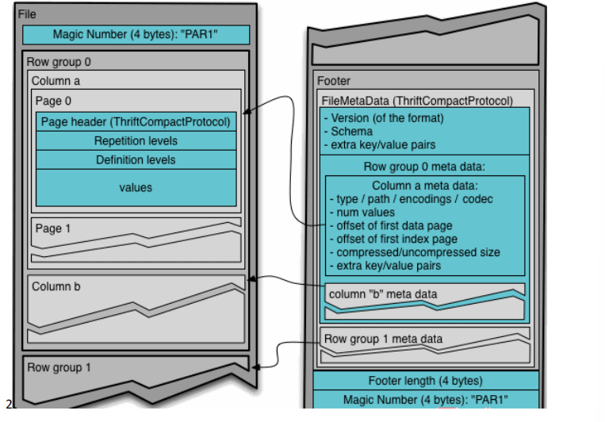

[toc]


# Hive 基本概念

## 什么是 Hive

* 由 Facebook 开源用于解决**海量结构化**日志的数据统计工具
* 基于 Hadoop
* 将结构化的数据文件**映射为一张表**，并提供类 SQL 查询功能
* 将 **HQL 转化成 MapReduce** 程序
* 处理的数据存储在 HDFS
* 分析数据底层的实现是 MapReduce
* 执行程序运行在 Yarn 上

## Hive 的优缺点

|优点|缺点|
| :--: | :--: |
|<p>1. 采用类 SQL 语法,简单、容易上手</p><p>2. 避免了去写 MapReduce，减少开发人员的学习成本</p><p>3. 执行延迟比较高,用于于处理大数据数据分析，对实时性要求不高的场合</p><p>4. 支持用户自定义函数</p>|<p>1.HQL 表达能力有限</p><p>2.效率比较低</p>|

## Hive 架构原理

<span style="text-align: center;display:block;">

<span style="text-align: center;display:block;">Hive架构原理</span></span>

1. 用户接口：Client
    * CLI(command-line interface)
    * JDBC/ODBC(jdbc 访问 hive)
    * WEBUI(浏览器访问 hive)
2. 元数据：Metastore
    * 表名、表所属的数据库（默认是 default）、表的拥有者、列/分区字段、表的类型（是否是外部表）、表的数据所在目录等
    * 默认存储在自带的 **derby 数据库**中，**推荐使用 MySQL 存储 Metastore**
3. Hadoop
4. 驱动器：Driver
    * 解析器(SQL Parser):将 SQL 字符串转换成**抽象语法树 AST**,检查语法错误
    * 编译器(Physical Plan):将 AST 编译生成**逻辑执行计划**
    * 优化器(Query Optimizer):对逻辑执行计划进行**优化**
    * 执行器(Execution):把逻辑执行计划转换成可以运行的**物理计划**

## Hive 和数据库比较

* 从结构上来看，Hive 和数据库除了拥有类似的查询语言，再无类似之处。

|Hive|数据库|
| :--: | :--: |
|为数据仓库而设计|用在 Online 的应用|
|类 SQL 的查询语言 HQL|SQL|
|Hive 中 不建议对数据的改写，所有的数据都是在加载的时候确定好的|经常进行修改|
|没有索引,MapReduce 框架,延迟较高,但是并行计算|延迟较低|
|MapReduce 进行并行计算，因此可以支持很大规模的数据|支持的数据规模较小|

# Hive 安装

[Linux环境下Hive的安装部署]("https://github.com/heibaiying/BigData-Notes/blob/master/notes/installation/Linux环境下Hive的安装部署.md")

## Hive 常用交互命令

|功能|命令|
|不进入 hive 的交互窗口执行 sql 语句|`-e`|
|执行脚本中 sql 语句|`-f`|
|退出 hive 窗口|`exit;` `quit;`|
|在 hive cli 命令窗口中如何查看 hdfs 文件系统|`dfs -ls /` `fs -ls /`|
|查看在 hive 中输入的所有历史命令|进入用户根目录 `cat .hivehistory`|
|查看当前所有的配置信息|`set;`|

## Hive 常见属性配置

* Hive 运行日志信息配置
    * log 默认存放在/tmp/root/hive.log 目录下（当前用户名下）
    * 修改 hive 的 log 存放日志
        * `${HIVE_HOME}/conf/hive-log4j2.properties`
        * `hive.log.dir=<path>`
* 打印 当前库 和 表头
    * `hive-site.xml`
    ```xml
        <property>
        <name>hive.cli.print.header</name>
        <value>true</value>
        </property>
        <property>
        <name>hive.cli.print.current.db</name>
        <value>true</value>
        </property>
    ```
* 参数配置方式
    * 配置文件方式
        * 默认配置文件：`hive-default.xml`
        * 用户自定义配置文件：`hive-site.xml`
    * 命令行参数方式
        * 添加`-hiveconf param=value`来设定参数(仅对本次 hive 启动有效)
    * 参数声明方式
        * `set mapred.reduce.tasks=100;`(仅对本次 hive 启动有效)
    * 优先级
        * 优先级依次递增，**配置文件<命令行参数<参数声明**
        * log4j 相关的设定等，**必须用前两种方式设定**

# Hive 数据类型

## 基本数据类型

|Hive数据类型|Java数据类型|长度|例子|
| :-- | :-- | :-- | :-- |
|TINYINT|byte|1byte 有符号整数|20|
|SMALINT|short|2byte 有符号整数|20|
|INT|int|4byte 有符号整数|20|
|BIGINT|long|8byte 有符号整数|20|
|BOOLEAN|boolean 布尔类型，true 或者 false|TRUE FALSE|
|FLOAT|float|单精度浮点数|3.14159|
|DOUBLE|double|双精度浮点数|3.14159|
|STRING|string|字符系列。可以指定字符集。可以使用单引号或者双引号。|'now is the time' "for all good men"|
|TIMESTAMP||时间类型||
|BINARY||字节数组||

## 集合数据类型

|数据类型|描述|语法示例|
| :-- | :-- | :-- |
|STRUCT|和 c 语言中的 struct 类似，都可以通过“点”符号访问元素内容。例如，如果某个列的数据类型是 STRUCT{first STRING, last STRING},那么第 1 个元素可以通过字段.first 来引用。|struct()例 如 struct<street:string, city:string>|
|MAP|MAP 是一组键-值对元组集合，使用数组表示法可以访问数据。例如，如果某个列的数据类型是 MAP，其中键->值对是’first’->’John’和’last’->’Doe’，那么可以通过字段名[‘last’]获取最后一个元素|map()例如 map<string, int>|
|ARRAY|数组是一组具有相同类型和名称的变量的集合。这些变量称为数组的元素，每个数组元素都有一个编号，编号从零开始。例如，数组值为[‘John’, ‘Doe’]，那么第 2 个元素可以通过数组名[1]进行引用。|Array() 例如 array<string>|

## 案例实操

* 假设某表有如下一行，我们用 JSON 格式来表示其数据结构
```json
{
    "name": "songsong",
    "friends": ["bingbing" , "lili"] , //列表 Array, 
    "children": { //键值 Map,
        "xiao song": 18 ,
        "xiaoxiao song": 19
    }
    "address": { //结构 Struct,
        "street": "hui long guan",
        "city": "beijing"
    } 
}
```
* 基于上述数据结构，我们在 **Hive 里创建对应的表**，并导入数据
* 创建本地测试文件 test.txt
```txt
songsong,bingbing_lili,xiao song:18_xiaoxiao song:19,hui long guan_beijing
yangyang,caicai_susu,xiao yang:18_xiaoxiao yang:19,chao yang_beijing
```
* Hive 上创建测试表 test
    ```sql
    create table test(
        name string,
        friends array<string>,
        children map<string, int>,
        address struct<street:string, city:string> 
    )
    row format delimited fields terminated by ','
    collection items terminated by '_'
    map keys terminated by ':'
    lines terminated by '\n';
    ```
    * 字段解释

    |&#x1F308;|&#x1F308;|
    | :-- | :-- |
    |`row format delimited fields terminated by ','`|列分隔符|
    |`collection items terminated by '_'`|MAP STRUCT 和 ARRAY 的分隔符(数据分割符号)|
    |`map keys terminated by ':'`|MAP 中的 key 与 value 的分隔符|
    |`lines terminated by '\n';`|行分隔符|

* 导入文本数据到测试表 `load data local inpath '/opt/module/hive/datas/test.txt' into table test;`

* 访问三种集合列里的数据，以下分别是 ARRAY，MAP，STRUCT 的访问方式
    * ARRAY:`friends[1]`
    * MAP:`children['xiao song']`
    * STRUCT:`address.city`

## 类型转化

* 隐式类型转换规则
    * 任何整数类型都可以隐式地转换为**一个范围更广**的类型，如 TINYINT 可以转换成INT，INT 可以转换成 BIGINT。 
    * 所有整数类型、FLOAT 和 STRING 类型**都可以隐式地转换成 DOUBLE**。 
    * TINYINT、SMALLINT、INT 都可以**转换为 FLOAT**。 
    * BOOLEAN 类型**不可以转换为任何其它的类型**。
* 可以使用 CAST 操作显示进行数据类型转换 `CAST('1' AS INT)将`
    * 强制类型转换失败,返回**空值 NULL**

# DDL,DCL

## 创建数据库

|&#x1F308;|&#x1F308;|
| :-- | :-- |
|创建一个数据库，数据库在 HDFS 上的默认存储路径是/user/hive/warehouse/*.db|`create database db_hive;`|
|增加 if not exists 判断|` create database if not exists db_hive;`|
|创建一个数据库，指定数据库在 HDFS 上存放的位置|` create database db_hive2 location '/db_hive2.db';`|


## 查询数据库

|&#x1F308;|&#x1F308;|
| :-- | :-- |
|显示数据库|`show databases;`|
|过滤显示查询的数据库|`show databases like 'db_hive*';`|
|显示数据库信息|`desc database db_hive;`|
|显示数据库详细信息，extended|`desc database extended db_hive;`|
|切换当前数据库|`use db_hive;`|

## 修改数据库

|&#x1F308;|&#x1F308;|
| :-- | :-- |
|使用 ALTER DATABASE 命令为某个数据库的 DBPROPERTIES 设置键-值对属性值|`alter database db_hive set dbproperties('key'='value');`|

* **修改数据表同理**

## 删除数据库

|&#x1F308;|&#x1F308;|
| :-- | :-- |
|删除空数据库|`drop database db_hive2;`|
|采用 if exists 判断数据库是否存在|`drop database if exists db_hive2;`|
|可以采用 cascade 命令，强制删除|`drop database db_hive cascade;`|

## 创建表

* 建表语法
```s
CREATE [EXTERNAL] TABLE [IF NOT EXISTS] table_name
[(col_name data_type [COMMENT col_comment], ...)]
[COMMENT table_comment]
[PARTITIONED BY (col_name data_type [COMMENT col_comment], ...)]
[CLUSTERED BY (col_name, col_name, ...)
[SORTED BY (col_name [ASC|DESC], ...)] INTO num_buckets BUCKETS]
[ROW FORMAT row_format]
[STORED AS file_format]
[LOCATION hdfs_path]
[TBLPROPERTIES (property_name=property_value, ...)]
[AS select_statement]
```

* 字段解释

|&#x1F308;|&#x1F308;|
| :-- | :-- |
|`EXTERNAL`|创建一个外部表,指向实际数据的路径（LOCATION），在删除表的时候，内部表的元数据和数据会被一起删除，而外部表**只删除元数据，不删除数据**|
|`COMMENT`|为表和列添加注释。|
|`PARTITIONED BY`|创建分区表|
|`CLUSTERED BY`|创建分桶表|
|`SORTED BY`|对桶中的一个或多个列另外排序|
|`ROW FORMAT`|分割规则，Hive 通过 SerDe 确定表
的具体的列的数据|
|`STORED AS`|指定存储文件类型 SEQUENCEFILE（二进制序列文件）、TEXTFILE（文本）、RCFILE（列式存储格式文件）|
|`LOCATION`|指定表在 HDFS 上的存储位置|
|`AS`|后跟查询语句，根据查询结果创建表|
|`LIKE`|允许用户复制现有的表结构，但是不复制数据|

## 管理表(内部表)

* 数据存储在由配置项 `hive.metastore.warehouse.dir` 所定义的目录的子目录下
* 当我们删除一个管理表时，Hive 也会删除这个表中数据

### 案例实操

* 原始数据
```
1001 ss1
1002 ss2
1003 ss3
1004 ss4
1005 ss5
1006 ss6
1007 ss7
1008 ss8
1009 ss9
1010 ss10
1011 ss11
1012 ss12
1013 ss13
1014 ss14
1015 ss15
1016 ss16
```
* 普通创建表
```sql
create table if not exists student(
id int, name string
)
row format delimited fields terminated by '\t'
stored as textfile
location '/user/hive/warehouse/student';
```
* 根据查询结果创建表（查询的结果会添加到新创建的表中）
```sql
create table if not exists student2 as select id, name from student;
```
* 根据已经存在的表结构创建表
```sql
create table if not exists student3 like student;
```
* 查询表的类型
```sql
desc formatted student2;
```

## 外部表

*  Hive 并非认为其完全拥有这份数据。删除该表并不会删除掉这份数据，不过描述表的元数据信息会被删除掉

### 案例实操

* 原始数据
    * dept:
    ```
    10 ACCOUNTING 1700
    20 RESEARCH 1800
    30 SALES 1900
    40 OPERATIONS 1700
    ```
    * emp:
    ```
    7369 SMITH CLERK 7902 1980-12-17 800.00 20
    7499 ALLEN SALESMAN 7698 1981-2-20 1600.00 300.00 30
    7521 WARD SALESMAN 7698 1981-2-22 1250.00 500.00 30
    7566 JONES MANAGER 7839 1981-4-2 2975.00 20
    7654 MARTIN SALESMAN 7698 1981-9-28 1250.00 1400.00 30
    7698 BLAKE MANAGER 7839 1981-5-1 2850.00 30
    7782 CLARK MANAGER 7839 1981-6-9 2450.00 10
    7788 SCOTT ANALYST 7566 1987-4-19 3000.00 20
    7839 KING PRESIDENT 1981-11-17 5000.00 10
    7844 TURNER SALESMAN 7698 1981-9-8 1500.00 0.00 30
    7876 ADAMS CLERK 7788 1987-5-23 1100.00 20
    7900 JAMES CLERK 7698 1981-12-3 950.00 30
    7902 FORD ANALYST 7566 1981-12-3 3000.00 20
    7934 MILLER CLERK 7782 1982-1-23 1300.00 10
    ```
* 上传数据到 HDFS

* 建表语句，创建外部表
```sql
create external table if not exists dept(
deptno int,
dname string,
loc int
)
row format delimited fields terminated by ' '
LOCATION '/external/dept';
```
```sql
create external table if not exists emp(
empno int,
ename string,
job string,
mgr int,
hiredate string,
sal double,
comm double,
deptno int)
row format delimited fields terminated by ' '
LOCATION '/external/emp';
```
* 查看创建的表
* 删除外部表

### 管理表与外部表的互相转换

`alter table student2 set tblproperties('EXTERNAL'='TRUE');`

* ('EXTERNAL'='TRUE')和('EXTERNAL'='FALSE') **区分大小写**

## 修改表

### 重命名表

* 语法 `ALTER TABLE table_name RENAME TO new_table_name`
* 实操 `alter table dept_partition2 rename to dept_partition3;`

### 增加/修改/替换列信息

* 语法 
    * 更新列 `ALTER TABLE table_name CHANGE COLUMN col_old_name col_new_name column_type [COMMENT col_comment] [FIRST|AFTER column_name]`
    * 增加和替换列 `ALTER TABLE table_name ADD|REPLACE COLUMNS (col_name data_type [COMMENT col_comment], ...)`
        * ADD 是代表新增一字段，字段位置在**所有列后面**(partition 列前)
        * REPLACE 则是表示替换表中所有字段
* 实操 
    * 更新列 `alter table dept change column deptdesc desc string;`
    * 添加列 `alter table dept add columns(deptdesc string);`
    * 替换列 `alter table dept replace columns(deptno string, dname string, loc string);`

## 删除表

`drop table dept;`

# DML 数据操作

## 数据导入

### 向表中装载数据（Load）

* 语法 ` load data [local] inpath '数据的 path' [overwrite] into table student [partition (partcol1=val1,…)];`

    * load data:表示加载数据
    * local:表示从本地加载数据到 hive 表；否则从 HDFS 加载数据到 hive 表 
    * inpath:表示加载数据的路径
    * overwrite:表示覆盖表中已有数据，否则表示追加
    * into table:表示加载到哪张表
    * student:表示具体的表
    * partition:表示上传到指定分区

* 实操 
    * create table: `create table student(id string, name string) row format delimited fields terminated by '\t';`
    * load local data: `load data local inpath '/opt/module/hive/datas/student.txt' into table default.student;`
    * load hdfs data: `load data inpath '/user/atguigu/hive/student.txt' into table default.student;`
    * load overwrite data: `load data inpath '/user/atguigu/hive/student.txt' overwrite into table default.student;`

### 通过查询语句向表中插入数据（Insert）

* 基本插入数据 `insert into table student_par values(1,'wangwu'),(2,'zhaoliu');`
* 基本模式插入（根据单张表查询结果） `insert overwrite table student_par select id, name from student where month='201709';`
* 多表（多分区）插入模式（根据多张表查询结果）
```sql
from student
insert overwrite table student partition(month='201707')
select id, name where month='201709'
insert overwrite table student partition(month='201706')
select id, name where month='201709';
```

### 查询语句中创建表并加载数据（As Select）

`create table if not exists student3 as select id, name from student;`

### 创建表(外部表)时通过 Location 指定加载数据路径

```sql
create external table if not exists student5(
id int, name string
)
row format delimited fields terminated by '\t'
location '/student;
```

### Import 数据到指定 Hive 表中

`import table student2 from '/user/hive/warehouse/export/student';`

## 数据导出

### Insert 导出

* 将查询的结果导出到本地 `insert overwrite local directory '/opt/module/hive/data/export/student' select * from student;`
* 将查询的结果格式化导出到本地 `insert overwrite local directory '/opt/module/hive/data/export/student1' ROW FORMAT DELIMITED FIELDS TERMINATED BY '\t' select * from student;`
* 将查询的结果导出到 HDFS 上(没有 local) `insert overwrite directory '/user/atguigu/student2' ROW FORMAT DELIMITED FIELDS TERMINATED BY '\t' select * from student;`

### Hadoop 命令导出到本地

* 基本语法：（hive -f/-e 执行语句或者脚本 > file） `bin/hive -e 'select * from default.student;' >/opt/module/hive/data/export/student4.txt;`

### Export 导出到 HDFS 上

`export table default.student to '/user/hive/warehouse/export/student';`

### 清除表中数据（Truncate）

* Truncate 只能删除管理表，不能删除外部表中数据
`truncate table student;`

# 查询

* 列别名 `as`

## 算术运算符

|运算符|描述|
| :-- | :-- |
|A+B|A 和 B|相加|
|A-B|A 减去 B|
|A*B|A 和 B 相乘|
|A/B|A 除以 B|
|A%B|A 对 B 取余|
|A&B|A 和 B 按位取与|
|A|B|A 和 B 按位取或|
|A^B|A 和 B 按位取异或|
|~A|A 按位取反|

## 常用函数

|功能|函数|
| :-- | :-- |
|总行数|`count(*)`|
|最大值|`max(sal)`|
|最小值|`min(sal)`|
|总和|`sum(sql)`|
|平均值|`avg(sql)`|

## 比较运算符（Between/In/ Is Null）

* 下面表中描述了谓词操作符，这些操作符同样可以用于 JOIN…ON 和 HAVING 语句中

|操作符|支持的数据类型|描述|
| :-- | :-- | :-- |
|`A=B`|基本数据类型|如果 A 等于 B 则返回 TRUE，反之返回 FALSE|
|`A<=>B`|基本数据类型|如果 A 和 B 都为 NULL，则返回 TRUE，如果一边为 NULL，返回 False|
|`A<>B, A!=B`|基本数据类型|A 或者 B 为 NULL 则返回 NULL；如果 A 不等于 B，则返回TRUE，反之返回 FALSE|
|`A<B`|基本数据类型|A 或者 B 为 NULL，则返回 NULL；如果 A 小于 B，则返回TRUE，反之返回 FALSE|
|`A<=B`|基本数据类型|A 或者 B 为 NULL，则返回 NULL；如果 A 小于等于 B，则返回 TRUE，反之返回 FALSE|
|`A>B`|基本数据类型|A 或者 B 为 NULL，则返回 NULL；如果 A 大于 B，则返回TRUE，反之返回 FALSE|
|`A [NOT] BETWEEN B AND C`|基本数据类型|如果 A，B 或者 C 任一为 NULL，则结果为 NULL。如果 A 的值大于等于 B 而且小于或等于 C，则结果为 TRUE，反之为 FALSE。如果使用 NOT 关键字则可达到相反的效果。|
|`A IS NULL`|所有数据类型|如果 A 等于 NULL，则返回 TRUE，反之返回 FALSE|
|`A IS NOT NULL`|所有数据类型|如果 A 不等于 NULL，则返回 TRUE，反之返回 FALSE|
|`IN(数值 1, 数值 2)`|所有数据类型|使用 IN 运算显示列表中的值|
|`A [NOT] LIKE B`|STRING 类型|B 是一个 SQL 下的简单正则表达式，也叫通配符模式，如 果 A 与其匹配的话，则返回 TRUE；反之返回 FALSE。B 的表达式说明如下：‘x%’表示 A 必须以字母‘x’开头，‘%x’表示 A必须以字母’x’结尾，而‘%x%’表示 A 包含有字母’x’,可以位于开头，结尾或者字符串中间。如果使用 NOT 关键字则可达到相反的效果。|
|`A RLIKE B, A REGEXP B`|STRING 类型|B 是基于 java 的正则表达式，如果 A 与其匹配，则返回TRUE；反之返回 FALSE。匹配使用的是 JDK 中的正则表达式接口实现的，因为正则也依据其中的规则。例如，正则表达式必须和整个字符串 A 相匹配，而不是只需与其字符串匹配。|

* 案例
    * 查询出薪水等于 5000 的所有员工 `select * from emp where sal =5000;`
    * 查询工资在 500 到 1000 的员工信息 `select * from emp where sal between 500 and 1000;`
    * 查询 comm 为空的所有员工信息 `select * from emp where comm is null;`
    * 查询工资是 1500 或 5000 的员工信息 `select * from emp where sal IN (1500, 5000);`

## Like 和 RLike

* % 代表**零个或多个字符**(任意个字符)
* _ 代表**一个字符**

* RLIKE 子句: **Java 的正则表达式**

* 案例
    * 查找名字以 A 开头的员工信息 `select * from emp where ename LIKE 'A%';`
    * 查找名字中第二个字母为 A 的员工信息 `select * from emp where ename LIKE '_A%';`
    * 查找名字中带有 A 的员工信息 `select * from emp where ename RLIKE '[A]';`

## 分组

### Group By 语句

* 计算 emp 表每个部门的平均工资 `select t.deptno, avg(t.sal) avg_sal from emp t group by t.deptno;`
* 计算 emp 每个部门中每个岗位的最高薪水 `select t.deptno, t.job, max(t.sal) max_sal from emp t group by t.deptno, t.job;`

### Having 语句

* having 与 where 不同点: **where 后面不能写分组函数**，而 having 后面**可以使用分组函数**
* having 只用于**group by 分组统计语句**

* 案例: 求每个部门的平均薪水大于 2000 的部门
    * 求每个部门的平均工资 `select deptno, avg(sal) from emp group by deptno;`
    * 求每个部门的平均薪水大于 2000 的部门 `select deptno, avg(sal) avg_sal from emp group by deptno having avg_sal > 2000;`

## 连接

* 等值 Join,内连接: `表1 join 表2 on ..`
* 左外连接: `表1 left join 表2 on ..`
* 多表连接查询：`表1 join 表2 on .. join 表3 on ..`
* 右外连接: `表1 right join 表2 on ..`
* 满外连接: `表1 full join 表2 on ..`

## 排序

### 全局排序（Order By）

Order By：全局排序，只有一个 Reducer

### 每个 Reduce 内部排序（Sort By）

* 设置 reduce 个数: `set mapreduce.job.reduces=3;`
* `select * from emp sort by deptno desc;`

### 分区（Distribute By）

* distribute by 控制某个特定行应该到哪个 reducer, 类似 MR 中 partition（自定义分区）
* distribute by 的分区规则是**根据分区字段的 hash 码**与 reduce 的个数进行模除后，余数相同的分到一个区。
* Hive 要求 DISTRIBUTE BY 语句要写在 **SORT BY 语句之前**

### Cluster By

* Sort By和Distribute By**合体**，只能升序

# 分区表和分桶表

## 分区表

* Hive 中的分区就是分目录
* 分区字段**不能是表中已经存在的数据**，可以将分区字段看作表的伪列
* 加载数据 `load data local inpath '/opt/module/hive/datas/dept_20200401.log' into table dept_partition partition(day='20200401');`
* 查询分区表中数据 `select * from dept_partition where day='20200401';`
* 增加分区 `alter table dept_partition add partition(day='20200404')  [partition(day='20200404')];`
* 删除分区 `alter table dept_partition drop partition(day='20200406'), [partition(day='20200405')];`
* 查看分区表有多少分区 `show partitions dept_partition;`

## 二级分区

* 创建二级分区表 `partitioned by (day string, hour string)`
* 加载数据到二级分区表中 `load data local inpath '/opt/module/hive/datas/dept_20200401.log' into tabledept_partition2 partition(day='20200401', hour='12');`
* 把数据直接上传到分区目录上，让分区表和数据产生关联的三种方式
    * 上传数据后修复 `msck repair table dept_partition2;`
    * 上传数据后添加分区 `alter table dept_partition2 add partition(day='201709',hour='14');`
    * 创建文件夹后 load 数据到分区 `load data local inpath '/opt/module/hive/datas/dept_20200401.log' into tabledept_partition2 partition(day='20200401',hour='15');`

## 动态分区调整

### 开启动态分区参数设置

* 默认开启 `hive.exec.dynamic.partition=true`
* 设置为非严格模式 `hive.exec.dynamic.partition.mode=nonstrict`,默认为 `strict`，表示必须指定至少一个分区为静态分区
* **所有执行** MR 的节点上,最大**一共可以创建**多少个动态分区。默认 1000 `hive.exec.max.dynamic.partitions=1000`
* **在每个执行** MR 的节点上，**最大可以创建**多少个动态分区 `hive.exec.max.dynamic.partitions.pernode` ,根据实际的数据来设定,n必须大于max(set(每个字段).length)
* 整个 MR Job 中，**最大可以创建**多少个 HDFS 文件 `hive.exec.max.created.files=100000`
* 当有空分区生成时，**是否抛出异常** `hive.error.on.empty.partition=false`

### 案例

* 创建目标分区表
```sql
create table dept_partition_dy(id int, name string) 
partitioned by (loc int) row format delimited fields terminated by '\t';
```
* 设置动态分区
```sql
set hive.exec.dynamic.partition.mode = nonstrict;
insert into table dept_partition_dy partition(loc) select deptno, dname, loc from dept;
```

## 分桶表

* 分桶是将数据集分解成更容易管理的若干部分的另一个技术
* 分区针对的是*数据的存储路径*；分桶**针对的是数据文件**
* Hive 的分桶采用对分桶字段的值**进行哈希**，然后除以桶的个数求余的方式决定该条记录存放在哪个桶当中
* reduce 需要设置为 -1 或 >= 桶数
* 不要使用本地模式

* 创建分桶表
```sql
create table stu_buck(id int, name string)
clustered by(id) 
into 4 buckets
row format delimited fields terminated by '\t';
```

## 抽样查询

* 语法：`TABLESAMPLE(BUCKET x OUT OF y)`,x 的值必须小于等于 y 的值。

* `select * from stu_buck tablesample(bucket 1 out of 4 on id);`

# 函数

## 系统内置函数

* 查看系统自带的函数 `show functions;`
* 显示自带的函数的用法 `desc function upper;`
* 详细显示自带的函数的用法 `desc function extended upper;`

## 常用内置函数

|功能|用法|说明|
| :-- | :-- | :-- |
|空字段赋值|`NVL(value，default_value)`|如果 value 为 NULL，则 NVL 函数返回 default_value 的值，否则返回 value 的值，如果两个参数都为 NULL ，则返回 NULL|
|模式匹配|`case sex when '男' then 1 else 0 end`|类似case语法，else是default语句|
|行转列|`CONCAT(string A/col, string B/col…)`|一行不同字段，转为一个字段，参数为字符串或字段|
|带分隔符的行转列|`CONCAT_WS(separator, str1, str2,...)`|如果分隔符是 NULL，返回值也将为 NULL。CONCAT_WS must be **string or array<string>**,类似python中join函数|
|将某字段的值进行去重
汇总|`COLLECT_SET(col)`|函数只接受基本数据类型|
|拆分成多行|`EXPLODE(col)`|复杂的 Array 或者 Map 结构拆分成多行|
|列转行|`LATERAL VIEW udtf(expression) tableAlias AS columnAlias`|和split, explode等UDTF会形成临时表一起使用,将一行数据拆成多行数据，在此基础上可以对拆分后的数据进行聚合,tableAlias 为 临时表别名|
|窗口函数|`聚合函数 OVER(指定分析函数工作的数据窗口大小) AS 别名`|我们都知道在sql中有一类函数叫做聚合函数,例如sum()、avg()、max()等等,这类函数可以将多行数据按照规则聚集为一行,一般来讲聚集后的行数是要少于聚集前的行数的.但是有时我们想要**既显示聚集前的数据,又要显示聚集后的数据**,这时我们便引入了窗口函数，例子：`ROW_NUMBER() OVER(PARTITION BY cookieid ORDER BY pv desc) AS rn`|
|基本排序|`RANK()`|排序相同时会重复，序号排列会有空隙|
|紧接排序|`DENSE_RANK()`|排序相同时会重复，序号排列没有空隙|
|数字排序|`ROW_NUMBER()`|会根据顺序计算，没有重复|

### 其他常用函数

常用日期函数
unix_timestamp:返回当前或指定时间的时间戳	
select unix_timestamp();
select unix_timestamp("2020-10-28",'yyyy-MM-dd');

from_unixtime：将时间戳转为日期格式
select from_unixtime(1603843200);

current_date：当前日期
select current_date;

current_timestamp：当前的日期加时间
select current_timestamp;

to_date：抽取日期部分
select to_date('2020-10-28 12:12:12');

year：获取年
select year('2020-10-28 12:12:12');

month：获取月
select month('2020-10-28 12:12:12');

day：获取日
select day('2020-10-28 12:12:12');

hour：获取时
select hour('2020-10-28 12:12:12');

minute：获取分
select minute('2020-10-28 12:12:12');

second：获取秒
select second('2020-10-28 12:12:12');

weekofyear：当前时间是一年中的第几周
select weekofyear('2020-10-28 12:12:12');

dayofmonth：当前时间是一个月中的第几天
select dayofmonth('2020-10-28 12:12:12');

months_between： 两个日期间的月份
select months_between('2020-04-01','2020-10-28');

add_months：日期加减月
select add_months('2020-10-28',-3);

datediff：两个日期相差的天数
select datediff('2020-11-04','2020-10-28');

date_add：日期加天数
select date_add('2020-10-28',4);

date_sub：日期减天数
select date_sub('2020-10-28',-4);

last_day：日期的当月的最后一天
select last_day('2020-02-30');

date_format(): 格式化日期
select date_format('2020-10-28 12:12:12','yyyy/MM/dd HH:mm:ss');

常用取整函数
round： 四舍五入
select round(3.14);
select round(3.54);

ceil：  向上取整
select ceil(3.14);
select ceil(3.54);

floor： 向下取整
select floor(3.14);
select floor(3.54);

常用字符串操作函数
upper： 转大写
select upper('low');

lower： 转小写
select lower('low');

length： 长度
select length("atguigu");

trim：  前后去空格
select trim(" atguigu ");

lpad： 向左补齐，到指定长度
select lpad('atguigu',9,'g');

rpad：  向右补齐，到指定长度
select rpad('atguigu',9,'g');

regexp_replace：使用正则表达式匹配目标字符串，匹配成功后替换！
SELECT regexp_replace('2020/10/25', '/', '-');

集合操作
size： 集合中元素的个数
select size(friends) from test3;

map_keys： 返回map中的key
select map_keys(children) from test3;

map_values: 返回map中的value
select map_values(children) from test3;

array_contains: 判断array中是否包含某个元素
select array_contains(friends,'bingbing') from test3;

sort_array： 将array中的元素排序
select sort_array(friends) from test3;

grouping_set:多维分析

CURRENT ROW：当前行
n PRECEDING：往前 n 行数据
n FOLLOWING：往后 n 行数据
UNBOUNDED：起点，
UNBOUNDED PRECEDING 表示从前面的起点，
 UNBOUNDED FOLLOWING 表示到后面的终点
LAG(col,n,default_val)：往前第 n 行数据
LEAD(col,n, default_val)：往后第 n 行数据
NTILE(n)：把有序窗口的行分发到指定数据的组中，各个组有编号，编号从 1 开始，对
于每一行，NTILE 返回此行所属的组的编号。注意：n 必须为 int 类型。

## 自定义函数

* UDF用户自定义函数(user-defined function) **一进一出**
* UDAF用户自定义聚合函数(User-Defined Aggregation Function) **聚集函数，多进一出** like *count/max/min*
* UDTF户自定义表生成函数(User-Defined Table-Generating Functions) **一进多出** like *lateral view explode()*

* 编程步骤
    * 继承 Hive 提供的类
    ```java
    org.apache.hadoop.hive.ql.udf.generic.GenericUDF
    org.apache.hadoop.hive.ql.udf.generic.GenericUDTF
    ```
    * 实现抽象方法
    * 在hive命令行创建函数
        * 添加jar `add jar linux_jar_path`
        * 创建 function `create [temporary] function [dbname.]function_name AS class_name;`
    * 在 hive 的命令行窗口删除函数 `drop [temporary] function [if exists] [dbname.]function_name;`

## 自定义 UDF 函数 实例

* *需求*：自定义一个 UDF 实现计算给定字符串的长度
* *步骤*
    1. 创建一个maven工程并添加依赖
    ```xml
    <dependency>
        <groupId>org.apache.hive</groupId>
        <artifactId>hive-exec</artifactId>
        <version>3.1.2</version>
    </dependency>
    ```
    2. 创建一个类 继承 GenericUDF类
    ```java
    import org.apache.hadoop.hive.ql.exec.UDFArgumentException;
    import org.apache.hadoop.hive.ql.exec.UDFArgumentLengthException;
    import org.apache.hadoop.hive.ql.exec.UDFArgumentTypeException;
    import org.apache.hadoop.hive.ql.metadata.HiveException;
    import org.apache.hadoop.hive.ql.udf.generic.GenericUDF;
    import org.apache.hadoop.hive.serde2.objectinspector.ObjectInspector;
    import org.apache.hadoop.hive.serde2.objectinspector.primitive.PrimitiveObjectIn
    spectorFactory;
    /**
    * 自定义 UDF 函数，需要继承 GenericUDF 类
    * 需求: 计算指定字符串的长度
    */
    public class MyStringLength extends GenericUDF {
        /**
        *
        * @param arguments 输入参数类型的鉴别器对象
        * @return 返回值类型的鉴别器对象
        * @throws UDFArgumentException
        */
        @Override
        public ObjectInspector initialize(ObjectInspector[] arguments) throws UDFArgumentException {
            // 判断输入参数的个数
            if(arguments.length !=1){
                throw new UDFArgumentLengthException("Input Args Length Error!!!");
            }
            // 判断输入参数的类型
            if(!arguments[0].getCategory().equals(ObjectInspector.Category.PRIMITIVE)){
                throw new UDFArgumentTypeException(0,"Input Args Type Error!!!");
            }
            //函数本身返回值为 int，需要返回 int 类型的鉴别器对象
            return PrimitiveObjectInspectorFactory.javaIntObjectInspector;
        }
        /**
        * 函数的逻辑处理
        * @param arguments 输入的参数
        * @return 返回值
        * @throws HiveException
        */
        @Override
        public Object evaluate(DeferredObject[] arguments) throws HiveException {
            if(arguments[0].get() == null){
                return 0;
            }
            return arguments[0].get().toString().length();
        }
        @Override
        public String getDisplayString(String[] children) {
            return "";
        } 
    }
    ```
    * 打成 jar 包上传到服务器
    * 将 jar 包添加到 **hive 的 classpath** `add jar <jar path>;`
    * 创建临时函数与开发好的 java class 关联 `create temporary function my_len as "<包名>";`
    * 使用 `select ename,my_len(ename) ename_len from emp;`

## 自定义 UDTF 函数 实例

* *需求*:自定义一个 UDTF 实现将一个任意分割符的字符串切割成独立的单词
* *步骤*，与 自定义 UDF 类似
    * 代码实现,只显示核心代码
    ```java
    private ArrayList<String> outList = new ArrayList<>();
    initialize{
        //1.定义输出数据的列名和类型
        List<String> fieldNames = new ArrayList<>();
        List<ObjectInspector> fieldOIs = new ArrayList<>();
        //2.添加输出数据的列名和类型
        fieldNames.add("lineToWord");
        fieldOIs.add(PrimitiveObjectInspectorFactory.javaStringObjectInspector);
        return ObjectInspectorFactory.getStandardStructObjectInspector(fieldNames, 
        fieldOIs);
    }
    process{
        //1.获取原始数据
        String arg = args[0].toString();
        //2.获取数据传入的第二个参数，此处为分隔符
        String splitKey = args[1].toString();
        //3.将原始数据按照传入的分隔符进行切分
        String[] fields = arg.split(splitKey);
        //4.遍历切分后的结果，并写出
        for (String field : fields) {
            //集合为复用的，首先清空集合
            outList.clear();
            //将每一个单词添加至集合
            outList.add(field);
            //将集合内容写出
            forward(outList);
        }
    }
    ```

# 压缩和存储

## Hadoop 压缩配置

> 参考 Hadoop.pdf 中的 压缩

### 开启 Map 输出阶段压缩（MR 引擎）

* hive命令行 
    * 开启 hive 中间传输数据压缩功能 `set hive.exec.compress.intermediate=true;`
    * 开启 mapreduce 中 map 输出压缩功能 `set mapreduce.map.output.compress=true;`
    * 设置 mapreduce 中 map 输出数据的压缩方式 `set mapreduce.map.output.compress.codec=org.apache.hadoop.io.compress.SnappyCodec;`

### 开启 Reduce 输出阶段压缩（MR 引擎）

* hive命令行
    * 开启 hive 最终输出数据压缩功能 `set hive.exec.compress.output=true;`
    * 开启 mapreduce 最终输出数据压缩 `set mapreduce.output.fileoutputformat.compress=true;`
    * 设置 mapreduce 最终数据输出压缩方式 `set mapreduce.output.fileoutputformat.compress.codec =org.apache.hadoop.io.compress.SnappyCodec;`
    * 设置 mapreduce 最终数据输出压缩为块压缩 `set mapreduce.output.fileoutputformat.compress.type=BLOCK;`

## 文件存储格式

Hive 支持的存储数据的格式主要有：TEXTFILE 、SEQUENCEFILE、ORC、PARQUET。

### 列式存储和行式存储

<span style="display:block;text-align:center;">

<span style="display:block;text-align:center;">如图所示左边为逻辑表，右边第一个为行式存储，第二个为列式存储。</span>
</span>

* 行存储的特点
    * **查询满足条件的一整行数据**的时候，列存储则需要去每个聚集的字段找到对应的每个列的值，行存储只需要找到其中一个值，其余的值都在相邻地方，所以此时**行存储查询的速度**更快。
* 列存储的特点
    因为每个字段的数据聚集存储，在**查询只需要少数几个字段的时候**，能大大**减少读取的数据量**；每个字段的数据类型一定是相同的，列式存储可以针对性的**设计更好的设计压缩算法**。
* TEXTFILE 和 SEQUENCEFILE 的存储格式都是基于行存储的；
* ORC 和 PARQUET 是基于列式存储的。

### SEQUENCEFILE 格式

* 二进制序列文件
* 如果数据需要压缩，使用 STORED 
AS SEQUENCEFILE

### TextFile 格式

* 默认格式
* 数据不做压缩，磁盘开销大，数据解析开销大。
* 可结合 Gzip、Bzip2 使用，
* 但使用 Gzip 这种方式，hive **不会对数据进行切分，从而无法对数据进行并行操作**。

### Orc 格式

<span style="display:block;text-align:center;">

<span style="display:block;text-align:center;">如上图所示可以看到每个 Orc 文件由 <b>1 个或多个 stripe 组成</b>，<b>每个 stripe 一般为 HDFS的块大小</b>，<b>每一个 stripe 包含多条记录</b>，这些记录按照列进行独立存储，对应到 Parquet中的 row group 的概念。<b>每个 Stripe 里有三部分组成，分别是 Index Data，Row Data，Stripe Footer</b></span>
</span>

* Index Data：一个轻量级的 index，默认是**每隔 1W 行做一个索引**。这里做的索引应该只是记录某行的各字段在 **Row Data 中的 offset**。 
* Row Data：存的是具体的数据，**先取部分行，然后对这些行按列进行存储**。对每个列进行了编码，分成多个 Stream 来存储。 
* Stripe Footer：存的是各个 Stream 的类型，长度等信息。
* 每个文件有一个 File Footer，这里面存的是**每个 Stripe 的行数**，**每个 Column 的数据类型信息**等；
* 每个文件的尾部是一个 PostScript，这里面记录了整个文件的**压缩类型以及FileFooter 的长度信息**等。
* 在读取文件时，会 **seek 到文件尾部读 PostScript**，从里面**解析到File Footer 长度**，**再读 FileFooter**，从里面解析到**各个 Stripe 信息**，再**读各个 Stripe**，即从后往前读。

### Parquet 格式

* 以二进制方式存储，文件中包括该文件的**数据和元数据**，因此 Parquet 格式文件是自解析的

* 行组(Row Group)：每一个行组包含**一定的行数**，在一个 HDFS 文件中至少存储一个行组，类似于 orc 的 stripe 的概念。
* 列块(Column Chunk)：在一个行组中**每一列保存在一个列块**中，行组中的所有列连续的存储在这个行组文件中。一个列块中的值都是相同类型的，不同的列块可能使用不同的算法进行压缩。
* 页(Page)：每一个列块划分为多个页，**一个页是最小的编码的单位，在同一个列块的不同页可能使用不同的编码方式**
* Parquet 数据的时候会按照 **Block 大小设置行组的大小**


<span style="display:block;text-align:center;">

</span>

如上图

* 文件的首位都是该文件的 Magic Code,**用于校验它是否是一个 Parquet 文件**
* Footer length 记录了文件元数据的大小，通过**该值和文件长度可以计算出元数据的偏移量**，文件的元数据中包括每一个行组的元数据信息和该文件存储数据的 Schema 信息

### 主流文件存储格式对比实验

* 创建表，存储数据格式为 TEXTFILE、ORC、Parquet，发现 存储文件大小 ：ORC < Parquet < textFile
* 查询速度相近

## 存储和压缩结合

* ORC 存储方式的压缩
* 所有关于 ORCFile 的参数都是在 HQL 语句的 TBLPROPERTIES 字段里面出现`stored as orc tblproperties("orc.compress"="ZLIB");`

|Key|Default|Notes|
| :-- | :-- | :-- |
|orc.compress|ZLIB|high level compression (one of NONE, ZLIB, SNAPPY)|
|orc.compress.size|262,144|number of bytes in each compression chunk|
|orc.stripe.size|268,435,456|number of bytes in each stripe|
|orc.row.index.stride|10,000|number of rows between index entries (must be >= 1000)|
|orc.create.index|true|whether to create row indexes|
|orc.bloom.filter.columns|""|comma separated list of column names for which bloom filter should be created|
|orc.bloom.filter.fpp|0.05|false positive probability for bloom filter (must >0.0 and <1.0)|

* parquet 存储方式的参数

|Key|Default|Notes|
| :-- | :-- | :-- |
|parquet.compression|ZLIB|high level compression (one of NONE, ZLIB, SNAPPY)|
|parquet.compression.size|262,144|number of bytes in each compression chunk|
|parquet.stripe.size|268,435,456|number of bytes in each stripe|
|parquet.row.index.stride|10,000|number of rows between index entries (must be >= 1000)|
|parquet.create.index|true|whether to create row indexes|
|parquet.bloom.filter.columns|""|comma separated list of column names for which bloom filter should be created|
|parquet.bloom.filter.fpp|0.05|false positive probability for bloom filter (must >0.0 and <1.0)|

# 企业级调优

## 执行计划（Explain）

* 基本语法
`EXPLAIN [EXTENDED | DEPENDENCY | AUTHORIZATION] query`

* 案例实操
`explain select * from emp;` : 无 MR 任务
`explain select deptno, avg(sal) avg_sal from emp group by deptno;` : 有 MR 任务 
`explain extended select * from emp;` : 查看详细执行计划

## Fetch 抓取

Fetch 抓取是指，Hive 中对某些情况的查询**可以不必使用 MapReduce 计算**

`hive-default.xml.template` 文件中 `hive.fetch.task.conversion` 默认是 `more`

* 老版本 hive **默认是 minimal**
* 该属性修改为 **more 以后，在全局查找、字段查找、limit 查找等都不走mapreduce**

## 本地模式

有时 Hive 的输入**数据量是非常小**的,Hive 可以通过**本地模式在单台机器上处理所有的任务**。对于小数据集，执行时间可以**明显被缩短**

* 开启本地 mr `set hive.exec.mode.local.auto=true;` 
* 设置 local mr 的最大输入数据量，当**输入数据量小于这个值时采用 local mr 的方式**，默认为 134217728，即 128M`set hive.exec.mode.local.auto.inputbytes.max=50000000;`
* 设置 local mr 的最大输入文件个数，**当输入文件个数小于这个值时采用 local mr 的方式**，默认为 4`set hive.exec.mode.local.auto.input.files.max=10;`

## 表的优化

### 小表大表 Join（MapJOIN）

* 将 key **相对分散**，并且**数据量小的表放在 join 的左边**,map 端完成 join
* **新版的 hive** 已经对小表 JOIN 大表和大表 JOIN 小表进行了优化。**小表放在左边和右边已经没有区别**。
* MapJoin 工作机制

<span style="display:block;text-align:center;">

<span style="display:block;text-align:center;">MapJoin工作机制</span>
</span>

* 案例实操
    * 开启 MapJoin 参数设置 `set hive.auto.convert.join = true;` 默认为 true
    * 大表小表的阈值设置（默认 25M 以下认为是小表）：`set hive.mapjoin.smalltable.filesize = 25000000;`

### 大表 Join 大表

#### 空 KEY 过滤

join 超时是因为某些 key 对应的数据太多，而相同 key 对应的数据都会发送到相同的 reducer 上，从而导致内存不够.很多情况下，这些 **key 对应的数据是异常数据**

#### 空 key 转换

key 为空的字段赋一个**随机的值**，使得数据**随机均匀地分不到不同的 reducer 上**

#### 分桶

* 设置参数
`set hive.optimize.bucketmapjoin = true;`
`set hive.optimize.bucketmapjoin.sortedmerge = true;`
`set hive.input.format=org.apache.hadoop.hive.ql.io.BucketizedHiveInputFormat;`

### Group By

* 开启 Map 端聚合参数设置 
    * `set hive.map.aggr = true`
    * 在 Map 端进行聚合操作的**条目数目** `set hive.groupby.mapaggr.checkinterval = 100000`
    * 负载均衡 `set hive.groupby.skewindata = true`
* 当选项设定为 true, 生成的查询计划会有**两个 MR Job**
    * 第一个 MR Job 中，Map 的输出结果会**随机分布**到 Reduce 中，每个 Reduce 做**部分聚合操作**，并输出结果，这样处理的结果是相同的 Group By Key 有可能被分发到不同的 Reduce 中，从而达到**负载均衡**
    * 第二个 MR Job 再根据预处理的数据结果按照 Group By Key 分布到 Reduce 中

### Count(Distinct) 去重统计

* 由于 COUNT DISTINCT 操作需要用一个Reduce Task 来完成，这一个 Reduce 需要处理的**数据量太大**，就会导致整个 Job 很难完成

* 先 **GROUP BY** 再 COUNT 的方式替换

### 笛卡尔积

尽量**避免笛卡尔积**,Hive 只能使用 1 个reducer 来完成笛卡尔积

### 行列过滤

* 列处理：在 SELECT 中，**只拿需要的列**，如果有分区，尽量使用分区过滤，少用 `SELECT *`
* 行处理：尽量先查询再联合

## 合理设置 Map 及 Reduce 数

### 复杂文件增加 Map 数

减少 maxSize 最大值，使 maxSize 小于 blocksize  ` set mapreduce.input.fileinputformat.split.maxsize=100;`

### 小文件进行合并,减少 Map 数

* 在 map 执行前合并小文件 `set hive.input.format=org.apache.hadoop.hive.ql.io.CombineHiveInputFormat;`
* 在 map-only 任务结束时合并小文件，默认 true `SET hive.merge.mapfiles = true;`
* 在 map-reduce 任务结束时合并小文件，默认 false `SET hive.merge.mapredfiles = true;`
* 合并文件的大小，默认 256M`SET hive.merge.size.per.task = 268435456;`
* 当输出文件的平均大小小于该值时，启动一个独立的 map-reduce 任务进行文件 merge `SET hive.merge.smallfiles.avgsize = 16777216;`

### 合理设置 Reduce 数

* 调整 reduce 个数方法一
    * 每个 Reduce 处理的数据量默认是 256MB `hive.exec.reducers.bytes.per.reducer=256000000`
    * 每个任务最大的 reduce 数，默认为 1009 `hive.exec.reducers.max=1009`
    * 计算 reducer 数的公式 `N=min(参数 2，总输入数据量/参数 1)`
* 调整 reduce 个数方法二
    * 在 hadoop 的 `mapred-default.xml` 文件中修改
    * 设置每个 job 的 Reduce 个数 `set mapreduce.job.reduces = 15;`
* reduce 个数并不是越多越好
    * 过多的启动和初始化 reduce 也会消耗时间和资源
    * 另外，有多少个 reduce，就会有多少个输出文件，如果生成了**很多个小文件**，那么如果这些小文件作为下一个任务的输入，则也会出现小文件过多的问题
* 处理大数据量利用合适的 reduce 数；使**单个 reduce 任务处理数据量大小要合适**；

## 并行执行

默认情况下，Hive **一次只会执行一个阶段**,串行

* 通过设置参数 `hive.exec.parallel` 值为 true，就可以开启并发执行
* 同一个 sql 允许最大并行度，默认为 8`set hive.exec.parallel.thread.number=16;`

## 严格模式

* 分区表不使用分区过滤
    * `hive.strict.checks.no.partition.filter` 设置为 true 时，对于分区表，除非 where 语句中含有分区字段过滤条件来**限制范围，否则不允许执行**,否则数据过大，消耗资源多
* 使用 order by 没有 limit 过滤
    * `hive.strict.checks.orderby.no.limit` 设置为 true 对于使用了 order by 语句的查询，要求**必须使用 limit 语句**。因为 order by 为了执行排序过程会将所有的结果数据分发到**同一个Reducer 中进行处理**,为了防止Reducer执行时间过长
* 笛卡尔积
    * `hive.strict.checks.cartesian.product` 设置为 true 时，**会限制笛卡尔积的查询**,笛卡尔积效率低

## JVM 重用

> 详见 Hadoop.pdf 中 jvm 重用

## Vectorization

**矢量计算的技术**，在计算类似scan, filter, aggregation的时候，vectorization
技术以设置批处理的增量大小为 1024 行单次来达到比单条记录单次获得更高的效率
`set hive.vectorized.execution.enabled = true;`
`set hive.vectorized.execution.reduce.enabled = true;`

## 多重模式

* 如果有 n 条 SQL，每个 SQL 执行都会扫描一次这张表
```sql
insert .... select id,name,sex, age from student where age > 17;
insert .... select id,name,sex, age from student where age > 18;
insert .... select id,name,sex, age from student where age > 19;
```
* **一次读取，多次插入**，有些场景是从一张表读取数据后，要多次利用
```sql
from student
insert int t_ptn partition(city=A) select id,name,sex, age where city= A
insert int t_ptn partition(city=B) select id,name,sex, age where city= B
```

## in/exists 语句

推荐使用 Hive 的一个高效替代方案：left semi join, 而不是使用in/exists
`select a.id, a.name from a left semi join b on a.id = b.id;`

## CBO 优化

`hive.cbo.enable` 默认开启，自动优化join顺序
`set hive.cbo.enable=true;`
`set hive.compute.query.using.stats=true;`
`set hive.stats.fetch.column.stats=true;`
`set hive.stats.fetch.partition.stats=true;`

## 谓词下推

* 将 SQL 语句中的 where 谓词逻辑都尽可能提前执行，减少下游处理的数据量
* 打开谓词下推优化属性 `set hive.optimize.ppd = true;` 默认为true

## Join 数据倾斜优化

* join 的键对应的记录条数超过这个值则会进行分拆，值根据具体数据量设置
* `set hive.skewjoin.key=100000;`
* 如果是 join 过程出现倾斜应该设置为 true
* `set hive.optimize.skewjoin=true;`
如果开启了，在 Join 过程中 Hive 会将计数超过阈值 hive.skewjoin.key（默认 100000）的
倾斜 key 对应的行临时写进文件中，然后再启动另一个 job 做 map join 生成结果。通过
hive.skewjoin.mapjoin.map.tasks 参数还可以控制第二个 job 的 mapper 数量，默认 10000。
`set hive.skewjoin.mapjoin.map.tasks=10000;`

## Hive On Spark

|参数|含义|说明|
| :-- | :-- | :-- |
|`spark.executor.cores`|表示每个 Executor 可利用的 CPU 核心数|其值不宜设定过大，因为 Hive 的底层以 HDFS 存储，而 HDFS 有时对高并发写入处理不太好，容易造成 race condition。根据经验实践，设定在 3~6 之间比较合理|
|`spark.executor.memory/spark.yarn.executor.memoryOverhead`|表示每个 Executor 可利用的堆内内存量和堆外内存量|堆内内存越大，Executor 就能缓存更多的数据，在做诸如 map join 之类的操作时就会更快，但同时也会使得GC 变得更麻烦。Hive 官方提供了一个计算 Executor 总内存量的经验公式，如下：`yarn.nodemanager.resource.memory-mb*(spark.executor.cores/yarn.nodemanager.resource.cpu-vcores)`80%~85%划分给堆内内存|
|`spark.executor.instances`|表示执行查询时一共启动多少个 Executor 实例| 10 台,每个节点承载 7 个 Executor,理论上讲我们可以将 spark.executor.instances 设为 70,推荐是理论值的一半左右，比如 40|
|`spark.dynamicAllocation.enabled`|启用 Executor 动态分配|推荐将 spark.dynamicAllocation.enabled 参数设为 true|
|`spark.driver.cores`|表示每个 Driver 可利用的 CPU 核心数|绝大多数情况下设为 1 都够用|
|`spark.driver.memory/spark.driver.memoryOverhead`|表示每个 Driver 可利用的堆内内存量和堆外内存量|一般是将总量控制在 512MB~4GB 之间，并且沿用 Executor 内存的“二八分配方式”,例如，spark.driver.memory 可以设为约 819MB，spark.driver.memoryOverhead 设为约 205MB，加起来正好 1G。|

* 参数配置样例参考
```
set hive.execution.engine=spark;
set spark.executor.memory=11.2g;
set spark.yarn.executor.memoryOverhead=2.8g;
set spark.executor.cores=4;
set spark.executor.instances=40;
set spark.dynamicAllocation.enabled=true;
set spark.serializer=org.apache.spark.serializer.KryoSerializer;
```

# Hive 实战

## 需求描述

统计硅谷影音视频网站的常规指标，各种 TopN 指标：
* 统计视频观看数 Top10
* 统计视频类别热度 Top10
* 统计出视频观看数最高的 20 个视频的所属类别以及类别包含 Top20 视频的个数
* 统计视频观看数 Top50 所关联视频的所属类别排序
* 统计每个类别中的视频热度 Top10,以 Music 为例
* 统计每个类别视频观看数 Top10 
* 统计上传视频最多的用户 Top10 以及他们上传的视频观看次数在前 20 的视频

## 数据结构

* 视频表

|字段 |备注 |详细描述|
| :-- | :-- | :-- |
|videoId |视频唯一 id（String）| 11 位字符串|
|uploader| 视频上传者（String） |上传视频的用户名 String|
|age| 视频年龄（int）| 视频在平台上的整数天|
|category| 视频类别（Array<String>）| 上传视频指定的视频分类|
|length| 视频长度（Int）| 整形数字标识的视频长度|
|views| 观看次数（Int）| |视频被浏览的次数|
|rate |视频评分（Double） 满分 5 分|
|Ratings| 流量（Int） |视频的流量，整型数字|
|conments |评论数（Int）| 一个视频的整数评论数|
|relatedId |相关视频 id（Array<String>）| 相关视频的 id，最多 20 个|

* 用户表

|字段 |备注 |字段类型|
| :-- | :-- | :-- |
|uploader |上传者用户名 |string|
|videos |上传视频数 |int|
|friends |朋友数量| int|

## 准备工作

### 准备表

* 需要准备的表
    * 创建原始数据表：`gulivideo_ori，gulivideo_user_ori`
    * 创建最终表：`gulivideo_orc，gulivideo_user_orc`

* 创建原始数据表
    * gulivideo_ori
    ```sql
    create table gulivideo_ori( videoId string, 
        uploader string, 
        age int, 
        category array<string>, 
        length int, 
        views int, 
        rate float, 
        ratings int, 
        comments int,
        relatedId array<string>)
    row format delimited fields terminated by "\t"
    collection items terminated by "&"
    stored as textfile;
    ```

    * gulivideo_user_ori
    ```sql
    create table gulivideo_user_ori(
        uploader string,
        videos int,
        friends int)
    row format delimited 
    fields terminated by "\t" 
    stored as textfile;
    ```
* 创建 orc 存储格式带 snappy 压缩的表
    * gulivideo_orc
    ```sql
    create table gulivideo_orc(
        videoId string, 
        uploader string, 
        age int, 
        category array<string>, 
        length int, 
        views int, 
        rate float, 
        ratings int, 
        comments int,
        relatedId array<string>)
    stored as orc
    tblproperties("orc.compress"="SNAPPY");
    ```
    * gulivideo_user_orc
    ```sql
    create table gulivideo_user_orc(
        uploader string,
        videos int,
        friends int)
    row format delimited 
    fields terminated by "\t" 
    stored as orc
    tblproperties("orc.compress"="SNAPPY");
    ```

* 加载数据
```sql
load data local inpath "/opt/module/data/video" into table gulivideo_ori;
load data local inpath "/opt/module/user" into table gulivideo_user_ori;
```

* 向 orc 表插入数据
```sql
insert into table gulivideo_orc select * from gulivideo_ori;
insert into table gulivideo_user_orc select * from gulivideo_user_ori;
```

### 安装 Tez 引擎（了解）

* Tez 是一个 Hive 的运行引擎，性能优于 MR
* 将多个有依赖的作业转换为一个作业，这样只需写一次 HDFS，且中间节点较少，从而大大提升作业的计算性能

1. 将 tez 安装包拷贝到集群，并解压 tar 包
2. 上传 tez 依赖到 HDFS ` hadoop fs -put /opt/software/tez-0.10.1-SNAPSHOT.tar.gz /tez`
3. 新建 tez-site.xml `vim $HADOOP_HOME/etc/hadoop/tez-site.xml`
```xml
<?xml version="1.0" encoding="UTF-8"?>
<?xml-stylesheet type="text/xsl" href="configuration.xsl"?>
<configuration>
<property>
<name>tez.lib.uris</name>
 <value>${fs.defaultFS}/tez/tez-0.10.1-SNAPSHOT.tar.gz</value>
</property>
<property>
 <name>tez.use.cluster.hadoop-libs</name>
 <value>true</value>
</property>
<property>
 <name>tez.am.resource.memory.mb</name>
 <value>1024</value>
 </property>
<property>
 <name>tez.am.resource.cpu.vcores</name>
 <value>1</value>
</property>
<property>
 <name>tez.container.max.java.heap.fraction</name>
 <value>0.4</value>
</property>
<property>
 <name>tez.task.resource.memory.mb</name>
 <value>1024</value>
</property>
<property>
 <name>tez.task.resource.cpu.vcores</name>
 <value>1</value>
</property>
</configuration>
```
4. 修改 Hadoop 环境变量 `vim$HADOOP_HOME/etc/hadoop/shellprofile.d/tez.sh`
```s
hadoop_add_profile tez
function _tez_hadoop_classpath
{
 hadoop_add_classpath "$HADOOP_HOME/etc/hadoop" after
 hadoop_add_classpath "/opt/module/tez/*" after
 hadoop_add_classpath "/opt/module/tez/lib/*" after
}
```
5. 修改 Hive 的计算引擎 `vim $HIVE_HOME/conf/hive-site.xml`
```xml
<property>
 <name>hive.execution.engine</name>
 <value>tez</value>
</property>
<property>
 <name>hive.tez.container.size</name>
 <value>1024</value>
</property>
```
6. 解决日志 Jar 包冲突 `rm /opt/module/tez/lib/slf4j-log4j12-1.7.10.jar`

## 业务分析

### 统计视频观看数 Top10

* *思路*：使用 order by 按照 views 字段做一个全局排序即可，同时我们设置只显示前 10条。
```sql
create table video_result.table_1 comment "统计视频观看数 Top10" as select videoid,views from video_orc order by views desc limit 10;
```

### 统计视频类别热度 Top10

* *思路*
    * 即统计每个类别有多少个视频，显示出包含视频最多的前 10 个类别。
    * 我们需要按照类别 group by 聚合，然后 count 组内的 videoId 个数即可。
    * 因为当前表结构为：一个视频对应一个或多个类别。所以如果要 group by 类别，**需要先将类别进行列转行**(展开)，然后再进行 count 即可。
    * 最后按照热度排序，显示前 10 条。
```sql
create table video_result.table_2 comment '统计视频类别热度 Top10' as 
    select t1.category_name, count(t1.videoid) as hot
    from (
        select videoid,category_name
        from video_orc
        lateral view explode(category) video_orc_tmp as category_name
    ) t1
    group by t1.category_name
    order by hot desc
    limit 10
;
```

### 统计出视频观看数最高的 20 个视频的所属类别以及类别包含Top20 视频的个数

* *思路*：
    * 先找到观看数最高的 20 个视频所属条目的所有信息，降序排列
    * 把这 20 条信息中的 category 分裂出来(列转行) 
    * 最后查询视频分类名称和该分类下有多少个 Top20 的视频

```sql
create table video_result.table_3 comment "统计出视频观看数最高的 20 个视频的所属类别以及类别包含Top20 视频的个数" as 
    select t2.category_name,count(t2.category_name) as video_sum
    from (
        select videoid,category_name
        from (
            select videoid,category,views
            from video_orc
            order by views desc limit 20
        ) t1
        lateral view explode(category) t1_tmp as category_name
    ) t2 
    group by t2.category_name
;
```

### 统计视频观看数 Top50 所关联视频的所属类别排序

```sql
create table video_result.table_4 comment "统计视频观看数 Top50 所关联视频的所属类别排序" as 
    select t5.category_name,t5.video_sum,rank() over(order by video_sum desc) rk
    from (
        select category_name,count(t4.relatedid_id) video_sum
        from (
            select t3.category,t3.views,t2.relatedid_id
            from(
                select t1.videoid,relatedid_id,t1.views
                from (
                    select videoid,relatedid,views
                    from video_orc
                    order by views desc limit 50
                ) t1
                lateral view explode(t1.relatedid) t1_tmp as relatedid_id
            ) t2
            join
            (select videoid,views,category from video_orc) t3 on t2.relatedid_id = t3.videoid
        ) t4
        lateral view explode(t4.category) t4_tmp as category_name
        group by category_name
        order by video_sum desc
    ) t5
;
```

### 统计每个类别中的视频热度 Top10，以 Comedy 为例

```sql
create table video_result.table_5 comment "统计每个类别中的视频热度 Top10，以  Comedy 为例" as 
    select t1.videoid,t1.views,t1.category_name
    from (
        select category_name,videoid,views
        from video_orc
        lateral view explode(category) video_orc_tmp as category_name
    ) t1
    where t1.category_name = "Comedy"
    order by t1.views
    desc
    limit 10
;
```

### 统计每个类别视频观看数 Top10
```sql
create table video_result.table_6 comment "统计每个类别视频观看数 Top10" as 
    select t2.category_name,t2.videoid,t2.views,t2.rk
    from (
        select t1.videoid,t1.category_name,t1.views,rank() over(partition by t1.category_name order by t1.views desc) rk
        from (
            select videoid,category_name,views
            from video_orc
            lateral view explode(category) video_orc_tmp as category_name
        ) t1
    ) t2
    where t2.rk <= 10
;
```

### 统计上传视频最多的用户 Top10以及他们各自上传的视频观看次数前 20 的视频
```sql
create table video_result.table_7 comment "统计上传视频最多的用户 Top10以及他们各自上传的视频观看次数前 20 的视频" as 
    select t4.uploader,t4.videoid,t4.views,t4.rk
    from (
        select t3.uploader,t3.videoid,t3.views,rank() over(partition by t3.uploader order by t3.views desc) rk
        from (
            select t2.uploader,t2.videoid,t2.views
            from (
                select uploader,videos
                from video_user_orc
                order by videos desc
                limit 10
            ) t1
            join 
                (select uploader,videoid,views from video_orc ) t2 on t1.uploader = t2.uploader
        ) t3
    ) t4
    where t4.rk <= 20
;
```

## 统计用户视频平均评分 Top 10
```sql
create table video_result.table_8 comment "统计用户视频平均评分 Top 10" as 
    select uploader,avg(rate) rata_avg
    from video_orc
    group by uploader
    order by rata_avg desc
    limit 10
;
```

## 统计视频上传者 包含 Top50 视频的个数及排序
```sql
create table video_result.table_9 comment "统计视频上传者 包含 流量Top50 视频的个数及排序" as 
    select t1.uploader,count(t1.videoid) sum_videoid
    from (
        select videoid,ratings,uploader
        from video_orc
        order by ratings desc limit 50
    ) t1 
    group by t1.uploader
    order by sum_videoid
;
```

## 统计网站视频日上传量
```sql
create table video_result.table_11 comment "统计网站视频日上传量" as 
    select t1.upload_date,count(t1.upload_date)
    from (
        select date_sub(CURRENT_DATE,age) upload_date
        from video_orc
    ) t1
    group by t1.upload_date
    order by t1.upload_date
;
```

# 常见错误及解决方案

* 如果更换 Tez 引擎后，执行任务卡住，可以尝试调节容量调度器的资源调度策略， 将`$HADOOP_HOME/etc/hadoop/capacity-scheduler.xml` 文件中的 `yarn.scheduler.capacity.maximum-am-resource-percent` 改为 1
* 连接不上 mysql 数据库
    * 应该把 `mysql-connector-java-5.1.27-bin.jar 导入/opt/module/hive/lib` 的不是这个包。错把 `mysql-connector-java-5.1.27.tar.gz 导入 hive/lib 包下`
    * 修改 user 表中的主机名称**没有都修改为%**，而是修改为 localhost
* 不能执行 mapreduce 程序,yarn 没有开启
* 启动 mysql 服务时，报 MySQL server PID file could not be found! 异常。**在/var/lock/subsys/mysql 路径下创建 hadoop102.pid，并在文件中添加内容：4396**
* 报 service mysql status MySQL is not running, but lock file (/var/lock/subsys/mysql[失败])异 常。**在/var/lib/mysql 目录下创建hadoop102.pid 文件，并修改权限为 777。**
* JVM 堆内存溢出 在 `yarn-site.xml`
```xml
<property>
<name>yarn.scheduler.maximum-allocation-mb</name>
<value>2048</value>
</property>
<property>
 <name>yarn.scheduler.minimum-allocation-mb</name>
 <value>2048</value>
</property>
<property>
<name>yarn.nodemanager.vmem-pmem-ratio</name>
<value>2.1</value>
</property>
<property>
<name>mapred.child.java.opts</name>
<value>-Xmx1024m</value>
</property>
```
* 虚拟内存限制 `在 yarn-site.xml 中添加如下配置`
```xml
<property>
 <name>yarn.nodemanager.vmem-check-enabled</name>
 <value>false</value>
</property>
```

# Hive源码

## HQL 转换为 MR 源码详细解读

<span style="text-align: center;display:block;">

<span style="text-align: center;display:block;">HQL转换为MR源码流程</span>
<span style="text-align:center;display:block"><a href="https://www.bilibili.com/video/BV1Cb4y1r7p2?p=19">HQL转换为MR源码流程(p19-33)</a></span></span>

程序入口 — **CliDriver**
我 们 执 行 HQL 主 要 依 赖 于 $HIVE_HOME/bin/hive 和 $HIVE_HOME/bin/hivesever2 两种脚本来实现提交 HQL这两个脚本中，**最终启动的 JAVA 程序的主类为“org.apache.hadoop.hive.cli.CliDriver”**，所以其实 Hive 程序的入口就是“CliDriver”这个类

## Hive 源码 Debug 介绍

1. 编译好的hive
2. 在IDEA里打开项目配置项
3. 添加远程连接配置组
4. 添加配置信息，包括名称、hive所在机器ip、端口
5. 在CliDriver类的run方法随意打上断点
6. 开启 Hive 客户端 Debug 模式 `$HIVE_HOME/bin/hive –debug`
7. 使用 debug 模式启动本地项目
8. 在 Hive 客户端中执行 HQL，切换到 IDEA 中查看

# Hive 面试题

## 连续问题

### 问题

[连续问题](https://www.bilibili.com/video/BV1Cb4y1r7p2?p=35)
如下数据为蚂蚁森林中用户领取的减少碳排放量
```sql
id dt lowcarbon
1001 2021-12-12 123
1002 2021-12-12 45
1001 2021-12-13 43
1001 2021-12-13 45
1001 2021-12-13 23
1002 2021-12-14 45
1001 2021-12-14 230
1002 2021-12-15 45
1001 2021-12-15 23
… …
```
找出连续 3 天及以上减少碳排放量在 100 以上的用户

### 解法(等差数列法)

1. 按id分组，按dt排序并相同日期求和过滤出 lowcarbon 大于 100
```sql
select 
    id,
    dt,
    sum(lowcarbon) lowcarbon
from test1
group by id,dt 
having lowcarbon > 100
order by id,dt; t1 
```
```sql
1001 2021-12-12 123
1001 2021-12-13 111
1001 2021-12-14 230
```
2. 按照等差数列相减，如果结果相同，则连续的规则
```sql
select 
    id,
    dt,
    lowcarbon,
    rank() over(partition by id order by dt) rk
from t1; t2
```
```sql
1001 2021-12-12 123 1
1001 2021-12-13 111 2
1001 2021-12-14 230 3
```
3. dt 与 rk 相减
```sql
select 
    id,
    dt,
    lowcarbon,
    date_sub(dt,rk) date_diff
from t2; t3
```
```sql
1001 2021-12-12 123 2021-12-11
1001 2021-12-13 111 2021-12-11
1001 2021-12-14 230 2021-12-11
```
4. 判断 count 大于等于 3的id
```sql
select 
    id,
    date_diff,
    count(*) count_num
from t3
group by id,date_diff
having count_num >= 3;
```
5. 
```sql
select 
    id,
    date_diff,
    count(*) count_num
from (select 
    id,
    dt,
    lowcarbon,
    date_sub(dt,rk) date_diff
from (select 
    id,
    dt,
    lowcarbon,
    rank() over(partition by id order by dt) rk
from (select 
    id,
    dt,
    sum(lowcarbon) lowcarbon
from test1
group by id,dt 
having lowcarbon > 100
order by id,dt)t1)t2)t3
group by id,date_diff
having count_num >= 3;
```

## 分组问题

### 问题

[分组问题(p36-37)](https://www.bilibili.com/video/BV1Cb4y1r7p2?p=36)
如下为电商公司用户访问时间数据
```sql
id ts(秒)
1001 17523641234
1001 17523641256
1002 17523641278
1001 17523641334
1002 17523641434
1001 17523641534
1001 17523641544
1002 17523641634
1001 17523641638
1001 17523641654
```
某个用户连续的访问记录如果时间间隔小于 60 秒，则分为同一个组，结果为：
```sql
id ts(秒) group
1001 17523641234 1
1001 17523641256 1
1001 17523641334 2
1001 17523641534 3
1001 17523641544 3
1001 17523641638 4
1001 17523641654 4
1002 17523641278 1
1002 17523641434 2
1002 17523641634 3
```

### 解法

1. 按id分组将上一个时间放到这一时间后面
```sql
select 
    id,
    ts,
    lag(ts,1,0) over(partition by id order by ts) lag_ts
from test2; t1
```
```sql
1001    17523641234     0
1001    17523641256     17523641234
1001    17523641334     17523641256
1001    17523641534     17523641334
1001    17523641544     17523641534
1001    17523641638     17523641544
1001    17523641654     17523641638
1002    17523641278     0
1002    17523641434     17523641278
1002    17523641634     17523641434
```
2. 将时间相减
```sql
select 
    id,
    ts,
    lag_ts,
    ts-lag_ts ts_diff
from t1; t2
```
```sql
1001    17523641234     0       17523641234
1001    17523641256     17523641234     22
1001    17523641334     17523641256     78
1001    17523641534     17523641334     200
1001    17523641544     17523641534     10
1001    17523641638     17523641544     94
1001    17523641654     17523641638     16
1002    17523641278     0       17523641278
1002    17523641434     17523641278     156
1002    17523641634     17523641434     200
```
3. 按id分组，相减时间大于60秒的为1，小于 为0进行累加
```sql
select 
    id,
    ts,
    lag_ts,
    ts_diff,
    sum(if(ts_diff>60,1,0)) over(partition by id order by ts) group_num
from t2;
```
4. 
```sql
select 
    id,
    ts,
    lag_ts,
    ts_diff,
    sum(if(ts_diff>60,1,0)) over(partition by id order by ts) group_num
from (select 
    id,
    ts,
    lag_ts,
    ts-lag_ts ts_diff
from (select 
    id,
    ts,
    lag(ts,1,0) over(partition by id order by ts) lag_ts
from test2)t1)t2;
```
```sql
1001    17523641234     0       17523641234     1
1001    17523641256     17523641234     22      1
1001    17523641334     17523641256     78      2
1001    17523641534     17523641334     200     3
1001    17523641544     17523641534     10      3
1001    17523641638     17523641544     94      4
1001    17523641654     17523641638     16      4
1002    17523641278     0       17523641278     1
1002    17523641434     17523641278     156     2
1002    17523641634     17523641434     200     3
```

## 间隔连续问题

### 问题

[间隔连续问题(p38-39)](https://www.bilibili.com/video/BV1Cb4y1r7p2?p=38)
某游戏公司记录的用户每日登录数据
```sql
id dt
1001 2021-12-12
1002 2021-12-12
1001 2021-12-13
1001 2021-12-14
1001 2021-12-16
1002 2021-12-16
1001 2021-12-19
1002 2021-12-17
1001 2021-12-20
```
计算每个用户最大的连续登录天数，可以间隔一天。解释：如果一个用户在 1,3,5,6 登录游戏，则视为连续 6 天登录

### 解法

1. 按 id 分组，dt排序,将上一个时间放到这一时间后面
```sql
select 
    id,
    dt,
    lag(dt,1,"1970-01-01") over(partition by id order by dt) lag_dt
from test3; t1
```
```sql
1001    2021-12-12      1970-01-01
1001    2021-12-13      2021-12-12
1001    2021-12-14      2021-12-13
1001    2021-12-16      2021-12-14
1001    2021-12-19      2021-12-16
1001    2021-12-20      2021-12-19
1002    2021-12-12      1970-01-01
1002    2021-12-16      2021-12-12
1002    2021-12-17      2021-12-16
```
2. lag_dt dt 相减
```sql 
select 
    id,
    dt,
    lag_dt,
    datediff(dt,lag_dt) dt_diff
from t1; t2
```
```sql
1001    2021-12-12      1970-01-01      18973
1001    2021-12-13      2021-12-12      1
1001    2021-12-14      2021-12-13      1
1001    2021-12-16      2021-12-14      2
1001    2021-12-19      2021-12-16      3
1001    2021-12-20      2021-12-19      1
1002    2021-12-12      1970-01-01      18973
1002    2021-12-16      2021-12-12      4
1002    2021-12-17      2021-12-16      1
```
3. 根据dt_diff，一旦出现大于2的数字，组号加1依此分组
```sql
select 
    id,
    dt,
    lag_dt,
    dt_diff,
    sum(if(dt_diff>2,1,0)) over(partition by id order by dt) group_id
from t2; t3
```
```sql
1001    2021-12-12      1970-01-01      18973   1
1001    2021-12-13      2021-12-12      1       1
1001    2021-12-14      2021-12-13      1       1
1001    2021-12-16      2021-12-14      2       1
1001    2021-12-19      2021-12-16      3       2
1001    2021-12-20      2021-12-19      1       2
1002    2021-12-12      1970-01-01      18973   1
1002    2021-12-16      2021-12-12      4       2
1002    2021-12-17      2021-12-16      1       2
```
4. 根据分组算出最高时间与最低时间
```sql
select 
    id,
    dt,
    lag_dt,
    group_id,
    max(dt) over(partition by id,group_id order by dt) max_dt,
    min(dt) over(partition by id,group_id order by dt) min_dt
from t3; t4
```
```sql
1001    2021-12-12      1970-01-01      1       2021-12-12       2021-12-12
1001    2021-12-13      2021-12-12      1       2021-12-13       2021-12-12
1001    2021-12-14      2021-12-13      1       2021-12-14       2021-12-12
1001    2021-12-16      2021-12-14      1       2021-12-16       2021-12-12
1001    2021-12-19      2021-12-16      2       2021-12-19       2021-12-19
1001    2021-12-20      2021-12-19      2       2021-12-20       2021-12-19
1002    2021-12-12      1970-01-01      1       2021-12-12       2021-12-12
1002    2021-12-16      2021-12-12      2       2021-12-16       2021-12-16
1002    2021-12-17      2021-12-16      2       2021-12-17       2021-12-16
```
5. max_dt min_dt 相减并加1
```sql
select 
    id,
    dt,
    lag_dt,
    group_id,
    max_dt,
    min_dt,
    datediff(max_dt,min_dt) + 1 dtm_diff
from t4;t5
```
```sql
1001    2021-12-12      1970-01-01      1       2021-12-12       2021-12-12 1
1001    2021-12-13      2021-12-12      1       2021-12-13       2021-12-12 2
1001    2021-12-14      2021-12-13      1       2021-12-14       2021-12-12 3
1001    2021-12-16      2021-12-14      1       2021-12-16       2021-12-12 5
1001    2021-12-19      2021-12-16      2       2021-12-19       2021-12-19 1
1001    2021-12-20      2021-12-19      2       2021-12-20       2021-12-19 2
1002    2021-12-12      1970-01-01      1       2021-12-12       2021-12-12 1
1002    2021-12-16      2021-12-12      2       2021-12-16       2021-12-16 1
1002    2021-12-17      2021-12-16      2       2021-12-17       2021-12-16 2
```
6. 根据id分组算出最大天数
```sql
select 
    distinct id,
    max(dtm_diff) max_days
from t5
group by id;
```
7. 
```sql
select 
    id,
    max(dtm_diff) max_days
from (select 
    id,
    dt,
    lag_dt,
    group_id,
    max_dt,
    min_dt,
    datediff(max_dt,min_dt) + 1 dtm_diff
from (select 
    id,
    dt,
    lag_dt,
    group_id,
    max(dt) over(partition by id,group_id order by dt) max_dt,
    min(dt) over(partition by id,group_id order by dt) min_dt
from (select 
    id,
    dt,
    lag_dt,
    dt_diff,
    sum(if(dt_diff>2,1,0)) over(partition by id order by dt) group_id
from (select 
    id,
    dt,
    lag_dt,
    datediff(dt,lag_dt) dt_diff
from (select 
    id,
    dt,
    lag(dt,1,"1970-01-01") over(partition by id order by dt) lag_dt
from test3)t1)t2)t3)t4)t5
group by id;
```

## 打折日期交叉问题

### 问题

[打折日期交叉问题(p40-41)](https://www.bilibili.com/video/BV1Cb4y1r7p2?p=40)
如下为平台商品促销数据：字段为品牌，打折开始日期，打折结束日期
```sql
brand stt edt
oppo 2021-06-05 2021-06-09
oppo 2021-06-11 2021-06-21
vivo 2021-06-05 2021-06-15
vivo 2021-06-09 2021-06-21
redmi 2021-06-05 2021-06-21
redmi 2021-06-09 2021-06-15
redmi 2021-06-17 2021-06-26
huawei 2021-06-05 2021-06-26
huawei 2021-06-09 2021-06-15
huawei 2021-06-17 2021-06-21
```
计算每个品牌总的打折销售天数，注意其中的交叉日期，比如 vivo 品牌，第一次活动时间为 2021-06-05 到 2021-06-15，第二次活动时间为 2021-06-09 到 2021-06-21 其中 9 号到 15号为重复天数，只统计一次，即 vivo 总打折天数为 2021-06-05 到 2021-06-21 共计 17 天。

### 解法

1. brand 分组 将 同brand的这一行之前的最大结束日期 放到这一行最后一列
```sql
select
    brand,
    stt,
    edt,
    max(edt) over(partition by brand order by stt rows between unbounded preceding and 1 preceding) stt_2
from test4; t1
```
```sql
huawei  2021-06-05      2021-06-26      NULL
huawei  2021-06-09      2021-06-15      2021-06-26
huawei  2021-06-17      2021-06-21      2021-06-26
oppo    2021-06-05      2021-06-09      NULL
oppo    2021-06-11      2021-06-21      2021-06-09
redmi   2021-06-05      2021-06-21      NULL
redmi   2021-06-09      2021-06-15      2021-06-21
redmi   2021-06-17      2021-06-26      2021-06-21
vivo    2021-06-05      2021-06-15      NULL
vivo    2021-06-09      2021-06-21      2021-06-15
```
2. 如果这一列大于开始列，则开始列替换为这一列+1，否则不做任何操作 
```sql
select
    brand,
    stt,
    edt,
    stt_2,
    if(isnull(stt_2),stt,if(datediff(stt,stt_2)<0,date_add(stt_2,1),stt)) stt_a
from t1; t2
```
```sql
huawei  2021-06-05      2021-06-26      NULL    2021-06-05
huawei  2021-06-09      2021-06-15      2021-06-26     2021-06-27
huawei  2021-06-17      2021-06-21      2021-06-26     2021-06-27
oppo    2021-06-05      2021-06-09      NULL    2021-06-05
oppo    2021-06-11      2021-06-21      2021-06-09     2021-06-11
redmi   2021-06-05      2021-06-21      NULL    2021-06-05
redmi   2021-06-09      2021-06-15      2021-06-21     2021-06-22
redmi   2021-06-17      2021-06-26      2021-06-21     2021-06-22
vivo    2021-06-05      2021-06-15      NULL    2021-06-05
vivo    2021-06-09      2021-06-21      2021-06-15     2021-06-16
```
3. 计算stt_a与edt差值
```sql
select 
    brand,
    stt_a,
    edt,
    datediff(stt_a,edt)+1 dt_diff
from t2;t3
```
4. 插值求和（不计算负数）
```sql
select 
    brand,
    sum(if(dt_diff<0,0,dt_diff)) over(partition by brand) sum_days
from t3; t4
```
5. 
```sql
select 
    distinct brand,
    sum(if(dt_diff<0,0,dt_diff)) over(partition by brand) sum_days
from (select 
    brand,
    stt_a,
    edt,
    datediff(edt,stt_a)+1 dt_diff
from (select
    brand,
    stt,
    edt,
    stt_2,
    if(isnull(stt_2),stt,if(datediff(stt,stt_2)<0,date_add(stt_2,1),stt)) stt_a
from (select
    brand,
    stt,
    edt,
    max(edt) over(partition by brand order by stt rows between unbounded preceding and 1 preceding) stt_2
from test4)t1)t2)t3;
```

## 同时在线问题

### 问题

[同时在线问题](https://www.bilibili.com/video/BV1Cb4y1r7p2?p=42)
如下为某直播平台主播开播及关播时间，根据该数据计算出平台最高峰同时在线的主播人数。
```sql
1001,2021-06-14 12:12:12,2021-06-14 18:12:12
1003,2021-06-14 13:12:12,2021-06-14 16:12:12
1004,2021-06-14 13:15:12,2021-06-14 20:12:12
1002,2021-06-14 15:12:12,2021-06-14 16:12:12
1005,2021-06-14 15:18:12,2021-06-14 20:12:12
1001,2021-06-14 20:12:12,2021-06-14 23:12:12
1006,2021-06-14 21:12:12,2021-06-14 23:15:12
1007,2021-06-14 22:12:12,2021-06-14 23:10:12
```

### 解法(流式解法)

1. 将开播时间和结束时间 union 并集在一起，并且开播设置为1，广播设置为-1
```sql
select 
    id,
    stt tt,
    1 flag
from test5
union
select 
    id,
    edt tt,
    -1 falg 
from test5; t1
```
2. sum窗口累加
```sql
select 
    id,
    tt,
    sum(flag) over(order by tt) sum_flag
from t1; t2
```
3. 取最大值
```sql
select tt, max(sum_flag) from t2;
```
4. 
```sql
select max(sum_flag) from (select 
    id,
    tt,
    sum(flag) over(order by tt) sum_flag
from (select 
    id,
    stt tt,
    1 flag
from test5
union
select 
    id,
    edt tt,
    -1 falg 
from test5)t1)t2;
```