[toc]

# Kafka 概述

Kafka 是一个**分布式**的基于**发布/订阅**模式的**消息队列**（Message Queue），主要应用于大数据实时处理领域。

## 消息队列

### 传统消息队列的应用场景

<span style="text-align: center;display:block;">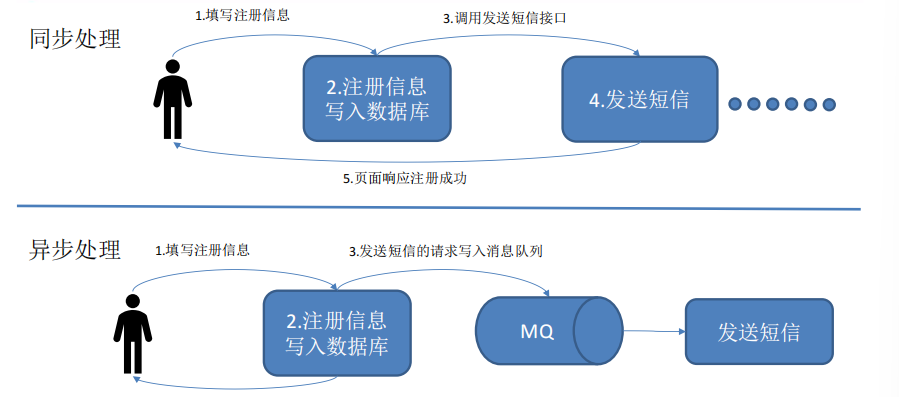<span style="text-align: center;display:block;">传统消息队列的应用场景</span></span>

### 使用消息队列的好处

* 解耦。允许你独立的扩展或修改两边的处理过程，只要确保它们遵守同样的接口约束。
* 可恢复性。系统的一部分组件失效时，不会影响到整个系统。
* 缓冲。有助于控制和优化数据流经过系统的速度，解决生产消息和消费消息的**处理速度不一致**
* 灵活性 & 峰值处理能力。使用消息队列能够使关键组件顶住突发的访问压力，而不会因为突发的超负荷的请求而完全崩溃。
* 异步通信。允许用户把一个消息放入队列，但并不立即处理它。想向队列中放入多少消息就放多少，然后在需要的时候再去处理它们。

### 消息队列的两种模式

* 点对点模式（一对一，消费者主动拉取数据，消息收到后消息清除）

<span style="text-align: center;display:block;">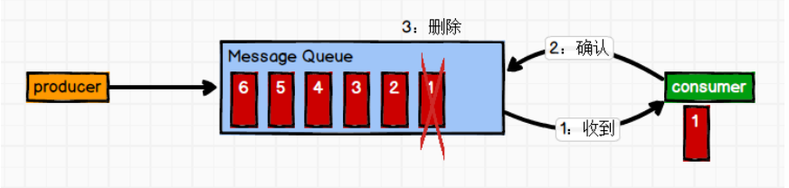<span style="text-align: center;display:block;">点对点</span></span>

* 发布/订阅模式（一对多，消费者消费数据之后不会清除消息）

<span style="text-align: center;display:block;">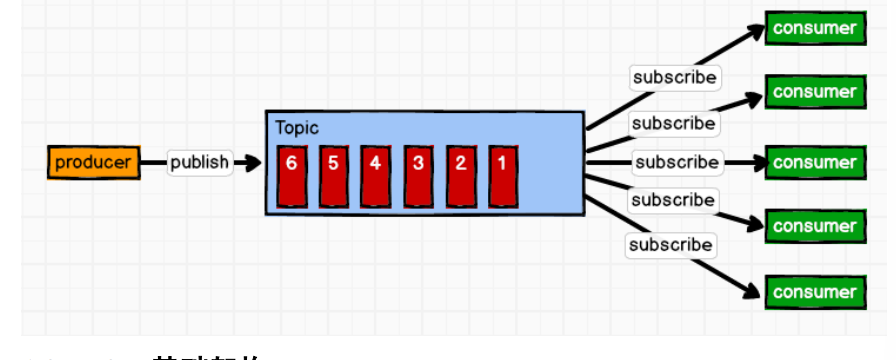<span style="text-align: center;display:block;">发布订阅模式</span></span>

* 两种消费方案

|方案|优点|缺点|
| :-- | :-- | :-- |
|推送|消费者不用长时间连接服务器，消息及时发送到消费者|很难适应消费速率不同的消费者，推送模式很容易造成 consumer 来不及处理消息，拒绝服务以及网络拥塞|
|拉取|消费者能即用即拿，能够保持自己的速度|需要保持长连接，占用资源。如果 kafka 没有数据，消费者可能会陷入循环中，一直返回空数据|

## Kafka 基础架构

<span style="text-align: center;display:block;">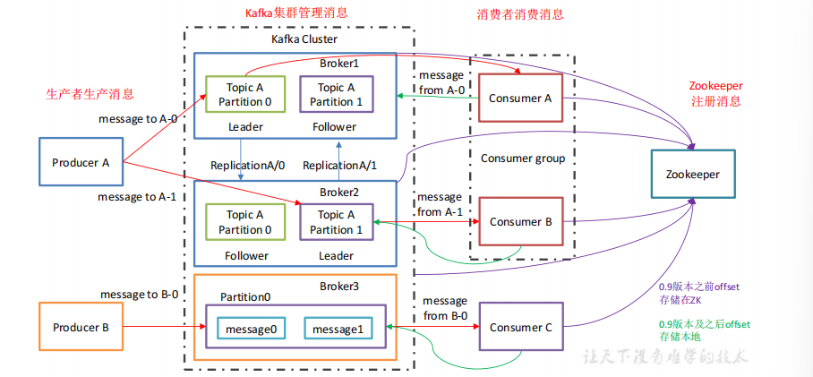<span style="text-align: center;display:block;">架构</span></span>

|组件|名称|功能|说明|
| :-- | :-- | :-- | :-- |
|Producer|消息生产者|向 kafka broker 发消息的客户端|-|
|Consumer|消息消费者|kafka broker 取消息的客户端|-|
|Consumer Group|消费者组,订阅者|由多个 consumer 组成|消费者组内每个消费者负责消费不同分区的数据，一个分区只能由一个组内消费者消费；消费者组之间互不影响。所有的消费者都属于某个消费者组，即消费者组是逻辑上的一个订阅者。|
|Broker|-|一台 kafka 服务器就是一个 broker|一个集群由多个 broker 组成。一个 broker可以容纳多个 topic|
|topic|主题|一个队列|生产者和消费者面向的都是一个 topic|
|Partition|分区|负载均衡|为了实现扩展性，一个非常大的 topic 可以分布到多个 broker（即服务器）上，一个 topic 可以分为多个 partition，每个 partition 是一个有序的队列|
|Replica|副本|容错机制|为保证集群中的某个节点发生故障时，该节点上的 partition 数据不丢失且 kafka 仍然能够继续工作，kafka 提供了副本机制，一个 topic 的每个分区都有若干个副本一个 leader 和若干个 follower|
|leader|-|副本master|每个分区多个副本的“主”，生产者发送数据的对象，以及消费者消费数据的对象都是 leader|
|follower|-|副本slave|实时从 leader 中同步数据，保持和 leader 数据的同步。leader 发生故障时，某个 follower 会成为新的 follower|

# Kafka 快速入门

## 安装部署

> [Kafka安装](https://github.com/heibaiying/BigData-Notes/blob/master/notes/installation/基于Zookeeper搭建Kafka高可用集群.md)

## Kafka 命令行操作

* 查看当前服务器中的所有 topic: `bin/kafka-topics.sh --zookeeper master:2181 --list`
* 创建 topic: `bin/kafka-topics.sh --zookeeper master:2181 --create --replication-factor 3 --partitions 1 --topic first`
* 删除 topic: `bin/kafka-topics.sh --zookeeper master:2181 --delete --topic first`
    * 需要 `server.properties` 中设置 `delete.topic.enable=true` 否则只是标记删除
* 发送消息: `bin/kafka-console-producer.sh --broker-list master:9092 --topic first`
* 消费消息: `bin/kafka-console-consumer.sh --zookeeper master:2181 --topic first`
    * `--from-beginning`表示 从头开始消费
* 查看某个 Topic 的详情: `bin/kafka-topics.sh --zookeeper master:2181 --describe --topic first`
* 修改分区数: `bin/kafka-topics.sh --zookeeper master:2181 --alter --topic first --partitions 6`

# Kafka 架构深入

## Kafka 工作流程及文件存储机制

<span style="text-align: center;display:block;">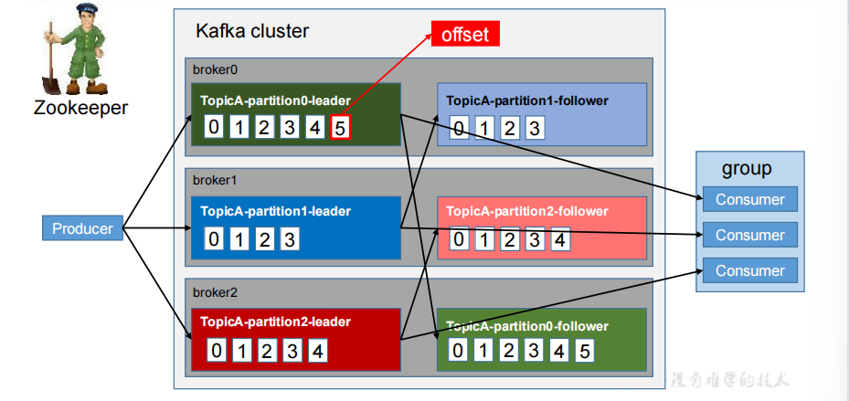<span style="text-align: center;display:block;">工作流程</span></span>

* topic 是逻辑上的概念，而 partition 是物理上的概念
* 每个 partition **对应于多个 log 文件**，该 log 文件中存储的就是 producer 生产的数据。每条数据都有**自己的 offset**
* 消费者组中的每个消费者，都会**实时记录**自己消费到了哪个 offset

<span style="text-align: center;display:block;">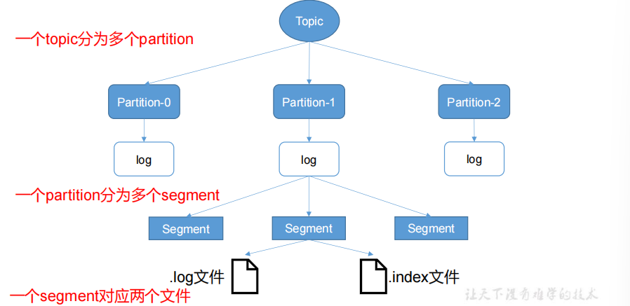<span style="text-align: center;display:block;">文件存储机制</span></span>

Kafka 采取了**分片和索引机制**，将每个 partition 分为多个 segment。每个 segment对应两个文件——“.index”文件和“.log”文件

这些文件位于一个文件夹下，该文件夹的命名规则为：**topic 名称+分区序号**

index 和 log 文件以当前 segment 的第一条消息的 offset 命名。下图为 index 文件和 log文件的结构示意图

<span style="text-align: center;display:block;">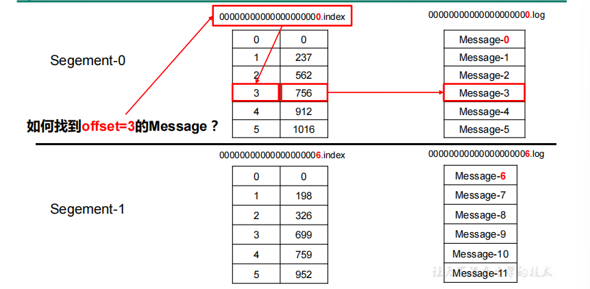<span style="text-align: center;display:block;">index与log文件结构</span></span>

## Kafka 生产者

### 分区策略

* 方便在集群中扩展，每个 Partition 可以通过调整以适应它所在的机器，而一个 topic又可以有多个 Partition 组成，因此整个集群就可以**适应任意大小的数据，负载均衡**
* 可以**提高并发**，因为可以以 Partition 为单位读写

### 分区的原则

`ProducerRecord`对象
<span style="text-align: center;display:block;">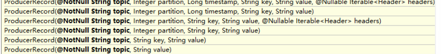</span>

* 指明 partition 的情况下，直接将*指明的值*直接作为 partiton 值
* 没有指明 partition 值但*有 key* 的情况下，将 key 的 hash 值与 topic 的 partition 数进行取余得到 partition 值；
* 既没有 partition 值又没有 key 值的情况下，第一次调用时随机生成一个整数（后面每次调用在这个整数上自增），将这个值与 topic 可用的 partition 总数取余得到 partition 值，也就是常说的 *round-robin 算法*

### 数据可靠性保证

<span style="text-align: center;display:block;">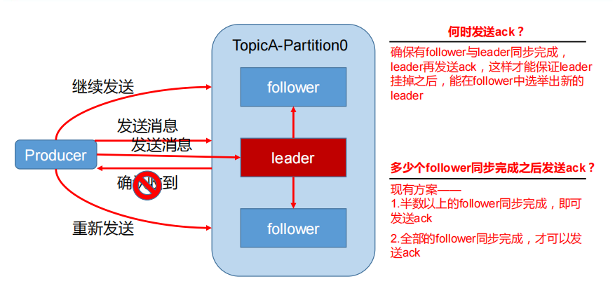<span style="text-align: center;display:block;">副本数据同步策略</span></span>

|方案|优点|缺点|
| :-- | :-- | :-- |
|半数以上完成同步，就发送 ack|延迟低|选举新的 leader 时，容忍 n 台节点的故障，需要 2n+1 个副本|
|全部完成同步，才发送ack|选举新的 leader 时，容忍 n 台节点的故障，需要 n+1 个副本|延迟高|

Kafka 选择了**第二种方案**。网络延迟对 Kafka 的影响较小

Kafka提出了ISR机制

### ISR(动态副本集)

Leader 维护了一个动态的 in-sync replica set (ISR)，意为和 leader **保持同步的 follower 集合**

如果 follower**长时间未向**leader同步数据，则该follower将被踢出ISR，该时间阈值由`replica.lag.time.max.ms`参数设定。Leader发生故障之后，**就会从ISR中选举新的leader**

### ack 应答机制

acks 设置值

|值|说明|
| :-- | :-- |
|0|producer 不等待 broker 的 ack,最低延迟，可能丢失数据|
|1|只有partition 的 leader 落盘成功后返回 ack，可能丢失数据|
|-1|producer 等待 所有 broker 的 ack，可能数据重复，可能丢失数据|

### 故障处理细节

LEO：每个副本的最后一个offset
HW：消费者能见到的最大的 offset，ISR 队列中最小的 LEO

<span style="text-align: center;display:block;">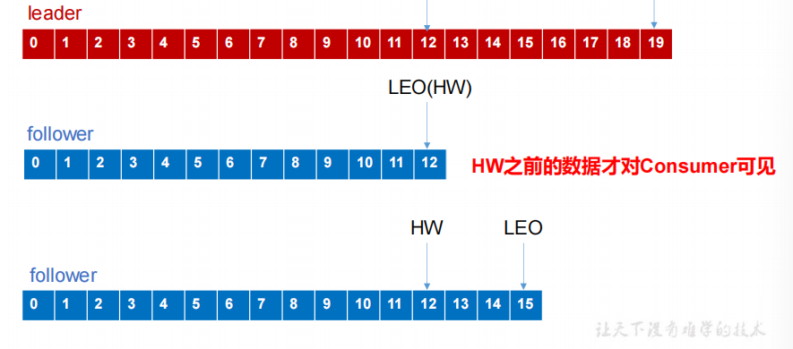<span style="text-align: center;display:block;">log文件中的HW和LEO</span></span>

* follower 故障
follower 发生故障后会被**临时踢出** ISR，待该 follower 恢复后，follower 会读取本地磁盘记录的上次的 HW，并将 log 文件高于 HW 的**部分截取掉**，从 HW 开始向 leader 进行**同步**。等该 follower 的 LEO 大于等于该 Partition 的 HW，即follower 追上 leader 之后，就可以重新加入 IS，并更新HW。
* leader 故障
leader 发生故障之后，会从 ISR 中选出一个新的 leader，之后其余的 follower 会先将各自的 log 文件**高于 HW 的部分截掉**，然后从新的 leader同步数据。
* 这只能保证**消费者**看到副本之间的**数据一致性**，并不能保证数据不丢失或者不重复

### Exactly Once 语义

* ACK 级别设置为-1，At Least Once 语义，可能丢失
* ACK 级别设置为 0，At Most Once 语义，可能重复
* 对于一些非常重要的信息，比如说交易数据，下游数据消费者要求数据既**不重复也不丢失**，即 Exactly Once 语义

* At Least Once + 幂等性 = Exactly Once

* 需要将 Producer 的参数中 `enable.idompotence` 设置为 true

* 开启幂等性的 Producer 在初始化的时候会被分配一个 **PID**，发往同一 Partition 的消息会附带 **Sequence Number**。而Broker 端会对<PID, Partition, SeqNumber>做**缓存**，当具有相同主键的消息提交时，Broker **只会持久化一条**

* PID 重启就会变化,所以幂等性**无法保证跨分区跨会话**的 Exactly Once

## Kafka 消费者

### 分区分配

* RoundRobin：轮询
* Range：分区数/消费者数=每个消费者得到分区数，第一个消费者分配到的分区可能会多。**增加分区后会重新分配**。

### offset 的维护

consumer 需要实时记录自己消费到了哪个 offset，以便故障恢
复后继续消费

<span style="text-align: center;display:block;">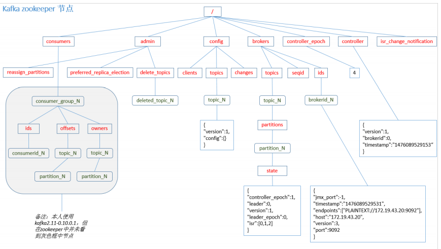<span style="text-align: center;display:block;">zookeeper节点</span></span>

* *Kafka 0.9 版本之前*，consumer 默认将 offset 保存在 Zookeeper 中
* *从 0.9 版本开始*，consumer 默认将 offset 保存在 Kafka 一个**内置的 topic** 中，该 topic 为**__consumer_offsets**。

* 读取offset
    1. 修改配置文件 `consumer.properties` 
        * `exclude.internal.topics=false`
    2. 0.11.0.0 之前版本:
        * `bin/kafka-console-consumer.sh --topic __consumer_offsets --zookeeper master:2181 --formatter "kafka.coordinator.GroupMetadataManager\$OffsetsMessageFormatter" --consumer.config config/consumer.properties --from-beginning`
    3. 0.11.0.0 之后版本(含):
        * `bin/kafka-console-consumer.sh --topic __consumer_offsets --zookeeper master:2181 --formatter "kafka.coordinator.group.GroupMetadataManager\$OffsetsMessageFormatter" --consumer.config config/consumer.properties --from-beginning`

### 消费者组案例

* 需求：测试同一个消费者组中的消费者，同一时刻只能有一个消费者消费
* 步骤
    1. 在 slave1、slave2 上修改`${KAFKA_HOME}/config/consumer.properties` 配置文件中的 `group.id` 属性为任意组名。
    2. 在 salve1、slave2 上分别启动消费者 `bin/kafka-console-consumer.sh --zookeeper master:2181 --topic first --consumer.config config/consumer.properties`
    3. 在 master 上启动生产者 `bin/kafka-console-producer.sh --broker-list master:9092 --topic first`
    4. 不断输入消息，观察消费者控制台。同一时刻只有一个消费者接收到消息

## Kafka 高效读写数据

* 顺序写磁盘。写的过程是一直追加到文件末端，为顺序写。顺序写能到 600M/s。顺序写之所以快，是因为其**省去了大量磁头寻址的时间**。
* 零复制技术：文件复制不需要经过用户空间，而是直接通过操作系统内核。

## Zookeeper 在 Kafka 中的作用

Kafka 集群中有**一个 broker 会被选举为 Controller**，负责管理集群 **broker 的上下线**，**所有 topic 的分区副本分配**和 **leader 选举**等工作。

<span style="text-align: center;display:block;">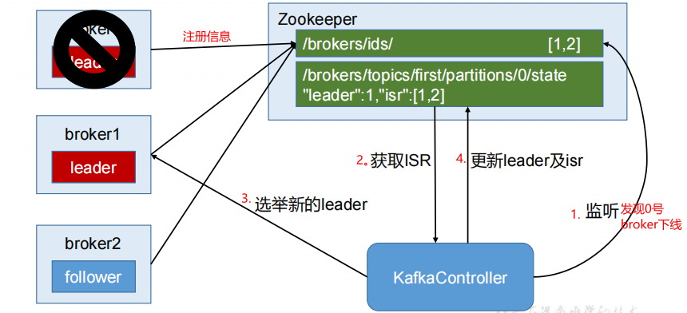<span style="text-align: center;display:block;">Leader选举过程</span></span>

## Kafka 事务

Kafka 从 0.11 版本开始引入了事务支持。
保证 Kafka 在 Exactly Once 语义的基础上，**生产和消费可以跨分区和会话**，要么全部成功，要么全部失败

### Producer 事务

* 引入一个全局唯一的 Transaction ID。并将 Producer
* 获得的PID 和Transaction ID 绑定。当Producer 重启后就可以**通过正在进行的 TransactionID 获得原来的 PID**
* 管理 Transaction。引入了一个新的组件 Transaction Coordinator。通过和 **Transaction Coordinator 交互获得 Transaction ID 对应的任务状态**
* Transaction Coordinator 还负责将**事务所有写入 Kafka 的一个内部 Topic**。整个服务重启，事务状态得到保存，**进行中的事务状态可以得到恢复**

### Consumer 事务

事务的保证就会相对**较弱**。不同的 **Segment File 生命周期不同，同一事务的消息可能会出现重启后被删除**的情况

# Kafka API

## Producer API

### 消息发送流程

异步发送的方式
涉及到了两个线程——**main 线程和 Sender 线程**，以及**一个线程共享变量——RecordAccumulator**

<span style="text-align: center;display:block;">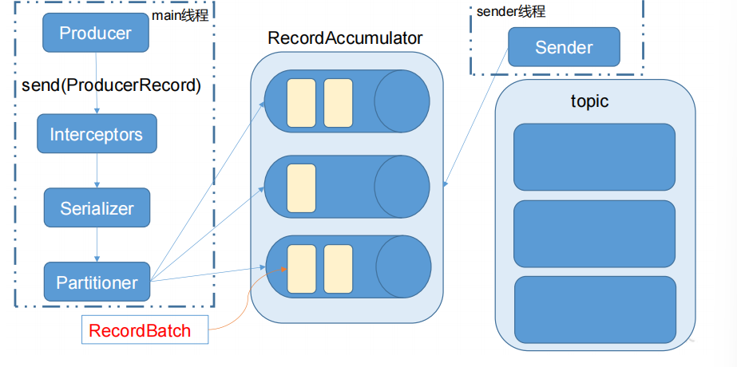<span style="text-align: center;display:block;">main 线程将消息发送给 RecordAccumulator，Sender 线程不断从 RecordAccumulator 中拉取消息发送到 Kafka broker</span></span>

|相关参数|功能|
| :-- | :-- |
|batch.size|只有数据积累到 batch.size 之后，sender 才会发送数据。|
|linger.ms|如果数据迟迟未达到 batch.size，sender 等待 linger.time 之后就会发送数据|

### 异步发送 API

* 导入依赖
```xml
<dependency>
<groupId>org.apache.kafka</groupId>
<artifactId>kafka-clients</artifactId>
<version>${kafka.version}</version>
</dependency>
```
* 编写代码

* 需要用到的类
    * KafkaProducer：需要创建一个生产者对象，用来发送数据
    * ProducerConfig：获取所需的一系列配置参数
    * ProducerRecord：每条数据都要封装成一个ProducerRecord 对象
    1. 不带回调函数的 API
    ```java
    package org.ciaran.kafka;
    import org.apache.kafka.clients.producer.*;
    import java.util.Properties;
    import java.util.concurrent.ExecutionException;
    public class CustomProducer {
        public static void main(String[] args) throws ExecutionException,InterruptedException {
            Properties props = new Properties();
            //kafka 集群，broker-list
            props.put("bootstrap.servers", "master:9092");
            //全部acks策略
            props.put("acks", "all");
            //重试次数
            props.put("retries", 1);
            //批次大小
            props.put("batch.size", 16384);
            //等待时间
            props.put("linger.ms", 1);
            //RecordAccumulator 缓冲区大小
            props.put("buffer.memory", 33554432);
            props.put("key.serializer", 
            "org.apache.kafka.common.serialization.StringSerializer");
            props.put("value.serializer", 
            "org.apache.kafka.common.serialization.StringSerializer");
            Producer<String, String> producer = new 
            KafkaProducer<>(props);
            for (int i = 0; i < 100; i++) {
                producer.send(new ProducerRecord<String, String>("first", Integer.toString(i), Integer.toString(i)));
            }
            producer.close();
        } 
    }
    ```
    2. 带回调函数的 API
        * 回调函数会在 producer 收到 ack 时调用，为异步调用。该方法有两个参数
            * RecordMetadata
            * Exception= null：说明消息发送成功else失败
        * 消息发送失败会**自动重试**，不需要我们在回调函数中手动重试
    ```java
    package org.ciaran.kafka;
    import org.apache.kafka.clients.producer.*;
    import java.util.Properties;
    import java.util.concurrent.ExecutionException;
    public class CustomProducer {
        public static void main(String[] args) throws ExecutionException, InterruptedException {
            Properties props = new Properties();
            props.put("bootstrap.servers", "master:9092");
            props.put("acks", "all");
            props.put("retries", 1);//重试次数
            props.put("batch.size", 16384);//批次大小
            props.put("linger.ms", 1);//等待时间
            props.put("buffer.memory", 33554432);
            props.put("key.serializer", "org.apache.kafka.common.serialization.StringSerializer");
            props.put("value.serializer", "org.apache.kafka.common.serialization.StringSerializer");
            Producer<String, String> producer = new KafkaProducer<>(props);
            for (int i = 0; i < 100; i++) {
                producer.send(new ProducerRecord<String, String>("first", Integer.toString(i), Integer.toString(i)), new Callback() {
                    @Override
                    public void onCompletion(RecordMetadata metadata, Exception exception) {
                        if (exception == null) {
                            System.out.println("success->" + metadata.offset());
                        } else {
                            exception.printStackTrace();
                        }
                    }
                });
            }
            producer.close();
        } 
    }
    ```
### 同步发送 API

* 一条消息发送之后，会阻塞当前线程，直至返回 ack
* send 方法返回的是一个 Future 对象
* 根据 Futrue 对象的特点,只需在调用 Future 对象的 get 方法即可实现同步发送

```java
package org.ciaran.kafka;
import org.apache.kafka.clients.producer.KafkaProducer;
import org.apache.kafka.clients.producer.Producer;
import org.apache.kafka.clients.producer.ProducerRecord;
import java.util.Properties;
import java.util.concurrent.ExecutionException;
public class CustomProducer {
    public static void main(String[] args) throws ExecutionException, InterruptedException {
        Properties props = new Properties();
        props.put("bootstrap.servers", "master:9092");
        props.put("acks", "all");
        props.put("retries", 1);//重试次数
        props.put("batch.size", 16384);//批次大小
        props.put("linger.ms", 1);//等待时间
        props.put("buffer.memory", 33554432);
        props.put("key.serializer", "org.apache.kafka.common.serialization.StringSerializer");
        props.put("value.serializer", "org.apache.kafka.common.serialization.StringSerializer");
        Producer<String, String> producer = new KafkaProducer<>(props);
        for (int i = 0; i < 100; i++) {
            producer.send(new ProducerRecord<String, String>("first", Integer.toString(i), Integer.toString(i))).get();
        }
        producer.close();
    } 
}
```

## Consumer API

offset 的维护是 Consumer 消费数据是必须考虑的问题

### 自动提交 offset

* 需要用到的类
    * KafkaConsumer：需要创建一个消费者对象，用来消费数据
    * ConsumerConfig：获取所需的一系列配置参数
    * ConsuemrRecord：每条数据都要封装成一个 ConsumerRecord 对象
* Kafka 提供了自动提交 offset 的功能
* 自动提交 offset 的相关参数

|相关参数|功能|
| :-- | :-- ||
|enable.auto.commit|是否开启自动提交 offset 功能|
|auto.commit.interval.ms|自动提交 offset 的时间间隔|

* 代码

```java
package org.ciaran.kafka;
import org.apache.kafka.clients.consumer.ConsumerRecord;
import org.apache.kafka.clients.consumer.ConsumerRecords;
import org.apache.kafka.clients.consumer.KafkaConsumer;
import java.util.Arrays;
import java.util.Properties;
public class CustomConsumer {
    public static void main(String[] args) {
        Properties props = new Properties();
        props.put("bootstrap.servers", "master:9092");
        props.put("group.id", "test");
        //
        props.put("enable.auto.commit", "true");
        props.put("auto.commit.interval.ms", "1000");
        //
        props.put("key.deserializer", "org.apache.kafka.common.serialization.StringDeserializer");
        props.put("value.deserializer", "org.apache.kafka.common.serialization.StringDeserializer");
        KafkaConsumer<String, String> consumer = new KafkaConsumer<>(props);
        consumer.subscribe(Arrays.asList("first"));
        while (true) {
            ConsumerRecords<String, String> records = consumer.poll(100);
            for (ConsumerRecord<String, String> record : records){
                System.out.printf("offset = %d, key = %s, value = %s%n", record.offset(), record.key(), record.value());
            }
        }
    } 
}
```

### 手动提交 offset

但由于自动提交 offset是**基于时间提交**的，开发人员难以把握offset 提交的时机。因此 Kafka 还提供了手动提交 offset 的 API。

|手动提交方式|相同点|不同点|
| :-- | :-- | :-- |
|commitSync（同步提交）|本次 poll 的一批数据最高的偏移量提交|commitSync **阻塞当前线程**，一直到提交成功，并且会自动失败重试（由不可控因素导致，也会出现提交失败）。吞吐量会收到很大的影响|
|commitAsync（异步提交）|-|commitAsync 则没有失败重试机制，故有可能提交失败|

* 同步提交 offset
```java
package org.ciaran.kafka.consumer;
import org.apache.kafka.clients.consumer.ConsumerRecord;
import org.apache.kafka.clients.consumer.ConsumerRecords;
import org.apache.kafka.clients.consumer.KafkaConsumer;
import java.util.Arrays;
import java.util.Properties;
public class CustomComsumer {
    public static void main(String[] args) {
        Properties props = new Properties();
        props.put("bootstrap.servers", "master:9092");
        props.put("group.id", "test");
        props.put("enable.auto.commit", "false");//关闭自动提交 offset
        props.put("key.deserializer", "org.apache.kafka.common.serialization.StringDeserializer");
        props.put("value.deserializer", "org.apache.kafka.common.serialization.StringDeserializer");
        KafkaConsumer<String, String> consumer = new KafkaConsumer<>(props);
        consumer.subscribe(Arrays.asList("first"));
        while (true) {
            //消费者拉取数据
            ConsumerRecords<String, String> records = 
            consumer.poll(100);
            for (ConsumerRecord<String, String> record : records) {
                System.out.printf("offset = %d, key = %s, value = %s%n", record.offset(), record.key(), record.value());
                }
            //同步提交，当前线程会阻塞直到 offset 提交成功
            consumer.commitSync();
        }
    } 
}
```

* 异步提交代码
```java
package com.atguigu.kafka.consumer;
import org.apache.kafka.clients.consumer.*;
import org.apache.kafka.common.TopicPartition;
import java.util.Arrays;
import java.util.Map;
import java.util.Properties;
public class CustomConsumer {
    public static void main(String[] args) {
        Properties props = new Properties();
        props.put("bootstrap.servers", "master:9092");
        props.put("group.id", "test");
        //关闭自动提交 offset
        props.put("enable.auto.commit", "false");
        props.put("key.deserializer", "org.apache.kafka.common.serialization.StringDeserializer");
        props.put("value.deserializer", "org.apache.kafka.common.serialization.StringDeserializer");
        KafkaConsumer<String, String> consumer = new KafkaConsumer<>(props);
        consumer.subscribe(Arrays.asList("first"));
        while (true) {
            ConsumerRecords<String, String> records = consumer.poll(100);
            for (ConsumerRecord<String, String> record : records) {
                System.out.printf("offset = %d, key = %s, value = %s%n", record.offset(), record.key(), record.value());
            }
            //异步提交
            consumer.commitAsync(new OffsetCommitCallback() {   
                @Override
                public void onComplete(Map<TopicPartition, OffsetAndMetadata> offsets, Exception exception) {
                    if (exception != null) {
                        System.err.println("Commit failed for" + offsets);
                    }
                }
            });
        }
    } 
}
```

* 数据漏消费和重复消费分析

* 无论是同步提交还是异步提交 offset，都有可能会造成**数据的漏消费或者重复消费**。
* 先提交 offset 后消费，有可能造成数据的漏消费
* 先消费后提交 offset，有可能会造成数据的重复消费。

### 自定义存储 offset

当有新的消费者加入消费者组、已有的消费者推出消费者组或者所订阅的主题的分区发生变化，就会触发到**分区的重新分配**，重新分配的过程叫做 Rebalance
消费者要**首先获取**到自己被重新分配到的**分区**，并且**定位**到每个分区最近提交的 **offset**位置继续消费
要实现自定义存储 offset，需要借助 `ConsumerRebalanceListener`

* 代码
```java
package com.atguigu.kafka.consumer;
import org.apache.kafka.clients.consumer.*;
import org.apache.kafka.common.TopicPartition;
import java.util.*;
public class CustomConsumer {
    private static Map<TopicPartition, Long> currentOffset = new HashMap<>();
    public static void main(String[] args) {
        Properties props = new Properties();
        props.put("bootstrap.servers", "master:9092");
        props.put("group.id", "test");
        //关闭自动提交 offset
        props.put("enable.auto.commit", "false");
        //Key 和 Value 的反序列化类
        props.put("key.deserializer", "org.apache.kafka.common.serialization.StringDeserializer");
        props.put("value.deserializer", "org.apache.kafka.common.serialization.StringDeserializer");
        KafkaConsumer<String, String> consumer = new KafkaConsumer<>(props);
        //消费者订阅主题
        consumer.subscribe(Arrays.asList("first"), new ConsumerRebalanceListener() {
            //该方法会在 Rebalance 之前调用
            @Override
            public void onPartitionsRevoked(Collection<TopicPartition> partitions) {
                commitOffset(currentOffset);
            }
            //该方法会在 Rebalance 之后调用
            @Override
            public void onPartitionsAssigned(Collection<TopicPartition> partitions) {
                currentOffset.clear();
                for (TopicPartition partition : partitions) {
                    //定位到最近提交的 offset 位置继续消费
                    consumer.seek(partition, getOffset(partition));
                }
            }
        });
        while (true) {
            ConsumerRecords<String, String> records = consumer.poll(100);//消费者拉取数据
            for (ConsumerRecord<String, String> record : records) {
                System.out.printf("offset = %d, key = %s, value = %s%n", record.offset(), record.key(), record.value());
                currentOffset.put(new TopicPartition(record.topic(), record.partition()), record.offset());
            }
            commitOffset(currentOffset);
        }
    }
    //获取某分区的最新 offset，自定义
    private static long getOffset(TopicPartition partition) {
        return 0;
    }
    //提交该消费者所有分区的 offset，自定义
    private static void commitOffset(Map<TopicPartition, Long> currentOffset) {
    } 
}
```

## 自定义 Interceptor

### 拦截器原理

interceptor 使得用户在消息发送前以及 producer 回调逻辑前有机会对消息做一些**定制化需求，比如修改消息**
用户可以指定多个 interceptor按序作用于同一条消息从而形成一个拦截链

Intercetpor 的实现接口是`org.apache.kafka.clients.producer.ProducerInterceptor`
定义的方法包括
* configure(configs)：获取**配置信息和初始化数据**时调用。 
* onSend(ProducerRecord)：该方法封装进 KafkaProducer.send 方法中，即它**运行在用户主线程**中。用户可以在该方法中对消息做任何操作，但**最好保证不要修改消息所属的 topic 和分区**，否则会影响目标分区的计算。 
* onAcknowledgement(RecordMetadata, Exception)：该方法会在消息从 **RecordAccumulator 成功发送到 Kafka Broker 之后**，或者在**发送过程中失败时调用**。并且通常都是在 producer **回调逻辑触发之前**。onAcknowledgement 运行在producer 的 IO 线程中，因此**不要在该方法中放入很重的逻辑**，否则会拖慢 producer 的消息发送效率。 
* close：**关闭** interceptor，主要用于执行一些资源清理工作如前所述，interceptor 可能被运行在多个线程中，因此在具体实现时用户**需要自行确保线程安全**。另外倘若指定了多个 interceptor，则 producer 将按照指定顺序调用它们，并仅仅是捕获每个 interceptor 可能抛出的异常记录到错误日志中而非在向上传递。这在使用过程中要特别留意。

### 拦截器案例

* 需求：实现一个简单的双 interceptor 组成的拦截链。
    * 第一个 interceptor 会在消息发送前将时间戳信息加到消息 value 的最前部
    * 第二个 interceptor 会在消息发送后更新成功发送消息数或失败发送消息数。
* 分析

<span style="text-align: center;display:block;"><span style="text-align: center;display:block;">拦截器</span></span>

* 代码
    * 时间拦截器
    ```java
    package org.ciaran.kafka.interceptor;
    import java.util.Map;
    import org.apache.kafka.clients.producer.ProducerInterceptor;
    import org.apache.kafka.clients.producer.ProducerRecord;
    import org.apache.kafka.clients.producer.RecordMetadata;
    public class TimeInterceptor implements 
    ProducerInterceptor<String, String> {
        @Override
        public void configure(Map<String, ?> configs) {
        }
        @Override
        public ProducerRecord<String, String> onSend(ProducerRecord<String, String> record) {
        // 创建一个新的 record，把时间戳写入消息体的最前部
            return new ProducerRecord(record.topic(), record.partition(), record.timestamp(), record.key(),System.currentTimeMillis() + "," + record.value().toString());
        }
        @Override
        public void onAcknowledgement(RecordMetadata metadata, Exception exception) {
        }
        @Override
        public void close() {
        } 
    }
    ```
    * 统计拦截器
    ```java
    package org.ciaran.kafka.interceptor;
    import java.util.Map;
    import org.apache.kafka.clients.producer.ProducerInterceptor;
    import org.apache.kafka.clients.producer.ProducerRecord;
    import org.apache.kafka.clients.producer.RecordMetadata;
    public class CounterInterceptor implements ProducerInterceptor<String, String>{
        private int errorCounter = 0;
        private int successCounter = 0;
        @Override
        public void configure(Map<String, ?> configs) {
        }
        @Override
        public ProducerRecord<String, String> onSend(ProducerRecord<String, String> record) {
            return record;
        }
        @Override
        public void onAcknowledgement(RecordMetadata metadata, Exception exception) {
            // 统计成功和失败的次数
            if (exception == null) {
                successCounter++;
            } else {
                errorCounter++;
            } 
        }
        @Override
        public void close() {
            // 保存结果
            System.out.println("Successful sent: " + successCounter);
            System.out.println("Failed sent: " + errorCounter);
        } 
    }
    ```
    * 主程序
    ```java
    package org.ciaran.kafka.interceptor;
    import java.util.ArrayList;
    import java.util.List;
    import java.util.Properties;
    import org.apache.kafka.clients.producer.KafkaProducer;
    import org.apache.kafka.clients.producer.Producer;
    import org.apache.kafka.clients.producer.ProducerConfig;
    import org.apache.kafka.clients.producer.ProducerRecord;
    public class InterceptorProducer {
        public static void main(String[] args) throws Exception {
            Properties props = new Properties();
            props.put("bootstrap.servers", "master:9092");
            props.put("acks", "all");
            props.put("retries", 3);
            props.put("batch.size", 16384);
            props.put("linger.ms", 1);
            props.put("buffer.memory", 33554432);
            props.put("key.serializer", "org.apache.kafka.common.serialization.StringSerializer");
            props.put("value.serializer", "org.apache.kafka.common.serialization.StringSerializer");
            // 2 构建拦截链
            List<String> interceptors = new ArrayList<>();
            interceptors.add("org.ciaran.kafka.interceptor.TimeInterceptor"); 
            interceptors.add("org.ciaran.kafka.interceptor.CounterInterceptor"); 
            props.put(ProducerConfig.INTERCEPTOR_CLASSES_CONFIG, interceptors);
            String topic = "first";
            Producer<String, String> producer = new KafkaProducer<>(props);
            // 3 发送消息
            for (int i = 0; i < 10; i++) {
                ProducerRecord<String, String> record = new ProducerRecord<>(topic, "message" + i);
                producer.send(record);
            }
            producer.close();
        } 
    }
    ```
* 测试

在 kafka 上启动消费者，然后运行客户端 java 程序。

# Kafka 监控(Kafka Eagle)

1. 修改 kafka 启动命令,并分发。 `kafka-server-start.sh` 中
```
if [ "x$KAFKA_HEAP_OPTS" = "x" ]; then
 export KAFKA_HEAP_OPTS="-Xmx1G -Xms1G"
fi
```
改为
```
if [ "x$KAFKA_HEAP_OPTS" = "x" ]; then
 export KAFKA_HEAP_OPTS="-server -Xms2G -Xmx2G -XX:PermSize=128m -XX:+UseG1GC -XX:MaxGCPauseMillis=200 -XX:ParallelGCThreads=8 -XX:ConcGCThreads=5 -XX:InitiatingHeapOccupancyPercent=70"
 export JMX_PORT="9999"
 #export KAFKA_HEAP_OPTS="-Xmx1G -Xms1G"
fi
```
2. 上传压缩包 `kafka-eagle-bin-1.3.7.tar.gz` 到集群,并解压
3. 解压后，进入解压目录将`kafka-eagle-web-1.3.7-bin.tar.gz` 解压,修改名称
4. 给eagle/bin中的ke.sh 赋予777权限
5. 修改配置文件
    * multi zookeeper&kafka cluster list `cluster1.zk.list=master:2181,slave1:2181,slave2:2181`
    * kafka offset storage `cluster1.kafka.eagle.offset.storage=kafka`
    * enable kafka metrics 
    `kafka.eagle.metrics.charts=true`
    `kafka.eagle.sql.fix.error=false`
    * kafka jdbc driver address 
    `kafka.eagle.driver=com.mysql.jdbc.Driver`
    `kafka.eagle.url=jdbc:mysql://master:3306/ke?useUnicode=true&characterEncoding=UTF-8&zeroDateTimeBehavior=convertToNull`
    `kafka.eagle.username=root`
    `kafka.eagle.password=your password`
6. 添加环境变量
`export KE_HOME=eagle路径`
`export PATH=$PATH:$KE_HOME/bin`
7. 启动
`bin/ke.sh start`
8. 登录页面查看监控数据
`http://192.168.150.101:8048/ke`

# Flume 对接 Kafka

* 配置 flume(flume-kafka.conf),sink 为 kafka（官网查）,以下为示例
```
a1.sources = r1
a1.sinks = k1
a1.channels = c1
# source
a1.sources.r1.type = exec
a1.sources.r1.command = tail -F -c +0 /temp/flume.log
a1.sources.r1.shell = /bin/bash -c
# sink
a1.sinks.k1.type = org.apache.flume.sink.kafka.KafkaSink
a1.sinks.k1.kafka.bootstrap.servers = 
master:9092,slave1:9092,slave2:9092
a1.sinks.k1.kafka.topic = first
a1.sinks.k1.kafka.flumeBatchSize = 20
a1.sinks.k1.kafka.producer.acks = 1
a1.sinks.k1.kafka.producer.linger.ms = 1
# channel
a1.channels.c1.type = memory
a1.channels.c1.capacity = 1000
a1.channels.c1.transactionCapacity = 100
# bind
a1.sources.r1.channels = c1
a1.sinks.k1.channel = c1
```
* 启动 kafka 消费者
* 启动 flume
* 向文件追加内容，查看Kafka消费者情况

# Kafka 面试题

1. Kafka 中的 ISR(InSyncRepli)、OSR(OutSyncRepli)、AR(AllRepli)代表什么？
答：
AR(AllReplicas)：分区的所有副本（AR=ISR+OSR）

ISR(InSyncReplicas)：与leader保持同步的follower集合

OSR(OutSyncReplicas)：ISR是由leader维护，follower从leader同步数据有一些延迟（包括延迟时间replica.lag.time.max.ms和延迟条数replica.lag.max.messages两个维度, 当前最新的版本0.10.x中只支持replica.lag.time.max.ms这个维度），任意一个超过阈值都会把follower剔除出ISR，存入OSR（Outof-Sync Replicas）列表，新加入的follower也会先存放在OSR中

OSR中的副本，如果与leader通信后，会尝试与leader同步，同步的策略是首先将当前记录的hw之后的消息删除，然后与leader同步，当与leader基本同步之后（存储的消息的offset大于当前isr中的hw），就重新回到isr之中

---

2. Kafka 中的 HW、LEO 等分别代表什么？
答：
LEO(Log End Offset)：指的是每个副本最大的offset

HW(High Watermark)：指的是消费者能见到的最大的offset，ISR队列中最小的LEO

---

3. Kafka 中是怎么体现消息顺序性的？
答：
每个分区内，每条消息都有一个offset，故智能保证分区内有序

kafka每个partition中的消息在写入时都是有序的，消费时每个partition只能被每一个group中的一个消费者消费，保证了消费时也是有序的

整个topic不保证有序，如果为了保证topic整个有序，那么将partition调整为1

---

4. Kafka 中的分区器、序列化器、拦截器是否了解？它们之间的处理顺序是什么？
答：
分区器：根据键值确定消息应该处于哪个分区中，默认情况下使用轮询分区，可以自行实现分区器接口自定义分区逻辑

序列化器：键序列化器和值序列化器，将键和值都转为二进制流还有反序列化器将二进制流转为指定类型数据

拦截器：两个方法doSend()方法会在序列化之前完成，onAcknowledgement()方法在消息确认或失败时调用可以添加多个拦截器按顺序执行

处理顺序：拦截器 --> 序列化器 --> 分区器

---

5. Kafka 生产者客户端的整体结构是什么样子的？使用了几个线程来处理？分别是什么？
答：
2个线程，主线程和Sender线程
主线程：负责创建消息，然后通过分区器、序列化器、拦截器作用之后缓存到累加器（RecordAccumulator）中

Sender线程：负责将RecordAccumulator中消息发送到kafka中

---

6. “消费组中的消费者个数如果超过 topic 的分区，那么就会有消费者消费不到数据”这句话是否正确？
答：
正确，因为一个分区只能被同一个消费组中的一个消费者消费，如果消费者组中消费者个数超过分区数，那么肯定有一个没有办法消费到数据
但是使用range策略，触发rebalance，会重新分区

---

7. 消费者提交消费位移时提交的是当前消费到的最新消息的 offset 还是 offset+1？
答：
offset + 1

---

8. 有哪些情形会造成重复消费？
答：
当ack=-1时，如果在follower同步完成后，broker发送ack之前，leader发生故障，导致没有返回ack给producer，由于失败重试机制，又会给新选举出来的leader发送数据，造成数据重复
手动管理offset时，先消费后提交offset，消费者消费后没有commit offset（程序崩溃/强行kill/消费耗时/自动提交偏移情况下unscrible）

---

9. 那些情景会造成消息漏消费？
答：
手动管理offset时，先提交offset后消费，有可能造成数据的漏消费
当ack=0时，producer不等待broker的ack，这一操作提供了一个最低的延迟，broker一接收到还没有写入磁盘就已经返回，当broker故障时有可能丢失数据
当ack=1时，producer等待broker的ack，partition的leader落盘成功后返回ack，如果在follower同步成功之前leader故障，而由于已经返回了ack，系统默认新选举的leader已经有了数据，从而不会进行失败重试，那么将会丢失数据
当ack=-1时，ISR只有leader，情况与ack=1相同
---

10. 当你使用 `kafka-topics.sh` 创建（删除）了一个 topic 之后，Kafka 背后会执行什么逻辑？
答：
1、会在 zookeeper 中的/brokers/topics 节点下创建一个新的 topic 节点，如：/brokers/topics/first
2、触发 Controller 的监听程序
3、kafka Controller 负责 topic 的创建工作，并更新 metadata cache

---

11. topic 的分区数可不可以增加？如果可以怎么增加？如果不可以，那又是为什么？
答：
可以增加

可以通过命令增加：`bin/kafka-topics.sh --zookeeper bigdata02:2181/kafka --alter --topic topic-config --partitions 3`

也可以通过Kafka Manager等图形化管理工具进行分区的添加

---

12. topic 的分区数可不可以减少？如果可以怎么减少？如果不可以，那又是为什么？
答：
不可以减少，被删除的分区数据难以处理

---

13. Kafka 有内部的 topic 吗？如果有是什么？有什么所用？
答：
__consumer_offsets，以双下划线开头，保存消费组的偏移量

---

14. Kafka 分区分配的概念？
答：
一个topic多个分区，一个消费者组中有多个消费者，故需要将分区分配给消费者（Range、RoundRobin）

Range是默认策略。Range是对每个topic而言的（即一个topic一个topic的分），首先对同一个topic里面的分区按照序号进行排序，并对消费者按照字母顺序进行排序；然后用partitions分区的个数除以消费者线程的总数来决定每个消费者线程消费几个分区；如果除不尽，那么前面几个消费者线程将会多消费一个分区

RoundRobin分区分配策略的前提是同一个消费者组里面的所有消费者的num.streams（消费者消费线程数）必须相等；每个消费者订阅的主题必须相同。首先将所有主题分区组成TopicAndPartition列表，然后对TopicAndPartition列表按照hashCode进行排序，最后按照轮询的方式发给每一个消费线程

---

15. 简述 Kafka 的日志目录结构？
答：
每个分区对应一个文件夹，文件夹的命名为topic-0，topic-1，内部为.log和.index文件

每个partition一个文件，包含四类文件：.index、.log、.timeindex、leader-epoch-checkpoint

.index .log .timeindex三个文件成对出现，前缀为上一个segment的最后一个消息的偏移+1

log文件中保存了所有的消息

index文件中保存了稀疏的相对偏移的索引

timeindex保存的则是时间索引

leader-epoch-checkpoint中保存了每一任leader开始写入消息时的offset，会定时更新，follower被选为leader时会根据这个确定哪些消息可用

---

16. 如果我指定了一个 offset，Kafka Controller 怎么查找到对应的消息？
答：
先二分查找获取对应index索引文件，获取到对应的物理offset
拿着物理offset去log数据文件顺序查找对应消息
返回查找找到的消息

---

17. 聊一聊 Kafka Controller 的作用？
答：
负责管理集群broker的上下线，所有topic的分区副本分配和leader选举等工作

在kafka集群中会有一个或者多个broker，其中有一个broker会被选举为控制器（kafka controller），它负责管理整个集群中所有分区和副本的状态

当某个分区的leader副本出现故障时，由控制器负责为该分区选举新的leader副本

当检测到某个分区的ISR集合发生变化时，由控制器负责通知所有broker更新其元数据信息

当使用kafka-topic.sh脚本为某个topic增加分区数量时，同样还是由控制器负责分区的重新分配

---

18. Kafka 中有那些地方需要选举？这些地方的选举策略又有哪些？
答：
partition leader（ISR）

kafka controller（先到先得）

当broker启动时，会尝试去创建/controller节点，创建成功即成为controller；如果该controller死亡，/controller节点会释放，由新的broker创建此节点成为新的controller

---

19. 失效副本是指什么？有那些应对措施？
答：
不能及时与leader同步，暂时踢出ISR，等其追上leader之后再重新加入

ISR是由leader维护，follower从leader同步数据有一些延迟（包括延迟时间replica.lag.time.max.ms和延迟条数replica.lag.max.messages两个维度, 当前最新的版本0.10.x中移除了replica.lag.max.messages参数，防止服务频繁的进去队列），任意一个超过阈值都会把follower剔除出ISR，存入OSR（Outof-Sync Replicas）列表，新加入的follower也会先存放在OSR中

OSR中的副本，如果与leader通信后，会尝试与leader同步，同步的策略是首先将当前记录的hw之后的消息删除，然后与leader同步，当与leader基本同步之后（存储的消息的offset大于当前ISR中的HW），就重新回到ISR之中

---

20. Kafka 的哪些设计让它有如此高的性能？
答：
kafka本身式分布式集群，同时采用分区技术，并发度高

顺序写磁盘

kafka的producer生产数据，要写入到log文件中，写的过程是一直追加到文件末端，为顺序写

官网有数据表明，同样的磁盘，顺序写能到600M/s，而随机写只有100K/s

零拷贝技术(0-copy)

# 更多面试题目

>[Kafka面试题](https://blog.csdn.net/weixin_45557389/article/details/109486482)