[toc]

# Zookeeper 入门

* Zookeeper 是一个开源的分布式的，为分布式框架提**供协调服务**的 Apache 项目。

## Zookeeper工作机制

<span style="display:block;text-align:center;">
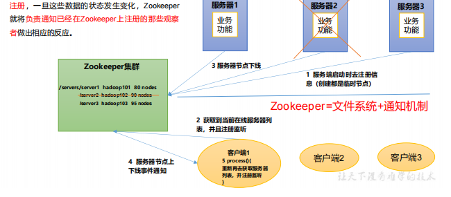
<span style="display:block;text-align:center;">ZooKeeper工作机制</span>
</span>

## Zookeeper特点

* Zookeeper：一个领导者（Leader），多个跟随者（Follower）组成的集群。 
* 集群中只要有**半数以上节点存活**，Zookeeper集群就能正常服务。所 以Zookeeper适合**安装奇数台服务器**。
* 全局数据一致：每个Server保存一份**相同的数据副本**，Client无论连接到哪个Server，**数据都是一致**的。 
* 更新请求**顺序执行**，来自同一个Client的更新请求按其发送顺序依次执行。 
* 数据**更新原子性**，一次数据更新要么成功，要么失败。
* 实时性，在一定时间范围内，Client能**读到最新数据**。
* 每次写操作都有**事务id**（zxid）

## Zookeeper数据结构

* 与 **Unix 文件系统很类似**，整体上可以看作是**一棵树**
* 每个节点称做一个**ZNode**。
* 每一个 ZNode 默认能够存储 **1MB** 的数据
* 每个 ZNode 都可以通过**其路径唯一标识**

## Zookeeper应用场景

* 统一命名服务
* 统一配置管理
* 统一集群管理
* 服务器节点动态上下线
* 软负载均衡

### 统一命名服务

* 在分布式环境下，经常需要对**应用/服务进行统一命名**，便于识别。例如：IP不容易记住，而域名容易记住。

<span style="display:block;text-align:center;">
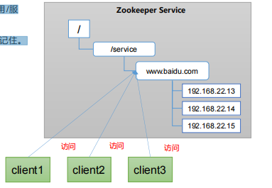
<span style="display:block;text-align:center;">ZooKeeper统一命名服务</span>
</span>

### 统一配置管理

* 可将配置信息写入ZooKeeper上的**一个Znode**
* 各个客户端服务器监听这个Znode。
* 一 旦Znode中的数据被修改，ZooKeeper将通知各个客户端**服务器**。

<span style="display:block;text-align:center;">
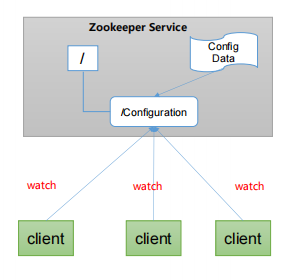
<span style="display:block;text-align:center;">ZooKeeper统一配置管理</span>
</span>

### 统一集群管理

* 实现实时监控节点状态变化
* 监听这个ZNode可获取它的**实时状态变化**

<span style="display:block;text-align:center;">
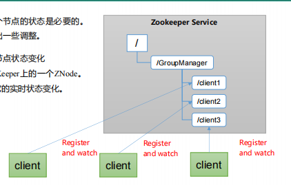
<span style="display:block;text-align:center;">ZooKeeper统一集群管理</span>
</span>

### 服务器动态上下线

* 客户端能**实时洞察**到服务器**上下线的变化**

<span style="display:block;text-align:center;">
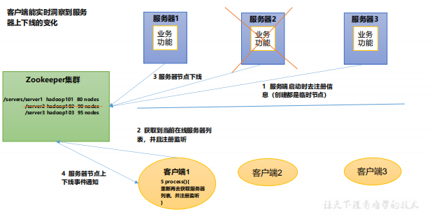
<span style="display:block;text-align:center;">ZooKeeper服务器动态上下线</span>
</span>

### 软负载均衡

* 在Zookeeper中记录每台服务器的访问数，让**访问数最少的服务器**去**处理最新的客户端请求**

<span style="display:block;text-align:center;">
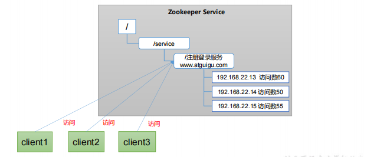
<span style="display:block;text-align:center;">ZooKeeper软负载均衡</span>
</span>

# Zookeeper 安装

[Zookeeper安装](https://github.com/heibaiying/BigData-Notes/blob/master/notes/installation/Zookeeper单机环境和集群环境搭建.md)

## 配置参数解读

* **zoo.cfg** 中
    * tickTime = 2000：Zookeeper 服务器之间或客户端与服务器之间维持心跳的**时间间隔** 毫秒
    * initLimit = 10：集群中的follower服务器(F)与leader服务器(L)之间初始连接时能容忍的最多心跳数
    * syncLimit = 5：集群中的follower服务器与leader服务器之间请求和应答之间能容忍的最多心跳数
    * dataDir：数据文件目录
    * clientPort = 2181：客户端 访问请求 连接端口
    * 服务器名称与地址：集群信息
        * 规则：服务器编号，服务器地址，LF通信端口，选举端口
        * 例如
        ```
        server.1=itcast05:2888:3888
        server.2=itcast06:2888:3888
        server.3=itcast07:2888:3888
        ```

# Zookeeper 集群操作

## 选举机制（面试重点）

* 部分参数解读

|参数|说明|
| :--: | :--: |
|SID|**服务器ID**。用来唯一标识一台ZooKeeper集群中的机器，每台机器不能重复，**和myid一致**|
|ZXID|事务ID。**ZXID是一个事务ID，用来标识一次服务器状态的变更**。在某一时刻，集群中的每台机器的ZXID值不一定完全一致，这和ZooKeeper服务器对于客户端“更新请求”的处理逻辑有关。|
|Epoch|每个**Leader任期的代号**。没有Leader时同一轮投票过程中的逻辑时钟值是相同的。每投完一次票这个数据就会增加|

* *第一次启动*

    * 假设有**5台机器**
    * 一致投给**myid大**的
    * 选举无法完成，服务器进入LOOKING状态
    * 每启动一台新服务器，新服务器发起**重新选举**
    * **非LOOKING** 状态服务器 **不会** 更改选票
    * 选举成功后，其他服务器 **服从多数**

    1. 服务器1启动，发起一次选举。服务器1投自己一票。此时服务器1票数一票，不够半数以上（3票），选举无法完成，服务器1状态保持为
    **LOOKING**； 

    2. 服务器2启动，再发起一次选举。服务器1和2**分别投自己一票**并交换选票信息：此时服务器1发现服务器2的**myid**比自己目前投票推举的（服务器1） **大**，**更改选票为推举服务器2**。此时服务器1票数0票，服务器2票数2票，没有半数以上结果，选举无法完成，服务器1，2状态保持**LOOKING**

    3. 服务器3启动，发起一次选举。此时服务器1和2都会更改选票为服务器3。此次投票结果：服务器1为0票，服务器2为0票，服务器3为3票。此时服务器3的票数已经超过半数，**服务器3当选Leader**。服务器1，2更改状态为**FOLLOWING**，服务器3更改状态为LEADING；

    4. 服务器4启动，发起一次选举。此时服务器1，2，3已经**不是LOOKING状态，不会更改选票信息**。交换选票信息结果：服务器3为3票，服务器4为 1票。此时服务器4**服从多数**，更改选票信息为服务器3，并更改状态为FOLLOWING； 

    5. 服务器5启动，同4一样当小弟。

* *非第一次启动*

    1. 当ZooKeeper集群中的一台服务器出现以下**两种情况之一**时，就会开始进入**Leader选举**：
        * 服务器**初始化启动**。 
        * 服务器运行期间**无法和Leader保持连接**。 
    2. 而当一台机器进入Leader选举流程时，当前集群也可能会处于以下两种状态：
        * 集群中本来就**已经存在一个Leader**。
            * 对于第一种已经存在Leader的情况，机器试图去选举Leader时，会被告知当前服务器的Leader信息，对于该机器来说，仅仅需要和Leader机器**建立连接，并进行状态同步即可**。
        * 集群中确实**不存在Leader**。
            * 假设ZooKeeper由5台服务器组成，**SID分别为1、2、3、4、5，ZXID分别为8、8、8、7、7**，并且此时**SID为3的服务器是Leader**。某一时刻，**3和5服务器出现故障**，因此开始进行Leader选举。
            * 选举Leader规则： ①EPOCH大的直接胜出 ②EPOCH相同，事务id大的胜出 ③事务id相同，服务器id大的胜出

            ||（EPOCH，ZXID，SID ）|（EPOCH，ZXID，SID ）|（EPOCH，ZXID，SID ）|
            | :--: | :-- | :-- | :-- |
            |SID为1、2、4的机器投票情况：|（1，8，1）|（1，8，2）|（1，7，4）|

            * 最后 SID = 2 机器 选举为 Leader

## 客户端命令行操作

* 命令行语法

|功能|命令|说明|
| :-- | :-- | :-- |
|启动客户端|`bin/zkCli.sh -server hadoop102:2181`||
|查看当前节点中所包含的内容|`ls /`|启动客户端后|
|查看当前节点详细数据|`ls -s /`|启动客户端后|
|查看子节点|`ls -w /`|启动客户端后|
|创建普通节点|`create /sanguo "diaochan"`|启动客户端后|
|获得节点的值|`get -s /sanguo`|启动客户端后|
|创建带序号的节点|`create -s /sanguo "diaochan"`|启动客户端后|
|创建短暂节点|`create -e /sanguo "diaochan"` or `create -e -s /sanguo "diaochan"`|启动客户端后|
|修改节点数据值|`set /sanguo "diaochan"`|启动客户端后|
|删除节点|`delete /sanguo`|启动客户端后|
|递归删除节点|`deleteall /sanguo`|启动客户端后|
|查看节点状态|`stat /sanguo"`|启动客户端后|

* 部分参数说明

|参数|说明|
| :--: | :--: |
|czxid|创建节点的事务 zxid|
|ctime|znode 被创建的毫秒数（从 1970 年开始）|
|mzxid|znode 最后更新的事务 zxid|
|mtime|znode 最后修改的毫秒数（从 1970 年开始）|
|pZxid|znode 最后更新的子节点 zxid|
|cversion|znode 子节点变化号，znode 子节点修改次数|
|dataversion|znode 数据变化号|
|aclVersion|znode 访问控制列表的变化号|
|ephemeralOwner|如果是临时节点，这个是 znode 拥有者的 session id。如果不是临时节点则是 0|
|dataLength|znode 的数据长度|
|numChildren|znode 子节点数量|

* 节点类型

|类型|说明|
| :--: | :-- |
|持久化目录节点|永久，*无序号*|
|持久化顺序编号目录节点|永久，*有序号*|
|临时目录节点|*临时*，无序号|
|临时顺序编号目录节点|*临时*，有序号|

* 监听器原理

    * 监听节点数据变化：`get -w <path>`
    * 监听子节点增减变化：`ls -w <path>`
    * **注册一次，只能监听一次**
    * new Zookeeper() 会**创建一个线程**，并执行**process()方法**
    * getxxx()等方法会**创建一个线程**。如果getxxx方法监听为true，会执行**process()方法**

    1. 首先要有一个main()线程
    2. 在main线程中创建Zookeeper客户端，这时就会创建两个线程，一个负责**网络连接通信**（connect），一个**负责监听**（listener）。
    3. 通过connect线程将注册的**监听事件**发送给Zookeeper。
    4. 在Zookeeper的注册监听器列表中将**注册的监听事件添加到列表中**。 
    5. Zookeeper监听到有数据或路径变化，就会**将这个消息发送给listener线程**。
    6. listener线程内部调用了**process()方法**

    <span style="display:block;text-align:center;">
    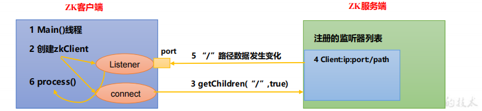
    <span style="display:block;text-align:center;">Zookeeper监听器原理</span>
    </span>

## 客户端 API 操作

* 依赖

```xml
<dependency>
    <groupId>org.apache.zookeeper</groupId>
    <artifactId>zookeeper</artifactId>
    <version>3.5.7</version>
</dependency>
```

* *创建 ZooKeeper 客户端*

```java
// 注意：逗号前后不能有空格
private static String connectString =
"hadoop102:2181,hadoop103:2181,hadoop104:2181";
private static int sessionTimeout = 2000;
private ZooKeeper zkClient = null;
@Before
public void init() throws Exception {
    zkClient = new ZooKeeper(connectString, sessionTimeout, new Watcher() {
        @Override
        public void process(WatchedEvent watchedEvent) {
            // 收到事件通知后的回调函数（用户的业务逻辑）
            System.out.println(watchedEvent.getType() + "--" + watchedEvent.getPath());
            // 再次启动监听
            try {
                List<String> children = zkClient.getChildren("/", true);
                for (String child : children) {
                    System.out.println(child);
                }
            } catch (Exception e) {
                e.printStackTrace();
            } 
        }
    });
} 
```

* *创建子节点*

* `zkClient.create(节点路径，节点数据，节点权限，节点类型)`
* `zkClient.create("/atguigu", "shuaige".getBytes(), Ids.OPEN_ACL_UNSAFE,CreateMode.PERSISTENT);`

* *获取子节点并监听节点变化*

* `zkClient.getChildren(节点路径，设为true 添加一次监听)`
* `zkClient.getChildren("/", true);`

* *判断 Znode 是否存在*

* `zkClient.getChildren(节点路径，设为true 添加一次监听)`
* `zkClient.exists("/atguigu", false);`

## 客户端向服务端写数据流程

<span style="display:block;text-align:center;">
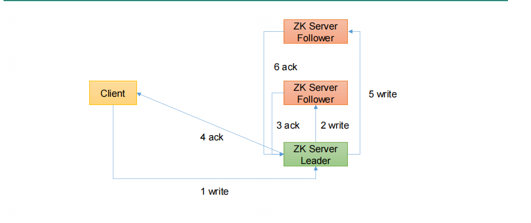
<span style="display:block;text-align:center;">Zookeeper写入请求-发给Leader</span>
</span>

<span style="display:block;text-align:center;">
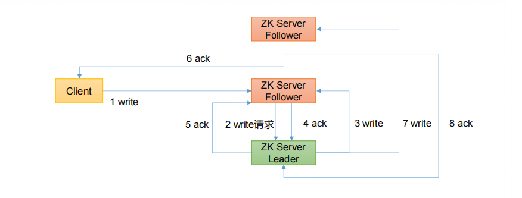
<span style="display:block;text-align:center;">Zookeeper写入请求-发给follower</span>
</span>

# 服务器动态上下线监听案例

1. 先在集群上创建/servers 节点

2. 服务器端向 Zookeeper 注册代码

```java
import java.io.IOException;
import org.apache.zookeeper.CreateMode;
import org.apache.zookeeper.WatchedEvent;
import org.apache.zookeeper.Watcher;
import org.apache.zookeeper.ZooKeeper;
import org.apache.zookeeper.ZooDefs.Ids;
public class DistributeServer {
    private static String connectString = "hadoop102:2181,hadoop103:2181,hadoop104:2181";
    private static int sessionTimeout = 2000;
    private ZooKeeper zk = null;
    private String parentNode = "/servers";
    // 创建到 zk 的客户端连接
    public void getConnect() throws IOException{
        zk = new ZooKeeper(connectString, sessionTimeout, new Watcher() {
        @Override
        public void process(WatchedEvent event) {
            }
        });
    }
    // 注册服务器,创建子节点
    public void registServer(String hostname) throws Exception{
        String create = zk.create(parentNode + "/" + hostname, hostname.getBytes(), Ids.OPEN_ACL_UNSAFE, CreateMode.EPHEMERAL_SEQUENTIAL);
        System.out.println(hostname +" is online "+ create);
    }
    // 业务功能
    public void business(String hostname) throws Exception{
        System.out.println(hostname + " is working ...");
        Thread.sleep(Long.MAX_VALUE);
    }
    public static void main(String[] args) throws Exception {
        // 1 获取 zk 连接
        DistributeServer server = new DistributeServer();
        server.getConnect();
        // 2 利用 zk 连接注册服务器信息
        server.registServer(args[0]);
        // 3 启动业务功能
        server.business(args[0]);
    } 
}
```

3. 客户端代码

```java
import java.io.IOException;
import java.util.ArrayList;
import java.util.List;
import org.apache.zookeeper.WatchedEvent;
import org.apache.zookeeper.Watcher;
import org.apache.zookeeper.ZooKeeper;
public class DistributeClient {
    private static String connectString = "hadoop102:2181,hadoop103:2181,hadoop104:2181";
    private static int sessionTimeout = 2000;
    private ZooKeeper zk = null;
    private String parentNode = "/servers";
    // 创建到 zk 的客户端连接
    public void getConnect() throws IOException {
        zk = new ZooKeeper(connectString, sessionTimeout, new Watcher() {
            @Override
            public void process(WatchedEvent event) {
                // 再次启动监听
                try {
                    getServerList();
                } catch (Exception e) {
                    e.printStackTrace();
                } 
            }
        });
    }
    // 获取服务器列表信息
    public void getServerList() throws Exception {
        // 1 获取服务器子节点信息，并且对父节点进行监听
        List<String> children = zk.getChildren(parentNode, true);
        // 2 存储服务器信息列表
        ArrayList<String> servers = new ArrayList<>();
        // 3 遍历所有节点，获取节点中的主机名称信息
        for (String child : children) {
            byte[] data = zk.getData(parentNode + "/" + child, false, null);
        servers.add(new String(data));
        }
        // 4 打印服务器列表信息
        System.out.println(servers);
    }
    // 业务功能
    public void business() throws Exception{
        System.out.println("client is working ...");
        Thread.sleep(Long.MAX_VALUE);
    }
    public static void main(String[] args) throws Exception {
        // 1 获取 zk 连接
        DistributeClient client = new DistributeClient();
        client.getConnect();
        // 2 获取 servers 的子节点信息，从中获取服务器信息列表
        client.getServerList();
        // 3 业务进程启动
        client.business();
    } 
}
```

4. 测试

* 在 Linux 命令行上操作增加减少服务器
    * 启动 DistributeClient 客户端
    * 在 Linux 命令行上操作增加减少服务器
    * 观察 Idea 控制台变化

* 在 Idea 上操作增加减少服务器
    * 启动 DistributeClient 客户端
    * 启动 DistributeServer 服务
    * 观察 DistributeClient 控制台

# ZooKeeper 分布式锁案例

1. 接收到请求后，在/**locks节点**下创建一个临时顺序节点
2. 判断自己是不是**当前节点下最小**的节点：**是，获取到锁；不是，对前一个节点进行监听**
3. 获取到锁，处理完业务后，**delete节点释放锁**，然后**下面的节点将收到通知**，重复第二步判断


## 原生 Zookeeper 实现分布式锁案例

* 分布式锁实现

* CountDownLatch ： 它**允许一个或多个线程一直等待**，直到其他线程执行完后再执行。通过一个计数器来实现的，计数器的初始化值为需**要等待线程的数量**

```java
import org.apache.zookeeper.*;
import org.apache.zookeeper.data.Stat;
import java.io.IOException;
import java.util.Collections;
import java.util.List;
import java.util.concurrent.CountDownLatch;
public class DistributedLock {
    // zookeeper server 列表
    private String connectString = "hadoop102:2181,hadoop103:2181,hadoop104:2181";
    // 超时时间
    private int sessionTimeout = 2000;
    private ZooKeeper zk;
    private String rootNode = "locks";
    private String subNode = "seq-";
    // 当前 client 等待的子节点
    private String waitPath;
    //ZooKeeper 连接
    private CountDownLatch connectLatch = new CountDownLatch(1);
    //ZooKeeper 节点等待
    private CountDownLatch waitLatch = new CountDownLatch(1);
    // 当前 client 创建的子节点
    private String currentNode;
    // 和 zk 服务建立连接，并创建根节点
    public DistributedLock() throws IOException, 
    InterruptedException, KeeperException {
        zk = new ZooKeeper(connectString, sessionTimeout, new Watcher() {
            @Override
            public void process(WatchedEvent event) {
                // 连接建立时, 打开 latch, 唤醒 wait 在该 latch 上的线程
                if (event.getState() == Event.KeeperState.SyncConnected) {
                    connectLatch.countDown();
                }
                // 发生了 waitPath 的删除事件
                if (event.getType() == Event.EventType.NodeDeleted && event.getPath().equals(waitPath)) {
                    waitLatch.countDown();
                }
        }
        });
        // 等待连接建立
        connectLatch.await();
        //获取根节点状态
        Stat stat = zk.exists("/" + rootNode, false);
        //如果根节点不存在，则创建根节点，根节点类型为永久节点
        if (stat == null) {
            System.out.println("根节点不存在");
            zk.create("/" + rootNode, new byte[0], ZooDefs.Ids.OPEN_ACL_UNSAFE, CreateMode.PERSISTENT);
        }
    }
    // 加锁方法
    public void zkLock() {
        try {
            //在根节点下创建临时顺序节点，返回值为创建的节点路径
            currentNode = zk.create("/" + rootNode + "/" + subNode, null, ZooDefs.Ids.OPEN_ACL_UNSAFE,CreateMode.EPHEMERAL_SEQUENTIAL);
            // wait 一小会, 让结果更清晰一些
            Thread.sleep(10);
            // 注意, 没有必要监听"/locks"的子节点的变化情况
            List<String> childrenNodes = zk.getChildren("/" + rootNode, false);
            // 列表中只有一个子节点, 那肯定就是 currentNode , 说明client 获得锁
            if (childrenNodes.size() == 1) {
                return;
            } else {
                //对根节点下的所有临时顺序节点进行从小到大排序
                Collections.sort(childrenNodes);
                //当前节点名称
                String thisNode = currentNode.substring(("/" + 
                rootNode + "/").length());
                //获取当前节点的位置
                int index = childrenNodes.indexOf(thisNode);
                if (index == -1) {
                    System.out.println("数据异常");
                } else if (index == 0) {
                    // index == 0, 说明 thisNode 在列表中最小, 当前client 获得锁
                    return;
                } else {
                    // 获得排名比 currentNode 前 1 位的节点
                    this.waitPath = "/" + rootNode + "/" + 
                    childrenNodes.get(index - 1);
                    // 在 waitPath 上注册监听器, 当 waitPath 被删除时, zookeeper 会回调监听器的 process 方法
                    zk.getData(waitPath, true, new Stat());
                    //进入等待锁状态
                    waitLatch.await();
                    return;
                }   
            }
        } catch (KeeperException e) {
            e.printStackTrace();
        } catch (InterruptedException e) {
            e.printStackTrace();
        }
    }
    // 解锁方法
    public void zkUnlock() {
        try {
            zk.delete(this.currentNode, -1);
        } catch (InterruptedException | KeeperException e) {
            e.printStackTrace();
        }
    } 
}
```

* 分布式锁测试

```java
import org.apache.zookeeper.KeeperException;
import java.io.IOException;
public class DistributedLockTest {
    public static void main(String[] args) throws 
    InterruptedException, IOException, KeeperException {
        // 创建分布式锁 1
        final DistributedLock lock1 = new DistributedLock();
        // 创建分布式锁 2
        final DistributedLock lock2 = new DistributedLock();
        new Thread(new Runnable() {
            @Override
            public void run() {
                // 获取锁对象
                try {
                    lock1.zkLock();
                    System.out.println("线程 1 获取锁");
                    Thread.sleep(5 * 1000);
                    lock1.zkUnlock();
                    System.out.println("线程 1 释放锁");
                } catch (Exception e) {
                    e.printStackTrace();
                }
            }
        }).start();
        new Thread(new Runnable() {
            @Override
            public void run() {
                // 获取锁对象
                try {
                    lock2.zkLock();
                    System.out.println("线程 2 获取锁");
                    Thread.sleep(5 * 1000);
                    lock2.zkUnlock();
                    System.out.println("线程 2 释放锁");
                } catch (Exception e) {
                    e.printStackTrace();
                }
            }
        }).start();
    } 
}
```

* 观察控制台变化

## Curator 框架实现分布式锁案例

* 原生的 Java API 开发存在的问题
    * 会话连接是异步的，需要自己去处理。比如使用 CountDownLatch
    * Watch 需要重复注册，不然就不能生效
    * 开发的复杂性还是比较高的
    * 不支持多节点删除和创建。需要自己去递归
* Curator 是一个专门解决分布式锁的框架

* 添加依赖

```xml
<dependency>
    <groupId>org.apache.curator</groupId>
    <artifactId>curator-framework</artifactId>
    <version>4.3.0</version>
</dependency>
<dependency>
    <groupId>org.apache.curator</groupId>
    <artifactId>curator-recipes</artifactId>
    <version>4.3.0</version>
</dependency>
<dependency>
    <groupId>org.apache.curator</groupId>
    <artifactId>curator-client</artifactId>
    <version>4.3.0</version>
</dependency>
```

* 代码实现

```java
import org.apache.curator.RetryPolicy;
import org.apache.curator.framework.CuratorFramework;
import org.apache.curator.framework.CuratorFrameworkFactory;
import 
org.apache.curator.framework.recipes.locks.InterProcessLock;
import 
org.apache.curator.framework.recipes.locks.InterProcessMutex;
import org.apache.curator.retry.ExponentialBackoffRetry;
public class CuratorLockTest {
    private String rootNode = "/locks";
    // zookeeper server 列表
    private String connectString = "hadoop102:2181,hadoop103:2181,hadoop104:2181";
    // connection 超时时间
    private int connectionTimeout = 2000;
    // session 超时时间
    private int sessionTimeout = 2000;
    public static void main(String[] args) {
        new CuratorLockTest().test();
    }
    // 测试
    private void test() {
        // 创建分布式锁 1
        final InterProcessLock lock1 = new InterProcessMutex(getCuratorFramework(), rootNode);
        // 创建分布式锁 2
        final InterProcessLock lock2 = new InterProcessMutex(getCuratorFramework(), rootNode);
        new Thread(new Runnable() {
            @Override
            public void run() {
            // 获取锁对象
                try {
                    lock1.acquire();
                    System.out.println("线程 1 获取锁");
                    // 测试锁重入
                    lock1.acquire();
                    System.out.println("线程 1 再次获取锁");
                    Thread.sleep(5 * 1000);
                    lock1.release();
                    System.out.println("线程 1 释放锁");
                    lock1.release();
                    System.out.println("线程 1 再次释放锁");
                } catch (Exception e) {
                    e.printStackTrace();
                }
            }
        }).start();
        new Thread(new Runnable() {
            @Override
            public void run() {
                // 获取锁对象
                try {
                    lock2.acquire();
                    System.out.println("线程 2 获取锁");
                    // 测试锁重入
                    lock2.acquire();
                    System.out.println("线程 2 再次获取锁");
                    Thread.sleep(5 * 1000);
                    lock2.release();
                    System.out.println("线程 2 释放锁");
                    lock2.release();
                    System.out.println("线程 2 再次释放锁");
                } catch (Exception e) {
                    e.printStackTrace();
                }
            }
        }).start();
    }
    // 分布式锁初始化
    public CuratorFramework getCuratorFramework(){
        //重试策略，初试时间 3 秒，重试 3 次
        RetryPolicy policy = new ExponentialBackoffRetry(3000, 3);
        //通过工厂创建 Curator
        CuratorFramework client = CuratorFrameworkFactory.builder().connectString(connectString).connectionTimeoutMs(connectionTimeout).sessionTimeoutMs(sessionTimeout).retryPolicy(policy).build();
        //开启连接
        client.start();
        System.out.println("zookeeper 初始化完成...");
        return client;
    } 
}
```

* 观察控制台变化

# 企业面试真题（面试重点）

## 选举机制

* 半数机制，超过半数的投票通过，即通过

* 第一次启动选举规则
    * 投票过半数时，服务器 **id 大的胜出**
* 第二次启动选举规则
    ① **EPOCH 大**的直接胜出
    ② EPOCH 相同，**事务 id 大**的胜出
    ③ 事务 id 相同，**服务器 id 大**的胜出

## 生产集群安装多少 zk 合适

* 安装奇数台
* 服务器台数多：**好处，提高可靠性**；坏处：**提高通信延时**

* 10 台服务器：3 台 zk； 
* 20 台服务器：5 台 zk； 
* 100 台服务器：11 台 zk； 
* 200 台服务器：11 台 zk

## 常用命令

* ls、get、create、delete

# 算法基础

* Zookeeper 是如何保证数据一致性的

##  拜占庭将军问题

拜占庭将军问题是**一个协议问题**，拜占庭帝国军队的将军们**必须全体一致的决定**是否攻击某一支敌军。问题是这些将军在**地理上是分隔开来**的，并且将军中**存在叛徒**。叛徒可以任意行动以达到以下目标：
* 欺骗某些将军采取进攻行动；促成一个不是所有将军都同意的决定，如当将军们不希望进攻时促成进攻行动；
* 迷惑某些将军，使他们无法做出决定。

如果叛徒达到了这些目的之一，则任何攻击行动的结果都是注定要失败的，**只有完全达成一致的努力才能获得胜利**。

## Paxos 算法

### 解决什么问题

* 一种基于**消息传递且具有高度容错特性**的**一致性算法**
* 解决：如何**快速正确**的在一个分布式系统中对**某个数据值**达成一致，并且保证不论发生任何异常，都不会破坏整个系统的**一致性**

### 算法描述

* 在一个Paxos系统中，首先将所有节点划分为Proposer（提议者），Acceptor（接受者），和Learner（学习者）。（注意：每个节点都可以身兼数职）
* 一个完整的Paxos算法流程分为三个阶段：
    1. repare准备阶段
        * Proposer向多个Acceptor发出Propose请求Promise（承诺）
        * Acceptor针对收到的Propose请求进行Promise（承诺）
    2. Accept接受阶段
        * Proposer收到多数Acceptor承诺的Promise后，向Acceptor发出Propose请求
        * Acceptor针对收到的Propose请求进行Accept处理
    3. Learn学习阶段：Proposer将形成的决议发送给所有Learners

### 算法流程流程

1. Prepare: Proposer生成**全局唯一且递增的Proposal ID**，向所有Acceptor发送Propose请求，这里无需携带提案内容，**只携带Proposal ID即可**。
2. Promise: Acceptor收到Propose请求后，做出“**两个承诺，一个应答**”。
    * 不再接受Proposal ID**小于等于**（注意：这里是<= ）当前请求的**Propose请求**
    * 不再接受Proposal ID**小于**（注意：这里是< ）当前请求的**Accept请求**
    * **不违背以前做出的承诺**下，回复已经Accept过的提案中**Proposal ID**最大的那个提案的Value和Proposal ID，没有则返回空值
3. Propose: Proposer收到**多数Acceptor的Promise应答**后，从**应答中选择Proposal ID最大的提案的Value**，作为本次要发起的提案。如果所有应答的提案Value均为空值，则可以自己随意决定提案Value。然后携带当前Proposal ID，向所有Acceptor发 送Propose请求。
4. Accept: Acceptor收到Propose请求后，在**不违背自己之前做出的承诺**下，接受并持久化当前Proposal ID和提案Value
5. Learn: Proposer收到多数Acceptor的Accept后，**决议形成，将形成的决议发送给所有Learner**

### 三种情况（无Learner）

* 情况一：决议形成

<span style="display:block;text-align:center;">
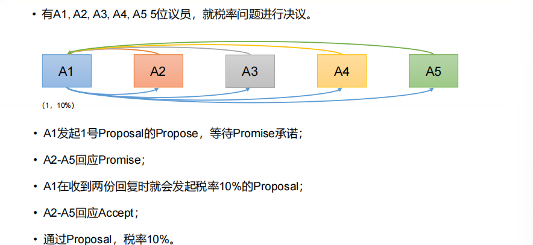
<span style="display:block;text-align:center;">Zookeeper-Paxos算法-情况一</span>
</span>

* 情况二：两个Proposer

<span style="display:block;text-align:center;">
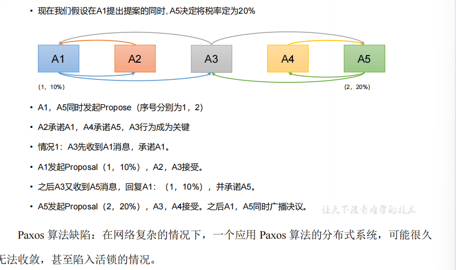
<span style="display:block;text-align:center;">Zookeeper-Paxos算法-情况二</span>
</span>

* 情况三：活死锁

<span style="display:block;text-align:center;">
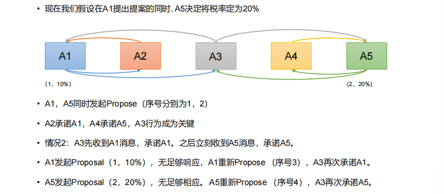
<span style="display:block;text-align:center;">Zookeeper-Paxos算法-情况三</span>
</span>

## ZAB 协议

### 什么是 ZAB 算法

Zab 借鉴了 Paxos 算法，是特别为 Zookeeper 设计的**支持崩溃恢复**的原子广播协议

只有一台客户端（Leader）负责处理外部的写事务请求，然后Leader 客户端将数据同步到其他 Follower 节点。即 Zookeeper **只有一个 Leader 可以发起提案**

### Zab 协议内容

两种基本模式
* 消息广播
* 崩溃恢复

#### 消息广播

1. 客户端**发起**一个写操作**请求**。 
2. Leader服务器将客户端的请求转化为**事务Proposal 提案**，同时为**每个Proposal分配一个全局的ID**，即**zxid**。 
3. Leader服务器为**每个Follower服务器分配一个单独的队列**，然后将需要广播的**Proposal依次放到队列**中去，并且根据FIFO策略进行消息发送。 
4. **Follower接收到Proposal**后，会首先将其以**事务日志**的方式**写入本地磁盘**中，写入**成功后向Leader反馈一个Ack**响应消息。 
5. Leader接收到**超过半数以上**Follower的Ack响应消息后，即认为**消息发送成功**，可以发送commit消息。 
6. Leader向所有Follower**广播commit消息**，同时自身也会**完成事务提交**。Follower 接收到commit消息后，会将**上一条事务提交**。 
7. Zookeeper采用Zab协议的核心，就是只要有一台服务器提交了Proposal，**就要确保所有的服务器最终都能正确提交Proposal**。
8. 如果**Leader发起一个事务Proposal1后就宕机**或**Leader收到半数ACK宕机，没来得及向Follower发送Commit**，进入**崩溃恢复模式**

<span style="display:block;text-align:center;">
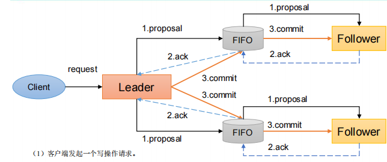
<span style="display:block;text-align:center;">Zookeeper-ZAB-消息广播</span>
</span>

#### 崩溃恢复

* 崩溃恢复——异常假设
    * 假设两种服务器异常情况
        * 假设一个事务在Leader提出之后，**Leader挂了**
        * 一个事务在Leader上提交了，并且过半的Follower都响应Ack了，但是**Leader在Commit消息发出之前挂了**。
    * Zab协议崩溃恢复要求满足以下两个要求
        * 已经产生的提案，**Follower必须执行**
        * 确保**丢弃**已经被Leader提出的，但是没有被提交的Proposal。（丢弃胎死腹中的提案）
* 崩溃恢复——Leader选举
    * 新选举出来的Leader不能**包含未提交的Proposal**。即新Leader必须都是已经提交了Proposal的Follower服务器节点。
    * 新选举的Leader节点中**含有最大的zxid**。这样做的好处是可以避免Leader服务器检查Proposal的提交和丢弃工作
* 崩溃恢复——数据恢复
    * Leader服务器会首先确认事务日志中的**所有的Proposal** 是否已经被集群中过半的服务器Commit
    * 等到Follower将所有尚未同步的事务Proposal都从Leader服务器上**同步**过，并且应用到内存数据中以后，Leader才会把该Follower**加入到真正可用的Follower列表**中

## CAP

一个分布式系统不可能同时满足以下三种
⚫ 一致性（C:Consistency） 
⚫ 可用性（A:Available） 
⚫ 分区容错性（P:Partition Tolerance）

ZooKeeper保证的是**CP**

1. ZooKeeper不能保证**每次服务请求的可用性**。（注：在极端环境下，ZooKeeper可能会丢弃一些请求，消费者程序需要重新请求才能获得结果）。所以说，ZooKeeper不能保证服务可用性。 
2. 进行Leader选举时**集群都是不可用**。

#  源码详解

## 辅助源码

* 持久化源码

Leader 和 Follower 中的数据会在内存和磁盘中各保存一份

<span style="display:block;text-align:center;">
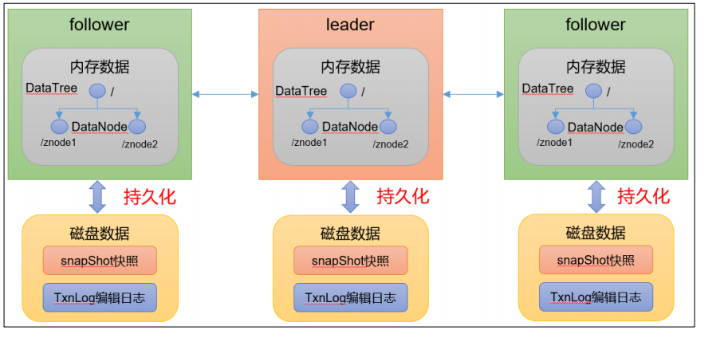
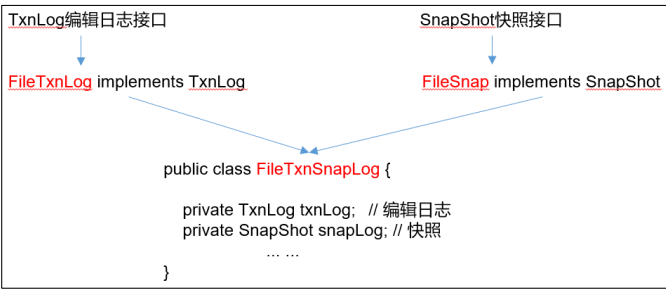
<span style="display:block;text-align:center;">Zookeeper持久化代码</span>
<span style="text-align:center;display:block"><a href="https://www.bilibili.com/video/BV1to4y1C7gw?p=34">Zookeeper持久化代码</a></span>
</span>

* 序列化源码

org.apache.zookeeper.server.persistence 包下的相关类都是序列化相关的代码

<span style="display:block;text-align:center;">
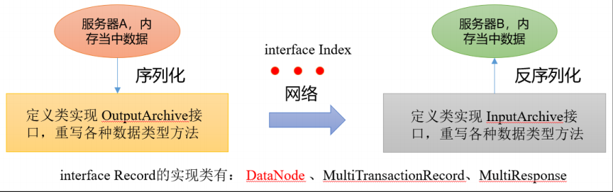
<span style="display:block;text-align:center;">Zookeeper序列化代码</span>
<span style="text-align:center;display:block"><a href="https://www.bilibili.com/video/BV1to4y1C7gw?p=34">Zookeeper序列化代码</a></span>
</span>

## ZK 服务端初始化源码解析

<span style="display:block;text-align:center;">
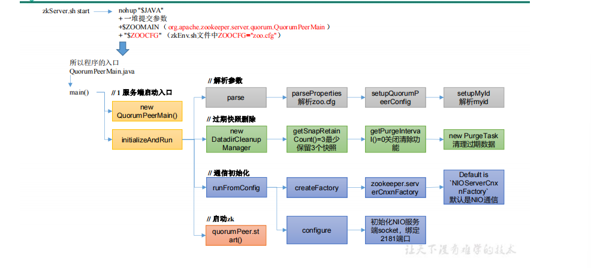
<span style="display:block;text-align:center;">Zookeeper服务端初始化源码</span>
<span style="text-align:center;display:block"><a href="https://www.bilibili.com/video/BV1to4y1C7gw?p=35">Zookeeper服务端初始化源码(p35-38)</a></span>
</span>

* ZK 服务端启动脚本分析
* ZK 服务端启动入口
* 解析参数 zoo.cfg 和 myid
* 过期快照删除
* 初始化通信组件

## ZK 服务端加载数据源码解析

* zk 中的数据模型，是**一棵树**，DataTree，每个节点，叫做 DataNode
* zk 集群中的 DataTree 时刻**保持状态同步**
* Zookeeper 集群中每个 zk 节点中，数据在内存和磁盘中都有**一份完整的数据**。 
    * 内存数据：DataTree
    * 磁盘数据：快照文件 + 编辑日志

<span style="display:block;text-align:center;">
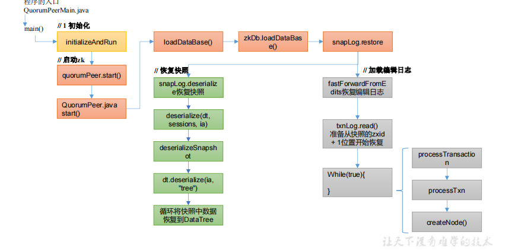
<span style="display:block;text-align:center;">Zookeeper服务端加载数据源码</span>
<span style="text-align:center;display:block"><a href="https://www.bilibili.com/video/BV1to4y1C7gw?p=39">Zookeeper服务端加载数据源码</a></span>
</span>

* 冷启动数据恢复快照数据
* 冷启动数据恢复编辑日志

## ZK 选举源码解析

<span style="display:block;text-align:center;">
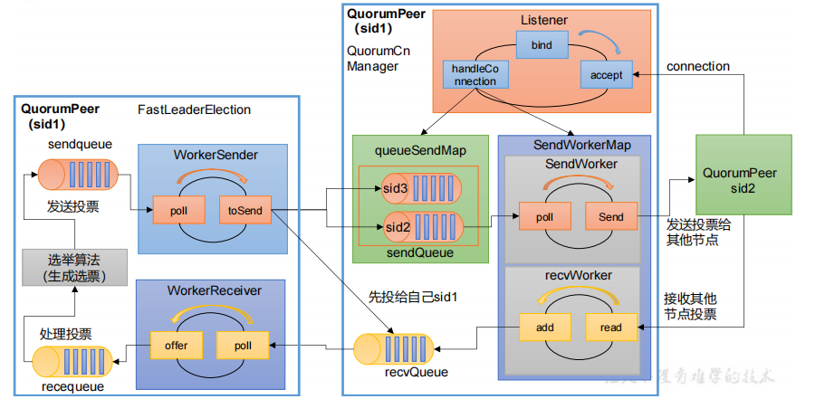
<span style="display:block;text-align:center;">Zookeeper选举源码解析</span></span>
</span>

* 选举准备

<span style="display:block;text-align:center;">

<span style="display:block;text-align:center;">Zookeeper 选举准备 源码</span>
<span style="text-align:center;display:block"><a href="https://www.bilibili.com/video/BV1to4y1C7gw?p=40">Zookeeper 选举准备 源码</a></span>
</span>

* 选举执行

<span style="display:block;text-align:center;">

<span style="display:block;text-align:center;">Zookeeper 选举执行 源码</span>
<span style="text-align:center;display:block"><a href="https://www.bilibili.com/video/BV1to4y1C7gw?p=41">Zookeeper 选举执行 源码</a></span>
</span>

## Follower 和 Leader 状态同步源码

* 选举结束后,选举出的 Leader **更新自己状态**为 Leader，其他节点更新自己状态为 Follower
    * Leader 更新状态入口：leader.lead()
    * Follower 更新状态入口：follower.followerLeader()
* follower 必须**要让 leader 知道自己的状态**：epoch、zxid、sid
* leader 接收到信息，**必须要返回对应的信息**给 follower
* 当leader得知follower的状态了，就**确定需要做何种方式的数据同步**DIFF、TRUNC、SNAP
* 执行数据同步
    * 同步的方式：
        * DIFF: 咱两一样，不需要做什么
        * TRUNC: follower 的 zxid 比 leader 的 zxid 大，所以 Follower 要回滚
        * COMMIT: leader 的 zxid 比 follower 的 zxid 大，发送 Proposal 给 foloower 提交执行
        * 如果 follower 并没有任何数据，直接使用 **SNAP 的方式来执行数据同步**（**直接把数据全部序列到 follower**）
* 当 leader 接收到超过半数 follower 的 ack 之后，进入正常工作状态，集群启动完成了

<span style="display:block;text-align:center;">
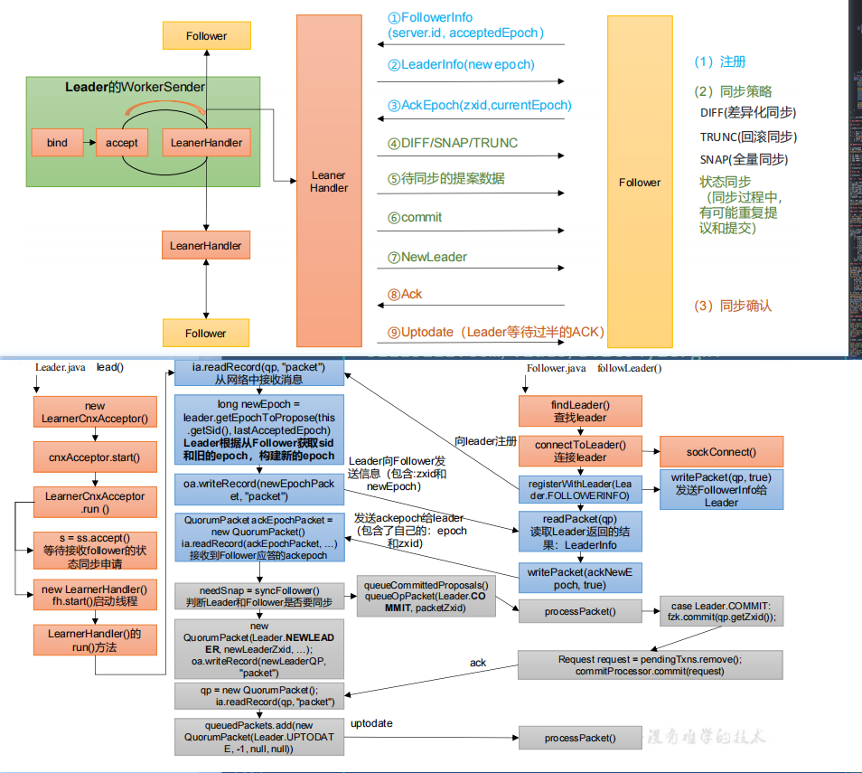
<span style="display:block;text-align:center;">Follower和Leader状态同步源码解析</span>
<span style="text-align:center;display:block"><a href="https://www.bilibili.com/video/BV1to4y1C7gw?p=42">Follower和Leader状态同步源码解析(p42-43)</a></span>
</span>

* Leader.lead()等待接收 follower 的状态同步申请
* Follower.lead()查找并连接 Leader
* Leader.lead()创建 LearnerHandler
* Follower.lead()创建 registerWithLeader
* Leader.lead()接收 Follwer 状态，根据同步方式发送同步消息
* Follower.lead()应答 Leader 同步结果
* Leader.lead()应答 Follower

## 服务端 Leader 启动

<span style="display:block;text-align:center;">
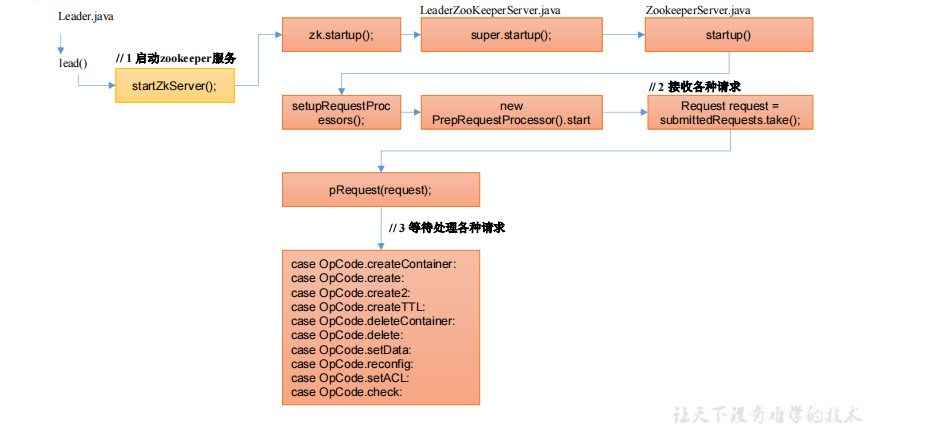
<span style="display:block;text-align:center;">服务端Leader启动源码</span>
<span style="text-align:center;display:block"><a href="https://www.bilibili.com/video/BV1to4y1C7gw?p=44">服务端Leader启动源码</a></span>
</span>

## 服务端 Follower 启动

<span style="display:block;text-align:center;">
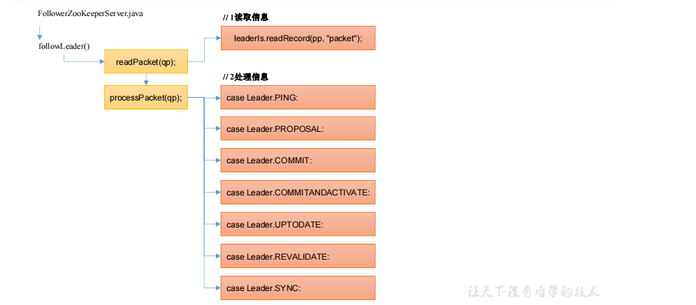
<span style="display:block;text-align:center;">服务端Follower启动源码</span>
<span style="text-align:center;display:block"><a href="https://www.bilibili.com/video/BV1to4y1C7gw?p=45">服务端Follower启动源码</a></span>
</span>

## 客户端启动

<span style="display:block;text-align:center;">
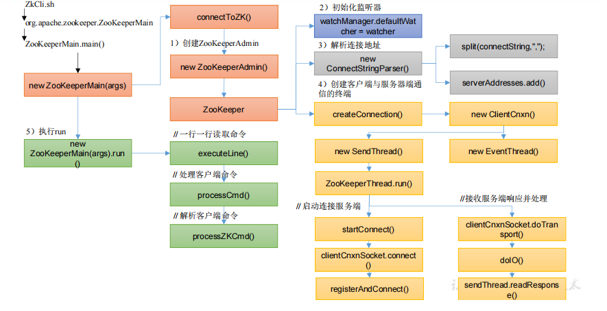
<span style="display:block;text-align:center;">客户端启动源码</span>
<span style="text-align:center;display:block"><a href="https://www.bilibili.com/video/BV1to4y1C7gw?p=46">客户端启动源码</a></span>
</span>

* 客户端启动脚本分析
* 创建 ZookeeperMain
* 初始化监听器
* 解析连接地址
* 创建通信
* 执行 run()

